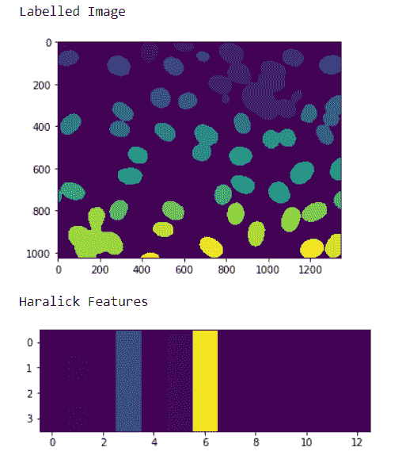
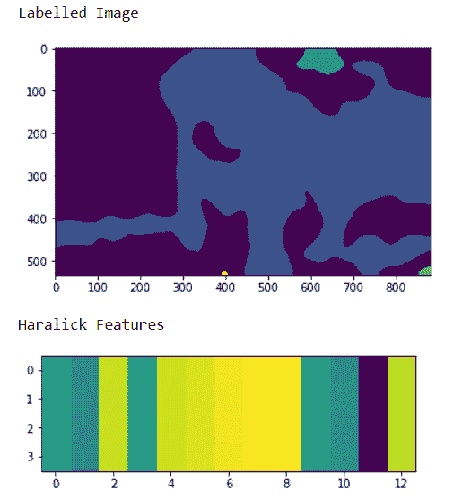

# maho tas–哈拉利克功能

> 原文:[https://www.geeksforgeeks.org/mahotas-haralick-features/](https://www.geeksforgeeks.org/mahotas-haralick-features/)

在本文中，我们将看到如何在 mahotas 中获得图像的 haralick 特征。哈拉利克纹理特征是根据灰度共生矩阵计算的，该矩阵计算图像中相邻灰度的共生情况。灰度共生矩阵是一个正方形矩阵，其维数为感兴趣区域的灰度级数。为此，我们将使用来自核分割基准的荧光显微图像。我们可以借助下面给出的命令
获得图像

```
mahotas.demos.nuclear_image()
```

下图是核 _ 图像


为此，我们将使用 mahotas.features.haralick 方法

> **语法:**maho tas . features . haralick(img)
> **参数:**它以图像对象作为参数
> **返回:**它返回 numpy.ndarray

**注意:**的输入应该是过滤后的图像或者加载为灰色
为了对图像进行过滤，我们将获取 numpy.ndarray 的图像对象，并借助索引对其进行过滤，下面是这样做的命令

```
image = image[:, :, 0]
```

**例 1 :**

## 蟒蛇 3

```
# importing various libraries
import mahotas
import mahotas.demos
import mahotas as mh
import numpy as np
from pylab import imshow, show

# loading nuclear image
nuclear = mahotas.demos.nuclear_image()

# filtering image
nuclear = nuclear[:, :, 0]

# adding gaussian filter
nuclear = mahotas.gaussian_filter(nuclear, 4)

# setting threshold
threshed = (nuclear > nuclear.mean())

# making is labeled image
labeled, n = mahotas.label(threshed)

# showing image
print("Labelled Image")
imshow(labeled)
show()

# getting haralick features
h_feature = mahotas.features.haralick(labelled)

# showing the feature
print("Haralick Features")
imshow(h_feature)
show()
```

**输出:**



**例 2 :**

## 蟒蛇 3

```
# importing required libraries
import numpy as np
import mahotas
from pylab import imshow, show

# loading image
img = mahotas.imread('dog_image.png')

# filtering the image
img = img[:, :, 0]

# setting gaussian filter
gaussian = mahotas.gaussian_filter(img, 15)

# setting threshold value
gaussian = (gaussian > gaussian.mean())

# making is labelled image
labeled, n = mahotas.label(gaussian)

# showing image
print("Labelled Image")
imshow(labelled)
show()

# getting haralick features
h_feature = mahotas.features.haralick(labelled)

# showing the feature
print("Haralick Features")
imshow(h_feature)
show()
```

**输出:**

