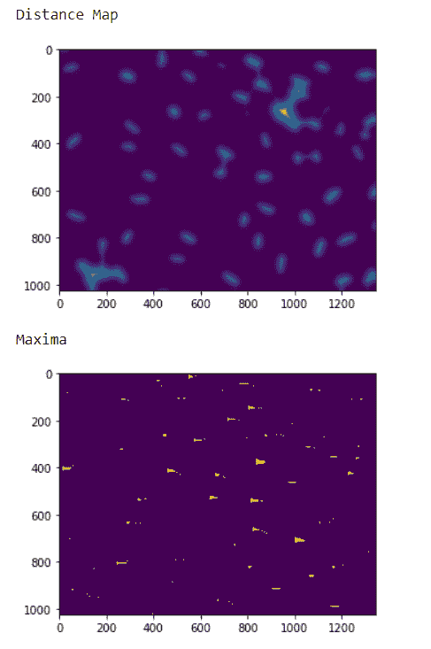
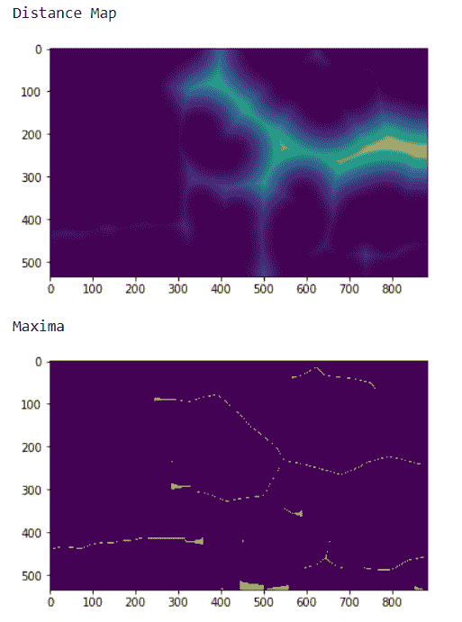

# maho tas–突出显示图像最大值

> 原文:[https://www . geesforgeks . org/maho tas-highlight-image-maxima/](https://www.geeksforgeeks.org/mahotas-highlighting-image-maxima/)

在本文中，我们将看到如何在 mahotas 中突出图像的最大值。最大值可以在距离图图像中找到，因为在标记图像中每个标记都是最大值，但是在距离图中最大值可以很容易地识别。为此，我们将使用来自核分割基准的荧光显微图像。我们可以借助下面给出的命令
获得图像

```py
mahotas.demos.nuclear_image()
```

下图是核 _ 图像


为了做到这一点，我们将使用 mahotas.morph.regmax 方法

> **语法:** mahotas.morph.regmax(img，Bc)
> **参数:**以图像对象和 numpy ones 数组为参数
> **返回:**返回图像对象

**注意:**的输入应该是过滤后的图像或者加载为灰色
为了对图像进行过滤，我们将获取 numpy.ndarray 的图像对象，并借助索引对其进行过滤，下面是这样做的命令

```py
image = image[:, :, 0]
```

**例 1 :**

## 蟒蛇 3

```py
# importing various libraries
import mahotas
import mahotas.demos
import mahotas as mh
import numpy as np
from pylab import imshow, show

# loading nuclear image
nuclear = mahotas.demos.nuclear_image()

# filtering image
nuclear = nuclear[:, :, 0]

# adding gaussian filter
nuclear = mahotas.gaussian_filter(nuclear, 4)

# setting threshold
threshed = (nuclear > nuclear.mean())

# creating distance map
dmap = mahotas.distance(threshed)

print("Distance Map")
# showing image
imshow(dmap)
show()

# numpy ones array
Bc = np.ones((3, 2))

# getting maxima
maxima = mahotas.morph.regmax(dmap, Bc = Bc)

# showing image
print("Maxima")
imshow(maxima)
show()
```

**输出:**



**例 2 :**

## 蟒蛇 3

```py
# importing required libraries
import numpy as np
import mahotas
from pylab import imshow, show

# loading image
img = mahotas.imread('dog_image.png')

# filtering the image
img = img[:, :, 0]

# setting gaussian filter
gaussian = mahotas.gaussian_filter(img, 15)

# setting threshold value
gaussian = (gaussian > gaussian.mean())

# creating a labelled image
labelled, n_nucleus = mahotas.label(gaussian)

# getting distance map
dmap = mahotas.distance(labelled)

# showing image
print("Distance Map")
imshow(dmap)
show()

# numpy ones array
Bc = np.ones((4, 1))

# getting maxima
maxima = mahotas.morph.regmax(dmap, Bc = Bc)

# showing image
print("Maxima")
imshow(maxima)
show()
```

**输出:**

