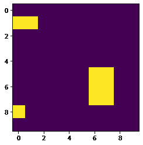
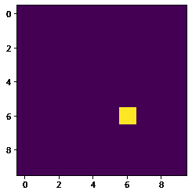
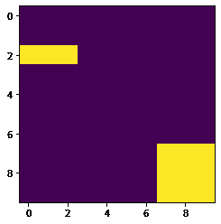
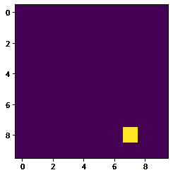

# 马霍斯–命中&未命中转换

> 原文:[https://www.geeksforgeeks.org/mahotas-hit-miss-transform/](https://www.geeksforgeeks.org/mahotas-hit-miss-transform/)

在本文中，我们将看到如何在 mahotas 中执行命中和未命中转换。在数学形态学中，命中或未命中变换是一种使用形态学腐蚀算子和一对不相交的结构元素来检测二值图像中给定配置的操作。

> 为了做到这一点，我们将使用`mahotas.hitmiss`方法
> 
> **语法:** mahotas.hitmiss(img，模板)
> 
> **参数:**它以两个数组作为参数
> 
> **返回:**返回正常

下面是实现

```py
# importing required libraries
import mahotas as mh
import numpy as np
from pylab import imshow, show

# creating region
# numpy.ndarray
regions = np.zeros((10, 10), bool)

# setting 1 value to the region
regions[1, :2] = 1
regions[5:8, 6: 8] = 1
regions[8, 0] = 1

# showing the image with interpolation = 'nearest'
print("Image")
imshow(regions, interpolation ='nearest')
show()

# template for hit miss
template = np.array([
            [0, 1, 1],
            [0, 1, 1],
            [0, 1, 1]])

# hit miss transform
img = mahotas.hitmiss(regions, template)

# showing image
print("Image after hit miss transform")
imshow(img)
show()
```

**输出:**

```py
Image
```



```py
Image after hit miss transform
```



另一个例子

```py
# importing required libraries
import mahotas as mh
import numpy as np
from pylab import imshow, show

# creating region
# numpy.ndarray
regions = np.zeros((10, 10), bool)

# setting 1 value to the region
regions[2:3, :3] = 1
regions[7:, 7:] = 1

# showing the image with interpolation = 'nearest'
print("Image")
imshow(regions, interpolation ='nearest')
show()

# template for hit miss
template = np.array([
            [0, 1, 1],
            [0, 1, 1],
            [0, 1, 1]])

# hit miss transform
img = mahotas.hitmiss(regions, template)

# showing image
print("Image after hit miss transform")
imshow(img)
show()
```

**输出:**

```py
Image
```



```py
Image after hit miss transform
```

