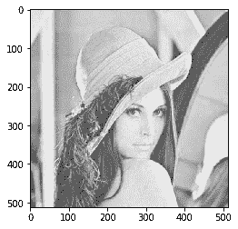
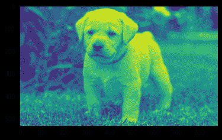
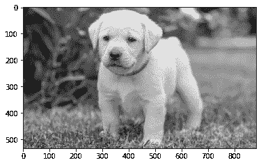

# maho tas–图像叠加

> 原文:[https://www.geeksforgeeks.org/mahotas-image-overlay/](https://www.geeksforgeeks.org/mahotas-image-overlay/)

在本文中，我们将看到如何在 mahotas 中应用图像覆盖。mahotas 中的图像覆盖创建了一个灰度图像，但可能有布尔覆盖。

在本教程中我们将使用“lena”图像，下面是加载它的命令。

```py
mahotas.demos.load('lena')
```

下图是莉娜形象


> 为此，我们将使用 mahotas.overlay 方法
> **语法:** mahotas.overlay(img)
> **参数:**它以图像对象作为参数
> **返回:**它返回图像对象

**注意:**输入图像应被过滤或加载为灰色

为了过滤图像，我们将获取 numpy.ndarray 的图像对象，并在索引的帮助下过滤它，下面是这样做的命令

```py
image = image[:, :, 0]
```

下面是实现

## 蟒蛇 3

```py
# importing required libraries
import mahotas
import mahotas.demos
from pylab import gray, imshow, show
import numpy as np
import matplotlib.pyplot as plt

# loading image
img = mahotas.demos.load('lena')

# filtering image
img = img.max(2)

print("Image")

# showing image
imshow(img)
show()

# Overlay method
new_img = mahotas.overlay(img)

# showing image
print("Overlay Image")
imshow(new_img)
show()
```

**输出:**

```py
Image
```


```py
Overlay Image
```



**另一个例子**

## 蟒蛇 3

```py
# importing required libraries
import mahotas
import numpy as np
from pylab import gray, imshow, show
import os
import matplotlib.pyplot as plt

# loading image
img = mahotas.imread('dog_image.png')

# filtering image
img = img[:, :, 0]

print("Image")

# showing image
imshow(img)
show()

# Overlay method
new_img = mahotas.overlay(img)

# showing image
print("Overlay Image")
imshow(new_img)
show()
```

**输出:**

```py
Image
```



```py
Overlay Image
```

