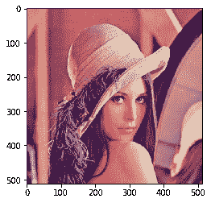
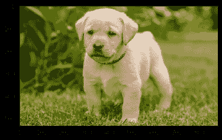
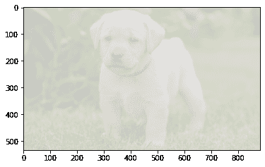

# maho tas–图像拉伸 RGB

> 原文:[https://www.geeksforgeeks.org/mahotas-image-stretch-rgb/](https://www.geeksforgeeks.org/mahotas-image-stretch-rgb/)

在本文中，我们将看到如何在 mahotas 中对 RGB 图像进行拉伸。对比度拉伸(通常称为归一化)是一种简单的图像增强技术，它试图通过“拉伸”图像中包含的亮度值范围来提高图像中的对比度，以跨越所需的值范围，例如相关图像类型允许的全部像素值范围。RGB 拉伸是拉伸()函数的变体，它对 RGB 图像的每个通道都有效

在本教程中我们将使用“lena”图像，下面是加载它的命令。

```py
mahotas.demos.load('lena')
```

下图是莉娜形象


> 为此，我们将使用 mahotas.regmin 方法
> **语法:**maho tas . stretch _ RGB(img)
> **参数:**它以图像对象作为参数
> **返回:**它返回图像对象

下面是实现

## 蟒蛇 3

```py
# importing required libraries
import mahotas
import mahotas.demos
from pylab import gray, imshow, show
import numpy as np
import matplotlib.pyplot as plt

# loading image
img = mahotas.demos.load('lena')

print("Image")

# showing image
imshow(img)
show()

# stretching rgb image
new_img = mahotas.stretch_rgb(img)

# Stretched image
print("Stretched Image")
imshow(new_img)
show()
```

**输出:**

```py
Image
```


```py
Stretched Image
```



另一个例子

## 蟒蛇 3

```py
# importing required libraries
import mahotas
import numpy as np
from pylab import gray, imshow, show
import os
import matplotlib.pyplot as plt

# loading image
img = mahotas.imread('dog_image.png')

print("Image")

# showing image
imshow(img)
show()

# stretching image
new_img = mahotas.stretch_rgb(img)

# Stretched image
print("Stretched Image")
imshow(new_img)
show()
```

**输出:**

```py
Image
```



```py
Stretched Image
```

