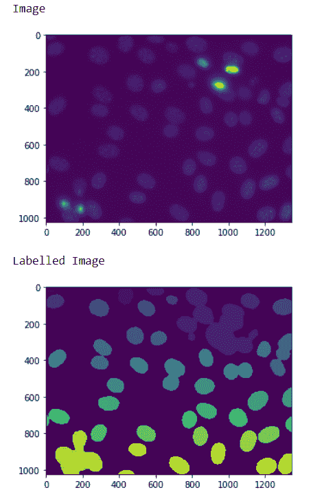
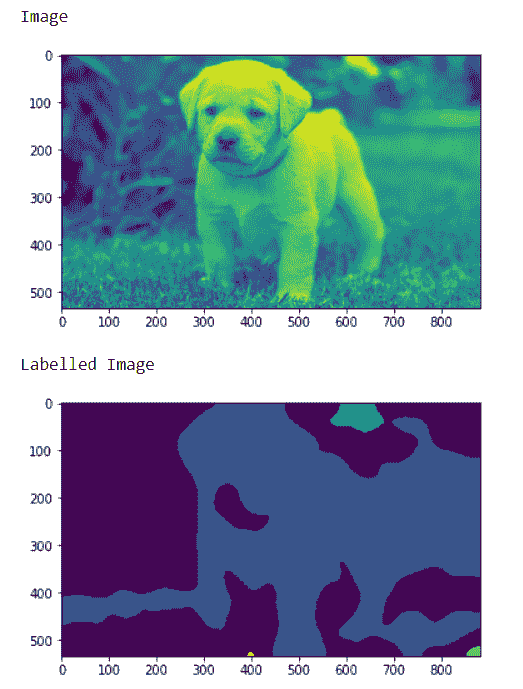

# maho tas–来自正常图像的标记图像

> 原文:[https://www . geeksforgeeks . org/maho tas-从正常图像中标记图像/](https://www.geeksforgeeks.org/mahotas-labelled-image-from-the-normal-image/)

在本文中，我们将看到如何从 mahotas 中的正常图像创建一个标签图像。为此，我们将使用来自核分割基准的荧光显微图像。我们可以借助下面给出的命令
获得图像

```py
mhotas.demos.nuclear_image()
```

下图是核 _ 图像


**标记图像**是整数图像，其中的值对应于不同的区域。也就是说，区域 1 是值为 1 的所有像素，区域 2 是值为 2 的像素，以此类推
为了做到这一点，我们将使用 mahotas.label 方法

> **语法:** mahotas.label(image)
> **参数:**它将加载的图像对象作为参数
> **返回:**它返回标记的图像和整数，即标签数量

**注意:**标签的输入应该是过滤后的图像对象，它应该有阈值，并且最好图像应该有高斯滤波器来去除更尖锐的边缘。
为了过滤图像，我们将获取 numpy.ndarray 的图像对象，并借助索引对其进行过滤，下面是执行此操作的命令

```py
image = image[:, :, 0]
```

**例 1 :**

## 蟒蛇 3

```py
# importing required libraries
import mahotas
import numpy as np
from pylab import imshow, show
import os

# loading nuclear image
f = mahotas.demos.load('nuclear')

# setting filter to the image
f = f[:, :, 0]

# show the image
print("Image")
imshow(f)
show()

# setting gaussian filter
f = mahotas.gaussian_filter(f, 4)

# setting threshold value
f = (f> f.mean())

# creating a labelled image
labelled, n_nucleus = mahotas.label(f)

# showing the labelled image
print("Labelled Image")
imshow(labelled)
show()
```

**输出:**



**例 2 :**

## 蟒蛇 3

```py
# importing required libraries
import numpy as np
import mahotas
from pylab import imshow, show

# loading image
img = mahotas.imread('dog_image.png')

# filtering the image
img = img[:, :, 0]

print("Image")
# showing the image
imshow(img)
show()

# setting gaussian filter
gaussian = mahotas.gaussian_filter(img, 15)

# setting threshold value
gaussian = (gaussian > gaussian.mean())

# creating a labelled image
labelled, n_nucleus = mh.label(gaussian)

print("Labelled Image")
# showing the gaussian filter
imshow(labelled)
show()
```

**输出:**

