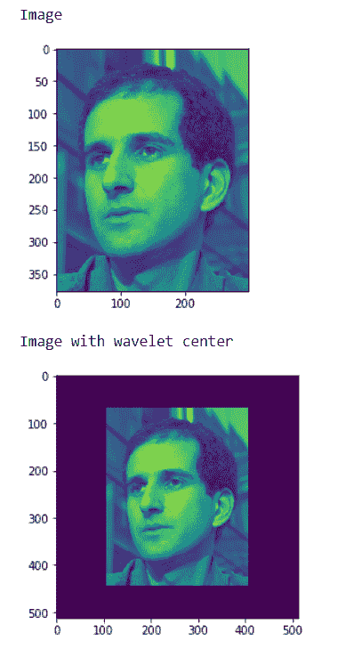
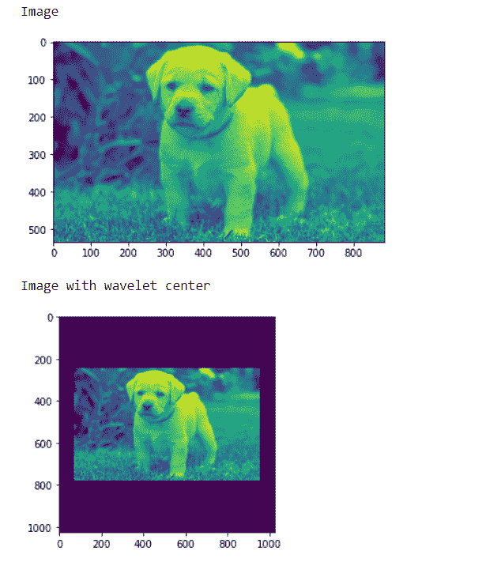

# maho tas–制作图像小波中心

> 原文:[https://www . geesforgeks . org/maho tas-making-image-小波-center/](https://www.geeksforgeeks.org/mahotas-making-image-wavelet-center/)

在本文中，我们将看到如何在 mahotas 中制作图像小波中心。小波表示图像中特征的比例以及它们的位置。小波中心将使图像变小，并将其放在中心，不像 daubechies 小波。
在本教程中我们将使用“luispedro”图像，下面是加载它的命令。

```
mahotas.demos.load('luispedro')
```

下面是路易斯德罗的图片


为了做到这一点，我们将使用小波中心法

> **语法:** mahotas .小波中心(img)
> **自变量:**它以图像对象为自变量
> **返回:**它返回图像对象

**注意:**输入图像应该被过滤或者应该被加载为灰色
为了过滤图像，我们将获取 numpy.ndarray 的图像对象，并借助索引对其进行过滤，下面是这样做的命令

```
image = image[:, :, 0]
```

**例 1:**

## 蟒蛇 3

```
# importing various libraries
import numpy as np
import mahotas
import mahotas.demos
from mahotas.thresholding import soft_threshold
from pylab import imshow, show
from os import path

# loading image
f = mahotas.demos.load('luispedro', as_grey = True)

# showing image
print("Image")

imshow(f)
show()

# making image wavelet center
fc = mahotas.wavelet_center(f)

# showing image
print("Image with wavelet center")
imshow(fc)
show()
```

**输出:**



**例 2:**

## 蟒蛇 3

```
# importing required libraries
import mahotas
import numpy as np
from pylab import imshow, show
import os

# loading image
img = mahotas.imread('dog_image.png')

# filtering image
img = img[:, :, 0]

# showing image
print("Image")

imshow(img)
show()

# making image wavelet center
fc = mahotas.wavelet_center(img)

# showing image
print("Image with wavelet center")
imshow(fc)
show()
```

**输出:**

