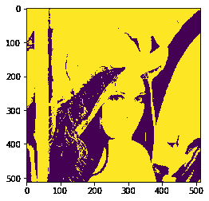
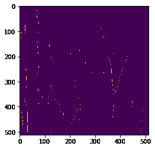
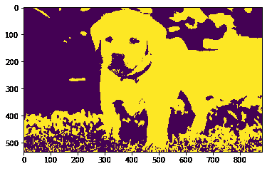
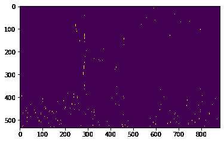

# maho tas–将模板与图像精确匹配

> 原文:[https://www . geesforgeks . org/maho tas-match-template-to-image-just/](https://www.geeksforgeeks.org/mahotas-match-template-to-image-exactly/)

在本文中，我们将看到如何将模板与 mahotas 中的图像进行匹配。通过匹配模板，我们可以借助于我们想要找到的结构来找到图像中的特定位置或事物。

在本教程中我们将使用“lena”图像，下面是加载它的命令。

```py
mahotas.demos.load('lena')
```

下面是莉娜的形象


> 为此，我们将使用 mahotas.find 方法
> 
> **语法:** mahotas.find(img，模板)
> 
> **自变量:**以图像对象和模板为自变量
> 
> **返回:**返回布尔数组

**注意:**输入图像应被过滤或加载为灰色

为了过滤图像，我们将获取 numpy.ndarray 的图像对象，并在索引的帮助下过滤它，下面是这样做的命令

```py
image = image[:, :, 0]
```

下面是实现

## 蟒蛇 3

```py
# importing required libraries
import mahotas
import mahotas.demos
from pylab import gray, imshow, show
import numpy as np

# loading image
img = mahotas.demos.load('lena')

# filtering image
img = img.max(2)

# otsu method
T_otsu = mahotas.otsu(img)  

# image values should be greater than otsu value
img = img > T_otsu

print("Image threshold using Otsu Method")

# showing image
imshow(img)
show()

# template
template = np.array([
        [0, 1, 1],
        [0, 1, 1],
        [0, 1, 1]], bool)

# finding template in the image
new_img = mahotas.find(img, template)

print("Image with only templates")
# showing new image
imshow(new_img)
show()
```

**输出:**

```py
Image threshold using Otsu Method
```



```py
Image with only templates
```



**另一个例子**

## 蟒蛇 3

```py
# importing required libraries
import mahotas
import numpy as np
from pylab import gray, imshow, show
import os

# loading image
img = mahotas.imread('dog_image.png')

# filtering image
img = img[:, :, 0]

# otsu method
T_otsu = mahotas.otsu(img)  

# image values should be greater than otsu value
img = img > T_otsu

print("Image threshold using Otsu Method")

# showing image
imshow(img)
show()

# template
template = np.array([
        [0, 1, 1],
        [0, 1, 1],
        [0, 1, 1]], bool)

# finding template in the image
new_img = mahotas.find(img, template)

print("Image with only templates")
# showing new image
imshow(new_img)
show()
```

**输出:**

```py
Image threshold using Otsu Method
```



```py
Image with only templates
```

