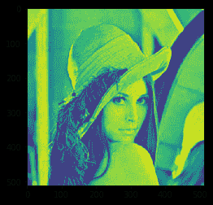
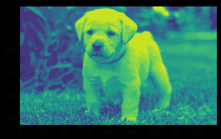

# maho tas–均值滤波器

> 原文:[https://www.geeksforgeeks.org/mahotas-mean-filter/](https://www.geeksforgeeks.org/mahotas-mean-filter/)

在本文中，我们将了解如何在 mahotas 中对图像应用均值滤波。平均(或平均)滤波是一种通过减少相邻像素之间的亮度变化量来“平滑”图像的方法。平均滤波器通过逐个像素地移动图像来工作，用相邻像素的平均值替换每个值，包括其本身。
在本教程中我们将使用“lena”图像，下面是加载它的命令。

```
mahotas.demos.load('lena')
```

下图是莉娜形象


> 为此，我们将使用 mahotas.mean_filter 方法
> **语法:** mahotas.mean_filter(img，n)
> **参数:**它以图像对象和相邻像素为参数
> **返回:**它返回图像对象

**注意:**输入图像应被过滤或加载为灰色

为了过滤图像，我们将获取 numpy.ndarray 的图像对象，并在索引的帮助下过滤它，下面是这样做的命令

```
image = image[:, :, 0]
```

下面是实现

## 蟒蛇 3

```
# importing required libraries
import mahotas
import mahotas.demos
from pylab import gray, imshow, show
import numpy as np
import matplotlib.pyplot as plt

# loading image
img = mahotas.demos.load('lena')

# filtering image
img = img.max(2)

print("Image")

# showing image
imshow(img)
show()

# applying mean filter
new_img = mahotas.mean_filter(img, n)

# showing image
print("Mean Filter")
imshow(new_img)
show()
```

**输出:**

```
Image
```


```
Mean Filter
```



另一个例子

## 蟒蛇 3

```
# importing required libraries
import mahotas
import numpy as np
from pylab import gray, imshow, show
import os
import matplotlib.pyplot as plt

# loading image
img = mahotas.imread('dog_image.png')

# filtering image
img = img[:, :, 0]

print("Image")

# showing image
imshow(img)
show()

# applying mean filter
new_img = mahotas.mean_filter(img, n)

# showing image
print("Mean Filter")
imshow(new_img)
show()
```

**输出:**

```
Image
```


```
Mean Filter
```

