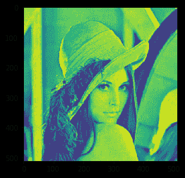
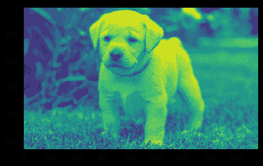

# maho tas–中值滤波器

> 原文:[https://www.geeksforgeeks.org/mahotas-median-filter/](https://www.geeksforgeeks.org/mahotas-median-filter/)

在本文中，我们将了解如何在 mahotas 中对图像应用中值滤波。中值滤波是一种非线性数字滤波技术，通常用于去除图像或信号中的噪声。这种降噪是典型的预处理步骤，用于改善后续处理的结果(例如，图像的边缘检测)。
在本教程中我们将使用“lena”图像，下面是加载它的命令。

```
mahotas.demos.load('lena')
```

下面是莉娜的形象


> 为此，我们将使用 mahotas .中值滤波方法
> **语法:** mahotas .中值滤波(img)
> **参数:**它以图像对象作为参数
> **返回:**它返回图像对象

**注意:**输入图像应被过滤或应加载为灰色
为了过滤图像，我们将获取 numpy.ndarray 的图像对象，并借助索引对其进行过滤，下面是这样做的命令

```
image = image[:, :, 0]
```

下面是实现

## 蟒蛇 3

```
# importing required libraries
import mahotas
import mahotas.demos
from pylab import gray, imshow, show
import numpy as np
import matplotlib.pyplot as plt

# loading image
img = mahotas.demos.load('lena')

# filtering image
img = img.max(2)

print("Image")

# showing image
imshow(img)
show()

# applying median filter
new_img = mahotas.median_filter(img)

# showing image
print("Median Filter")
imshow(new_img)
show()
```

**输出:**

```
Image
```


```
Median Filter
```



另一个例子

## 蟒蛇 3

```
# importing required libraries
import mahotas
import numpy as np
from pylab import gray, imshow, show
import os
import matplotlib.pyplot as plt

# loading image
img = mahotas.imread('dog_image.png')

# filtering image
img = img[:, :, 0]

print("Image")

# showing image
imshow(img)
show()

# applying median filter
new_img = mahotas.median_filter(img)

# showing image
print("Median Filter")
imshow(new_img)
show()
```

**输出:**

```
Image
```


```
Median Filter
```

