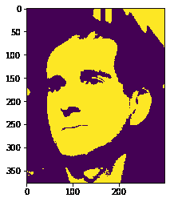
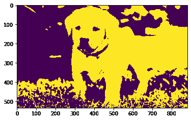

# maho tas–图像上的打开过程

> 原文:[https://www . geeksforgeeks . org/maho tas-open-process on-image/](https://www.geeksforgeeks.org/mahotas-opening-process-on-image/)

在本文中，我们将看到如何在 mahotas 中打开图像。打开是首先执行侵蚀操作然后执行扩张操作的过程。它消除了所获得图像的薄突起，并用于去除所获得图像的内部噪声。

在本教程中我们将使用“luispedro”图像，下面是加载它的命令。

```
mahotas.demos.load('luispedro')
```

下面是路易斯德罗的照片


为此，我们将使用 mahotas.morph.openmethod

> **语法:**maho tas . morph . open(image)
> **自变量:**它以图像对象为自变量
> **返回:**它返回图像对象

**注意:**输入图像应被过滤或加载为灰色

为了过滤图像，我们将获取 numpy.ndarray 的图像对象，并在索引的帮助下过滤它，下面是这样做的命令

```
image = image[:, :, 0]
```

下面是实现

## 蟒蛇 3

```
# importing required libraries
import mahotas
import mahotas.demos
from pylab import gray, imshow, show
import numpy as np

# loading image
luispedro = mahotas.demos.load('luispedro')

# filtering image
luispedro = luispedro.max(2)

# otsu method
T_otsu = mahotas.otsu(luispedro)

# image values should be greater than otsu value
img = luispedro > T_otsu

print("Image threshold using Otsu Method")

# showing image
imshow(img)
show()

# opening image
new_img = mahotas.morph.open(img)

# showing new image
print("Opened Image")
imshow(new_img)
show()
```

**输出:**

```
Image threshold using Otsu Method
```


```
Opened Image
```



另一个例子

## 蟒蛇 3

```
# importing required libraries
import mahotas
import numpy as np
import matplotlib.pyplot as plt
import os

# loading image
img = mahotas.imread('dog_image.png')

# setting filter to the image
img = img[:, :, 0]

# otsu method
T_otsu = mahotas.otsu(img)

# image values should be greater than otsu value
img = img > T_otsu

print("Image threshold using Otsu Method")

# showing image
imshow(img)
show()

# opening image
new_img = mahotas.morph.open(img)

# showing new image
print("Opened Image")
imshow(new_img)
show()
```

**输出:**

```
Image threshold using Otsu Method
```


```
Opened Image
```

