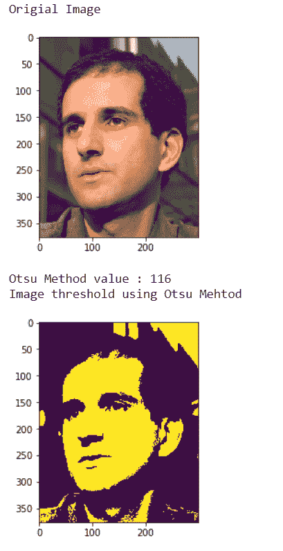
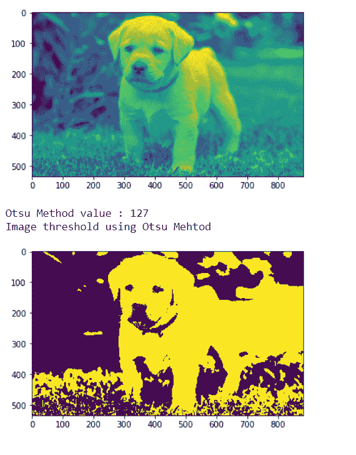

# maho tas–大津的方法

> 原文:[https://www.geeksforgeeks.org/mahotas-otsus-method/](https://www.geeksforgeeks.org/mahotas-otsus-method/)

在本文中，我们将看到如何在 mahotas 中实现 otsu 的方法。在计算机视觉和图像处理中，大津的方法以大津信行的名字命名，用于执行自动图像阈值处理。在最简单的形式中，该算法返回单个强度阈值，该阈值将像素分成两类，前景和背景。

在本教程中我们将使用“luispedro”图像，下面是加载它的命令。

```py
mahotas.demos.load('luispedro')
```

下面是路易斯德罗的照片


为此，我们将使用 mahotas.otsu 方法

> **语法:** mahotas.otsu(image)
> **自变量:**它以 image object 为自变量
> **返回:**它返回 integer

**注意:**输入图像应被过滤或加载为灰色

为了过滤图像，我们将获取 numpy.ndarray 的图像对象，并在索引的帮助下过滤它，下面是这样做的命令

```py
image = image[:, :, 0]
```

**例 1:**

## 蟒蛇 3

```py
# importing required libraries
import mahotas
import mahotas.demos
import numpy as np
from pylab import imshow, gray, show
from os import path

# loading the image
photo = mahotas.demos.load('luispedro')

# showing original image
print("Original Image")
imshow(photo)
show()

# loading image as grey
photo = mahotas.demos.load('luispedro', as_grey = True)

# converting image type to unit8
# because as_grey returns floating values
photo = photo.astype(np.uint8)

# otsu method
T_otsu = mahotas.otsu(photo)

# printing otsu value
print("Otsu Method value : " + str(T_otsu))

print("Image threshold using Otsu Method")
# showing image
# image values should be greater than otsu value
imshow(photo > T_otsu)
show()
```

**输出:**



**例 2:**

## 蟒蛇 3

```py
# importing required libraries
import mahotas
import numpy as np
from pylab import imshow, show
import os

# loading image
img = mahotas.imread('dog_image.png')

# setting filter to the image
img = img[:, :, 0]

imshow(img)
show()

# otsu method
T_otsu = mahotas.otsu(img)

# printing otsu value
print("Otsu Method value : " + str(T_otsu))

print("Image threshold using Otsu Method")
# showing image
# image values should be greater than otsu value
imshow(img > T_otsu)
show()
```

**输出:**

