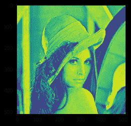

# maho tas–等级过滤器

> 原文:[https://www.geeksforgeeks.org/mahotas-rank-filter/](https://www.geeksforgeeks.org/mahotas-rank-filter/)

在本文中，我们将了解如何在 mahotas 中对图像应用等级过滤器。等级过滤器，尤其是过滤掉孤立的像素，其强度与其紧邻的像素有很大不同。使用此滤镜后，与这些像素相邻的具有恒定强度值的大区域以及边缘将被保留。

在本教程中我们将使用“lena”图像，下面是加载它的命令。

```py
mahotas.demos.load('lena')
```

下图是莉娜形象


> 为了做到这一点，我们将使用`mahotas.rank_filter`方法
> 
> **语法:** mahotas.rank_filter(img，neighbour，rank)
> 
> **自变量:**以图像对象和两个整数为自变量
> 
> **返回:**返回图像对象

**注意:**输入图像应被过滤或加载为灰色

为了过滤图像，我们将获取 numpy.ndarray 的图像对象，并在索引的帮助下过滤它，下面是这样做的命令

```py
image = image[:, :, 0]
```

下面是实现

```py
# importing required libraries
import mahotas
import mahotas.demos
from pylab import gray, imshow, show
import numpy as np
import matplotlib.pyplot as plt

# loading iamge
img = mahotas.demos.load('lena')

# filtering image
img = img.max(2)

print("Image")

# showing image
imshow(img)
show()

# neighbour pixel
neighbour = 3

# rank
rank = 2

# applaying rank filter
new_img = mahotas.rank_filter(img, neighbour, rank)

# showing image
print("Rank Filter")
imshow(new_img)
show()
```

**输出:**

```py
Image
```


```py
Rank Filter
```



另一个例子

```py
# importing required libraries
import mahotas
import numpy as np
from pylab import gray, imshow, show
import os
import matplotlib.pyplot as plt

# loading iamge
img = mahotas.imread('dog_image.png')

# fltering image
img = img[:, :, 0]

print("Image")

# showing image
imshow(img)
show()

# neighbour pixel
neighbour = 3

# rank
rank = 2

# applaying rank filter
new_img = mahotas.rank_filter(img, neighbour, rank)

# showing image
print("Rank Filter")
imshow(new_img)
show()
```

**输出:**

```py
Image
```


```py
Rank Filter
```

