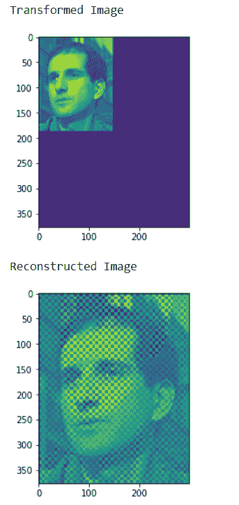
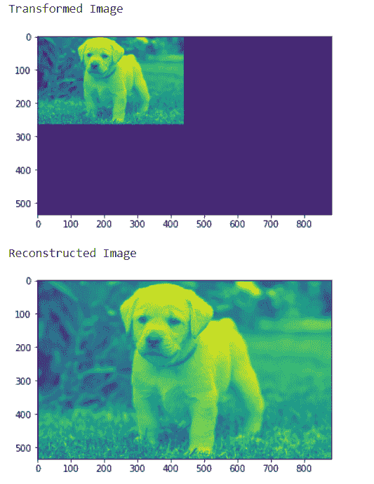

# maho tas–从变换的道贝希小波图像重建图像

> 原文:[https://www . geeksforgeeks . org/maho tas-重构-图像-从-变换-daubechies-小波-图像/](https://www.geeksforgeeks.org/mahotas-reconstructing-image-from-transformed-daubechies-wavelet-image/)

在本文中，我们将看到如何从 mahotas 中的 daubechies 小波的变换图像重建图像。一般来说，对于给定的支撑宽度 2A，道贝希小波被选择为具有最高数量的消失矩(这并不意味着最佳平滑度)。有两种命名方案在使用，DN 使用抽头的长度或数量，dbA 指消失矩的数量。所以 D4 和 db2 是相同的小波变换。
在本教程中我们将使用“luispedro”图像，下面是加载它的命令。

```
mahotas.demos.load('luispedro')
```

下面是路易斯德罗的图片


为此，我们将使用 mahotas.idaubechies 方法

> **语法:** mahotas.idaubechies(img，' D8')
> **参数:**它以图像对象和字符串即‘D2’、‘D4’、…‘D20’之一作为参数
> **返回:**它返回图像对象

**注意:**输入图像应该被过滤或者应该被加载为灰色
为了过滤图像，我们将获取 numpy.ndarray 的图像对象，并借助索引对其进行过滤，下面是这样做的命令

```
image = image[:, :, 0]
```

**例 1:**

## 蟒蛇 3

```
# importing various libraries
import numpy as np
import mahotas
import mahotas.demos
from mahotas.thresholding import soft_threshold
from pylab import imshow, show
from os import path

# loading image
f = mahotas.demos.load('luispedro', as_grey = True)

# Transform using D8 Wavelet to obtain transformed image t
t = mahotas.daubechies(f, 'D8')

# Discard low-order bits:
t /= 8
t = t.astype(np.int8)

# showing transformed image
print("Transformed Image")
imshow(t)
show()

# reconstructed image
r = mahotas.idaubechies(t, 'D8')

# showing image
print("Reconstructed Image")
imshow(r)
show()
```

**输出:**



**例 2:**

## 蟒蛇 3

```
# importing required libraries
import mahotas
import numpy as np
from pylab import imshow, show
import os

# loading image
img = mahotas.imread('dog_image.png')

# filtering image
img = img[:, :, 0]

# Transform using D8 Wavelet to obtain transformed image t
t = mahotas.daubechies(img, 'D8')

# showing transformed image
print("Transformed Image")
imshow(t)
show()

# reconstructed image
r = mahotas.idaubechies(t, 'D8')

# showing image
print("Reconstructed Image")
imshow(r)
show()
```

**输出:**

