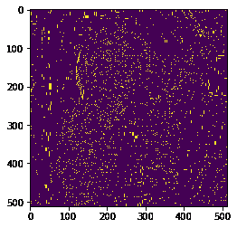

# maho tas–图像的区域最大值

> 原文:[https://www . geesforgeks . org/maho tas-regional-maxima-of-image/](https://www.geeksforgeeks.org/mahotas-regional-maxima-of-image/)

在本文中，我们将看到如何在 mahotas 中获得图像的区域最大值。区域最大值是比局部最大值更严格的标准，因为它考虑了整个对象，而不仅仅是邻域。最大值是具有恒定强度值的像素的连接分量，被具有较低值的像素包围。

在本教程中我们将使用“lena”图像，下面是加载它的命令。

```
mahotas.demos.load('lena')
```

下图是莉娜形象


> 为此，我们将使用 mahotas.regmax 方法
> **语法:** mahotas.regmax(img)
> **参数:**它以图像对象作为参数
> **返回:**它返回图像对象

**注意:**输入图像应被过滤或加载为灰色

为了过滤图像，我们将获取 numpy.ndarray 的图像对象，并在索引的帮助下过滤它，下面是这样做的命令

```
image = image[:, :, 0]
```

下面是实现

## 蟒蛇 3

```
# importing required libraries
import mahotas
import mahotas.demos
from pylab import gray, imshow, show
import numpy as np
import matplotlib.pyplot as plt

# loading image
img = mahotas.demos.load('lena')

# filtering image
img = img.max(2)

print("Image")

# showing image
imshow(img)
show()
# finding regional maxima
new_img = mahotas.regmax(img)

# showing image
print("Regional Maxima")
imshow(new_img)
show()
```

**输出:**

```
Image

```


```
Regional Maxima
```



**另一个例子**

## 蟒蛇 3

```
# importing required libraries
import mahotas
import numpy as np
from pylab import gray, imshow, show
import os
import matplotlib.pyplot as plt

# loading image
img = mahotas.imread('dog_image.png')

# filtering image
img = img[:, :, 0]

print("Image")

# showing image
imshow(img)
show()

# finding regional maxima
new_img = mahotas.regmax(img)

# showing image
print("Regional Maxima")
imshow(new_img)
show()
```

**输出:**

```
Image
```


```
Regional Maxima
```

