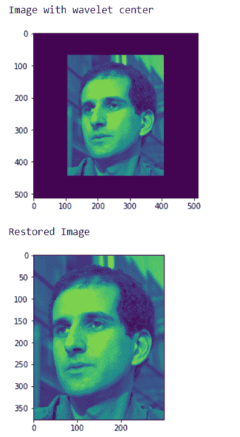
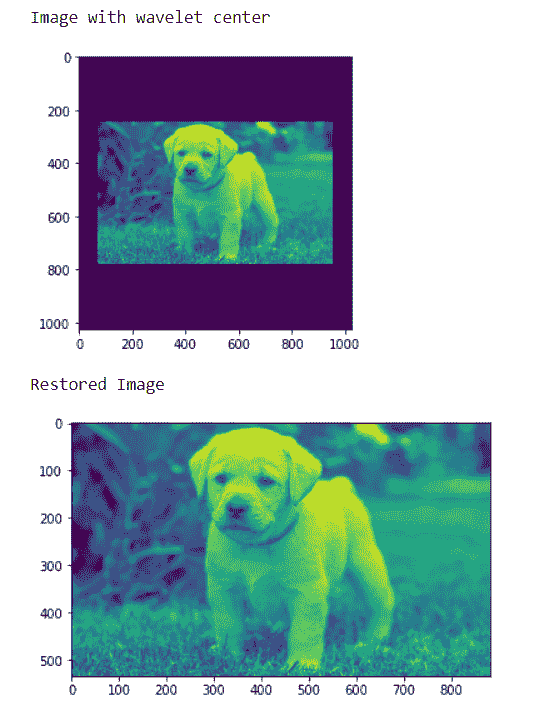

# maho tas–去除小波中心图像的边界效果

> 原文:[https://www . geesforgeks . org/maho tas-移除-边界-效果-从小波-中心-图像/](https://www.geeksforgeeks.org/mahotas-removing-border-effect-from-wavelet-center-image/)

在本文中，我们将看到如何在 mahotas 中消除小波中心的边界效应。小波表示图像中特征的比例以及它们的位置。小波中心将使图像变小，并将其放在中心，不像 daubechies 小波。我们使用小波中心法对图像进行小波中心化。
在本教程中我们将使用“luispedro”图像，下面是加载它的命令。

```py
mahotas.demos.load('luispedro')
```

下面是路易斯德罗的图片


为了做到这一点，我们将使用小波偏心方法

> **语法:** mahotas .小波 _ 偏心(centered_image，original_img_shape)
> **参数:**它以图像对象和原始图像形状为参数
> **返回:**它返回图像对象

**注意:**输入图像应被过滤或加载为灰色

为了过滤图像，我们将获取 numpy.ndarray 的图像对象，并在索引的帮助下过滤它，下面是这样做的命令

```py
image = image[:, :, 0]
```

**例 1:**

## 蟒蛇 3

```py
# importing various libraries
import numpy as np
import mahotas
import mahotas.demos
from mahotas.thresholding import soft_threshold
from pylab import imshow, show
from os import path

# loading image
f = mahotas.demos.load('luispedro', as_grey = True)

# making image wavelet center
fc = mahotas.wavelet_center(f)

# showing image
print("Image with wavelet center")
imshow(fc)
show()

# restoring image
rd = mahotas.wavelet_decenter(fc, f.shape)

# showing image
print("Restored Image")
imshow(rd)
show()
```

**输出:**



**例 2:**

## 蟒蛇 3

```py
# importing required libraries
import mahotas
import numpy as np
from pylab import imshow, show
import os

# loading image
img = mahotas.imread('dog_image.png')

# filtering image
img = img[:, :, 0]

# making image wavelet center
fc = mahotas.wavelet_center(img)

# showing image
print("Image with wavelet center")
imshow(fc)
show()

# restoring image
rd = mahotas.wavelet_decenter(fc, img.shape)

# showing image
print("Restored Image")
imshow(rd)
show()
```

**输出:**

