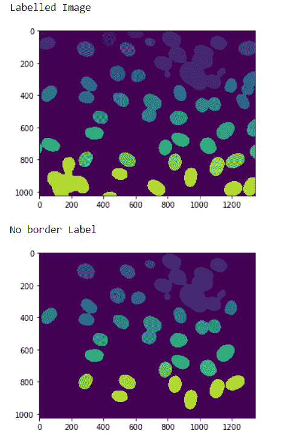
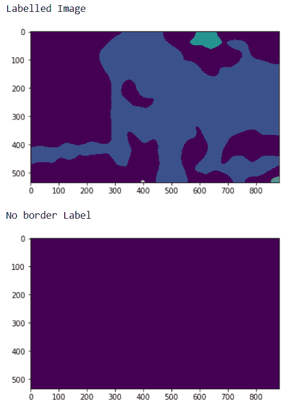

# maho tas–移除带边框的标签

> 原文:[https://www . geesforgeks . org/maho tas-remove-bordered-label/](https://www.geeksforgeeks.org/mahotas-removing-bordered-labeled/)

在本文中，我们将看到如何在 mahotas 中从标签图像中移除带边框的标签。边框标签是那些接触到边框的标签，我们可以借助于 mahotas.label 方法从普通图像创建标签图像。
为此，我们将使用来自核分割基准的荧光显微图像。我们可以借助下面给出的命令
获得图像

```
mhotas.demos.nuclear_image()
```

下图是核 _ 图像


**标记图像**是整数图像，其中的值对应于不同的区域。也就是说，区域 1 是值为 1 的所有像素，区域 2 是值为 2 的像素，以此类推
为了做到这一点，我们将使用 mahotas.remove _ bordering 方法

> **语法:**maho tas . remove _ boring(被标记)
> **参数:**它将被标记的图像对象作为参数
> **返回:**它返回在边界没有标记的被标记的图像

**例 1:**

## 蟒蛇 3

```
# importing required libraries
import mahotas
import numpy as np
from pylab import imshow, show
import os

# loading nuclear image
f = mahotas.demos.load('nuclear')

# setting filter to the image
f = f[:, :, 0]

# setting gaussian filter
f = mahotas.gaussian_filter(f, 4)

# setting threshold value
f = (f> f.mean())

# creating a labelled image
labelled, n_nucleus = mahotas.label(f)

# showing the labelled image
print("Labelled Image")
imshow(labelled)
show()

# removing border labels
labelled = mahotas.labelled.remove_bordering(labelled)

# showing the image
print("No border Label")
imshow(labelled)
show()
```

**输出:**



**例 2:**

## 蟒蛇 3

```
# importing required libraries
import numpy as np
import mahotas
from pylab import imshow, show

# loading image
img = mahotas.imread('dog_image.png')

# filtering the image
img = img[:, :, 0]

# setting gaussian filter
gaussian = mahotas.gaussian_filter(img, 15)

# setting threshold value
gaussian = (gaussian > gaussian.mean())

# creating a labelled image
labelled, n_nucleus = mahotas.label(gaussian)

print("Labelled Image")
# showing the gaussian filter
imshow(labelled)
show()

# removing border labels
labelled = mahotas.labelled.remove_bordering(labelled)

# showing the image
print("No border Label")
imshow(labelled)
show()
```

**输出:**

