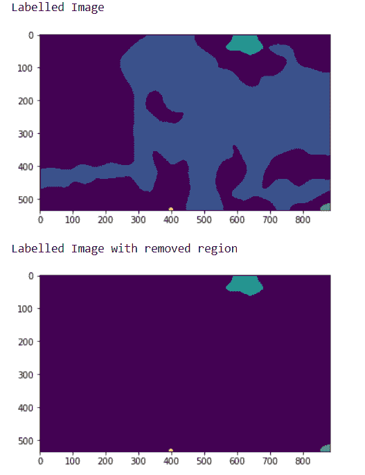
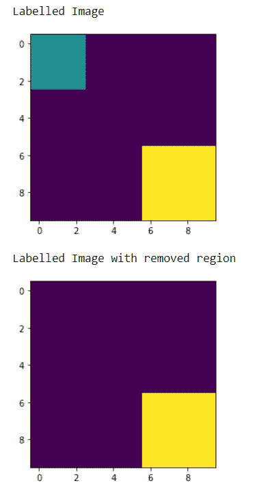

# maho tas–移除给定位置的区域

> 原文:[https://www . geeksforgeeks . org/maho tas-在给定位置移除区域/](https://www.geeksforgeeks.org/mahotas-removing-region-at-given-position/)

在本文中，我们将看到如何删除 mahotas 中给定位置的区域。标记图像是整数图像，其中的值对应于不同的区域。即，区域 1 是具有值 1 的所有像素，区域 2 是具有值 2 的像素，以此类推。按照惯例，区域 0 是背景，通常处理方式不同。我们可以在 mahotas.label 方法的帮助下创建一个标记区域。为了做到这一点，我们将使用方法

> **语法:**maho tas . label . remove _ regions(label _ img，I，j)
> **参数:**它获取带标签的图像和代表该区域的两个整数
> **返回:**它返回 numpy.ndarray 即图像对象

**例 1:**

## 蟒蛇 3

```py
# importing required libraries
import mahotas
import numpy as np
from pylab import imshow, show
import os

# loading image
img = mahotas.imread('dog_image.png')

# setting filter to the image
img = img[:, :, 0]

# setting gaussian filter
img = mahotas.gaussian_filter(img, 15)

# setting threshold value
img = (img> img.mean())

# creating a labelled image
labeled1, n_nucleus1 = mahotas.label(img)

# showing the labelled image
print("Labelled Image")
imshow(labelled1)
show()

# removing region
labelled2 = mahotas.labelled.remove_regions(labelled1, 1, 1)

# showing the labelled image
print("Labelled Image with removed region")
imshow(labelled2)
show()
```

**输出:**



**例 2:**

## 蟒蛇 3

```py
# importing required libraries
import mahotas
import numpy as np
from pylab import imshow, show

# creating region
# numpy.ndarray
regions = np.zeros((10, 10), bool)

# setting 1 value to the region
regions[:3, :3] = 1
regions[6:, 6:] = 1

# getting labelled function
labelled, nr_objects = mahotas.label(regions)

print("Labelled Image")
# showing the image with interpolation = 'nearest'
imshow(labelled, interpolation ='nearest')
show()

# removing region
labelled2 = mahotas.labelled.remove_regions(labelled, 1, 1)

# showing the labelled image
print("Labelled Image with removed region")
imshow(labelled2)
show()
```

**输出:**

