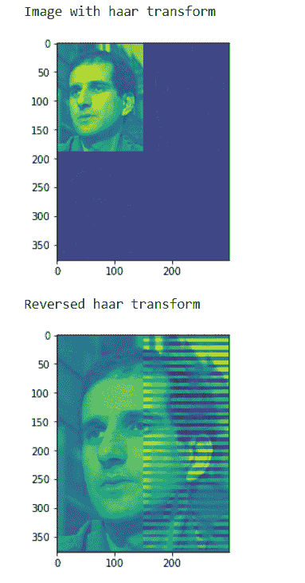
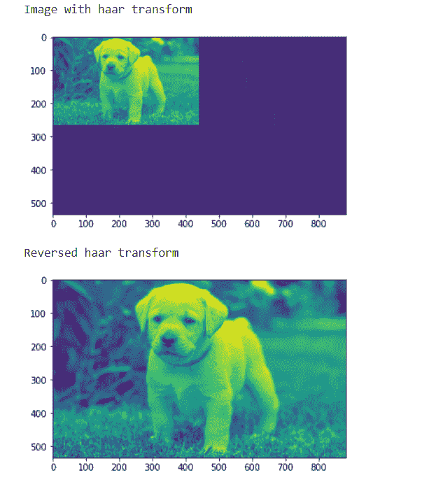

# maho tas–反转哈尔变换

> 原文:[https://www . geesforgeks . org/maho tas-reversing-Haar-transform/](https://www.geeksforgeeks.org/mahotas-reversing-haar-transform/)

在本文中，我们将看到如何在 mahotas 中反转图像哈尔变换。哈尔小波是一系列重新标度的“方形”函数，它们共同构成一个小波族或基。小波分析类似于傅立叶分析，因为它允许用正交基来表示一个区间上的目标函数。哈尔序列现在被认为是第一个已知的小波基，并被广泛用作教学例子。我们可以借助`mahotas.haar`方法进行哈尔变换

在本教程中我们将使用“luispedro”图像，下面是加载它的命令。

```
mahotas.demos.load('luispedro')
```

下图是吕斯佩德罗形象


为了做到这一点，我们将使用`mahotas.ihaar`方法

> **语法:**mahotas . ihar(hair _ img)
> 
> **自变量:**以图像对象为自变量
> 
> **返回:**返回图像对象

**注意:**输入图像应被过滤或加载为灰色

为了过滤图像，我们将获取 numpy.ndarray 的图像对象，并在索引的帮助下过滤它，下面是这样做的命令

```
image = image[:, :, 0]
```

**例 1:**

```
# importing various libraries
import numpy as np
import mahotas
import mahotas.demos
from mahotas.thresholding import soft_threshold
from pylab import imshow, show
from os import path

# loading image
f = mahotas.demos.load('luispedro', as_grey = True)

# haar transform
h = mahotas.haar(f)

# showing image
print("Image with haar transform")
imshow(h)
show()

# reversing haar transform
r = mahotas.ihaar(h)

# showing image
print("Reversed haar transform")
imshow(r)
show()
```

**输出:**


**例 2:**

```
# importing required libraries
import mahotas
import numpy as np
from pylab import imshow, show
import os

# loading iamge
img = mahotas.imread('dog_image.png')

# filtering iamge
img = img[:, :, 0]

# haar transform
h = mahotas.haar(img)

# showing image
print("Image with haar transform")
imshow(h)
show()

# reversing haar transform
r = mahotas.ihaar(h)

# showing image
print("Reversed haar transform")
imshow(r)
show()
```

**输出:**
