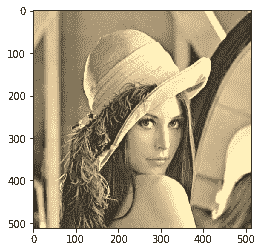
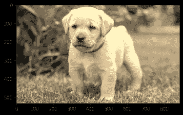

# maho tas–RGB 到棕褐色的转换

> 原文:[https://www . geesforgeks . org/maho tas-RGB 到 sepia-conversion/](https://www.geeksforgeeks.org/mahotas-rgb-to-sepia-conversion/)

在本文中，我们将了解如何在 mahotas 中将 rgb 图像转换为 sepia。RGB 图像，有时也称为真彩色图像，在 MATLAB 中存储为一个 m 乘 n 乘 3 的数据数组，该数组定义了每个单独像素的红色、绿色和蓝色分量。棕褐色调色效果在摄影中非常常用。它是改变灰度图像(即所谓的黑白图像)每个像素颜色强度的过程。
在本教程中我们将使用“lena”图像，下面是加载它的命令。

```
mahotas.demos.load('lena')
```

下图是莉娜形象


为了做到这一点，我们将使用 maho tas . colors . rgb2sepiamethod

> **语法:**maho tas . colors . rgb2sepia(img)
> **参数:**它以图像对象作为参数
> **返回:**它返回图像对象

下面是实现

## 蟒蛇 3

```
# importing required libraries
import mahotas
import mahotas.demos
from pylab import gray, imshow, show
import numpy as np

# loading image
img = mahotas.demos.load('lena')

# showing image
print("Image")
imshow(img)
show()

# rgb to sepia
new_img = mahotas.colors.rgb2sepia(img)

# showing new image
print("New Image")
imshow(new_img)
show()
```

**输出:**

```
Image
```


```
New Image
```



另一个例子

## 蟒蛇 3

```
# importing required libraries
import mahotas
import numpy as np
import matplotlib.pyplot as plt
import os

# loading image
img = mahotas.imread('dog_image.png')

# filtering image
img = img[:, :, :3]

# showing image
print("Image")
imshow(img)
show()

# rgb to sepia
new_img = mahotas.colors.rgb2sepia(img)

# showing new image
print("New Image")
imshow(new_img)
show()
```

**输出:**

```
Image
```


```
New Image
```

