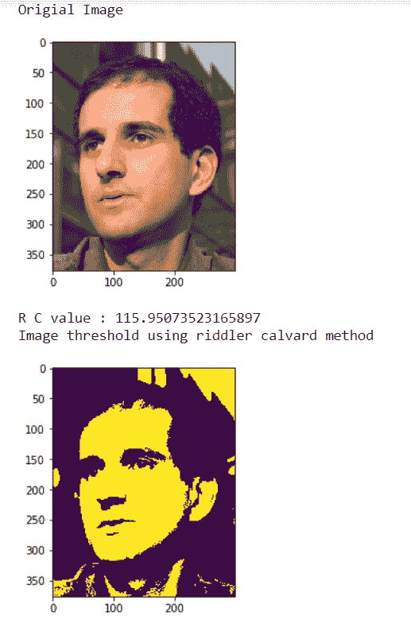
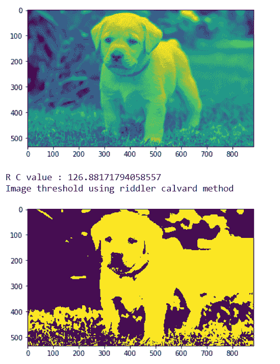

# 马霍塔斯-谜语-卡尔沃德法

> 原文:[https://www . geeksforgeeks . org/maho tas-谜语者-卡尔沃德-方法/](https://www.geeksforgeeks.org/mahotas-riddler-calvard-method/)

在本文中，我们将看到如何在 mahotas 中实现谜语卡尔沃德方法。这是大津方法的替代。Ridler 和 Calvard 算法使用迭代聚类方法。首先，进行阈值的初始估计(例如，平均图像强度)。阈值以上和以下的像素分别分配给对象和背景类。

在本教程中我们将使用“luispedro”图像，下面是加载它的命令。

```
mahotas.demos.load('luispedro')
```

下面是路易斯德罗的照片


为了做到这一点，我们将使用 mahotas.rc 方法

> **语法:** mahotas.rc(image)
> **自变量:**它以 image object 作为自变量
> **返回:**它返回 numpy.float64

**注意:**输入图像应被过滤或加载为灰色

为了过滤图像，我们将获取 numpy.ndarray 的图像对象，并在索引的帮助下过滤它，下面是这样做的命令

```
image = image[:, :, 0]
```

**例 1:**

## 蟒蛇 3

```
# importing required libraries
import mahotas
import mahotas.demos
import numpy as np
from pylab import imshow, gray, show
from os import path

# loading the image
photo = mahotas.demos.load('luispedro')

# showing original image
print("Original Image")
imshow(photo)
show()

# loading image as grey
photo = mahotas.demos.load('luispedro', as_grey = True)

# converting image type to unit8
# because as_grey returns floating values
photo = photo.astype(np.uint8)

# riddler calvard
T_rc = mahotas.rc(photo)

# printing otsu value
print("R C value : " + str(T_rc))

print("Image threshold using riddler calvard method")
# showing image
# image values should be greater than T_rc value
imshow(photo > T_rc)
show()
```

**输出:**



**例 2:**

## 蟒蛇 3

```
# importing required libraries
import mahotas
import numpy as np
from pylab import imshow, show
import os

# loading image
img = mahotas.imread('dog_image.png')

# setting filter to the image
img = img[:, :, 0]

imshow(img)
show()

# riddler calvard
T_rc = mahotas.rc(img)

# printing otsu value
print("R C value : " + str(T_rc))

print("Image threshold using riddler calvard method")
# showing image
# image values should be greater than T_rc value
imshow(img > T_rc)
show()
```

**输出:**

