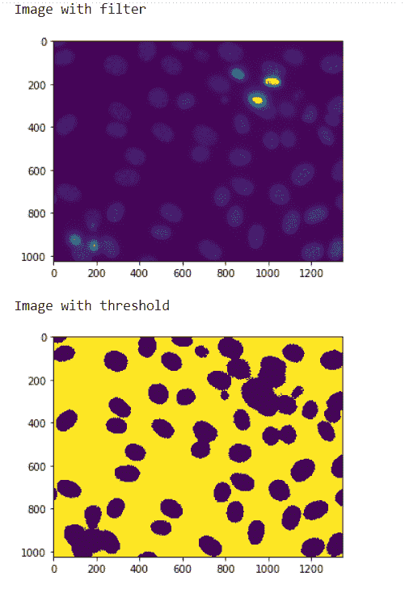
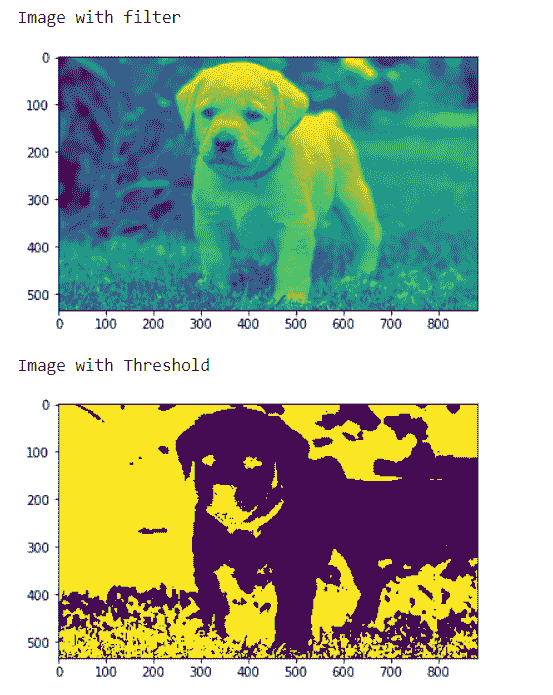

# maho tas–设置阈值

> 原文:[https://www.geeksforgeeks.org/mahotas-setting-threshold/](https://www.geeksforgeeks.org/mahotas-setting-threshold/)

在本文中，我们将看到如何在 mahotas 中为图像设置阈值。为此，我们将使用来自核分割基准的荧光显微图像。我们可以借助下面给出的命令
获得图像

```py
mahotas.demos.nuclear_image()
```

**图像阈值化**是一种简单的图像分割形式。这是一种从灰度或全色图像创建二进制图像的方法。这通常是为了将“对象”或前景像素与背景像素分开，以帮助图像处理。
下图是核 _ 图


为了给图像设置阈值，我们将取 numpy.ndarray 的图像对象，用阈值分割数组，这里的阈值是平均值，下面是这样做的命令

```py
img = (img < img.mean())]
```

**例 1 :**

## 蟒蛇 3

```py
# importing required libraries
import mahotas as mh
import mahotas.demos
import numpy as np
from pylab import imshow, show

# getting nuclear image
nuclear = mh.demos.nuclear_image()

# filtering the image
nuclear = nuclear[:, :, 0]

print("Image with filter")
# showing the image
imshow(nuclear)
show()

# setting image threshold
nuclear = (nuclear < nuclear.mean())

print("Image with threshold")
# showing the threshold image
imshow(nuclear)
show()
```

**输出:**



**例 2 :**

## 蟒蛇 3

```py
# importing required libraries
import numpy as np
import mahotas
from pylab import imshow, show

# loading image
img = mahotas.imread('dog_image.png')

# filtering the image
img = img[:, :, 0]

print("Image with filter")
# showing the image
imshow(img)
show()

# setting threshold
img = (img < img.mean())

print("Image with Threshold")
# showing the threshold image
imshow(img)
show()
```

**输出:**

