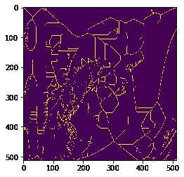
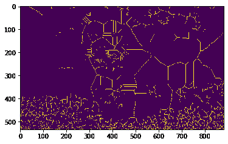

# maho tas–通过细化图像进行骨架化

> 原文:[https://www . geeksforgeeks . org/maho tas-图像细化骨架化/](https://www.geeksforgeeks.org/mahotas-skeletonization-by-thinning-of-image/)

在本文中，我们将看到如何在 mahotas 中通过细化实现图像的骨架化。骨架化是将二值图像中的前景区域减少到骨架残余的过程，该过程在很大程度上保留了原始区域的范围和连通性，同时丢弃了大部分原始前景像素。细化是一种形态学操作，用于从二值图像中移除选定的前景像素，有点像侵蚀或开放。

在本教程中我们将使用“lena”图像，下面是加载它的命令。

```
mahotas.demos.load('lena')
```

下面是莉娜的形象


> 为了做到这一点，我们将使用 mahotas.thin 方法
> 
> **语法:** mahotas.thin(img)
> 
> **自变量:**以图像对象为自变量
> 
> **返回:**返回图像对象

**注意:**输入图像应被过滤或加载为灰色

为了过滤图像，我们将获取 numpy.ndarray 的图像对象，并在索引的帮助下过滤它，下面是这样做的命令

```
image = image[:, :, 0]
```

下面是实现

## 蟒蛇 3

```
# importing required libraries
import mahotas
import mahotas.demos
from pylab import gray, imshow, show
import numpy as np

# loading image
img = mahotas.demos.load('lena')

# filtering image
img = img.max(2)

# otsu method
T_otsu = mahotas.otsu(img)  

# image values should be greater than otsu value
img = img > T_otsu

print("Image threshold using Otsu Method")

# showing image
imshow(img)
show()

# Skeletonisation by thinning
new_img = mahotas.thin(img)

# showing image
print("Skeletonised Image")
imshow(new_img)
show()
```

**输出:**

```
Image threshold using Otsu Method
```


```
Skeletonised Image
```



**另一个例子**

## 蟒蛇 3

```
# importing required libraries
import mahotas
import numpy as np
from pylab import gray, imshow, show
import os

# loading image
img = mahotas.imread('dog_image.png')

# filtering image
img = img[:, :, 0]

# otsu method
T_otsu = mahotas.otsu(img)  

# image values should be greater than otsu value
img = img > T_otsu

print("Image threshold using Otsu Method")

# showing image
imshow(img)
show()

# Skeletonisation by thinning
new_img = mahotas.thin(img)

# showing image
print("Skeletonised Image")
imshow(new_img)
show()
```

**输出:**

```
Image threshold using Otsu Method
```


```
Skeletonised Image
```

