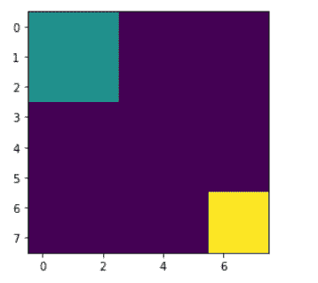
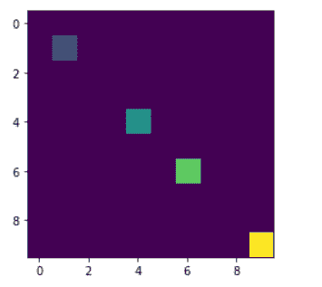

# maho tas–标记区域的重量

> 原文:[https://www . geeksforgeeks . org/maho tas-标记区域的重量/](https://www.geeksforgeeks.org/mahotas-weight-of-labeled-region/)

在本文中，我们将看到如何在 mahotas 中获得标记区域的权重。标记图像是整数图像，其中的值对应于不同的区域。即，区域 1 是具有值 1 的所有像素，区域 2 是具有值 2 的像素，以此类推。按照惯例，区域 0 是背景，通常处理方式不同。我们可以借助`mahotas.label`方法创建一个标记区域。

借助`mahotas.label_size`方法，我们可以得到每个区域的大小，这个大小简单地用每个区域的像素数来衡量。相反，我们可以测量每个区域的总重量。

为了做到这一点，我们将使用`mahotas.label_size`方法

> **语法:**maho tas . label _ sum(数组，labeled _ region)
> 
> **自变量:**以两个数组对象为自变量，即区域形状随机数组和标记区域
> 
> **返回:**返回数值列表

**例 1:**

```
# importing required libraries
import mahotas as mh
import numpy as np
from pylab import imshow, show

# creating region
# numpy.ndarray
regions = np.zeros((10, 10), bool)

# setting 1 value to the region
regions[:3, :3] = 1
regions[6:, 6:] = 1

# getting labeled function
labeled, nr_objects = mh.label(regions)

# showing the image with interpolation = 'nearest'
imshow(labeled, interpolation ='nearest')
show()

# random agaary of region shapes    
array = np.random.random_sample(regions.shape)

# getting sum i.e area
sums = mh.labeled_sum(array, labeled)

# printing the sums values
for i in range(len(sums)):
    print("Sum of region " + str(i) + " : " + str(sums[i]))
```

**输出:**


```
Sum of region 0 : 38.81707025816505
Sum of region 1 : 5.627375253802732
Sum of region 2 : 8.224633573583985

```

**例 2:**

```
# importing required libraries
import mahotas as mh
import numpy as np
from pylab import imshow, show

# creating region
# numpy.ndarray
regions = np.zeros((10, 10), bool)

# setting 1 value in the region
regions[1, 1] = 1
regions[6, 6] = 1
regions[4, 4] = 1
regions[9, 9] = 1

# getting labeled function
labeled, nr_objects = mh.label(regions)

# showing the image with interpolation = 'nearest'
imshow(labeled, interpolation ='nearest')
show()

# random agaary of region shapes    
array = np.random.random_sample(regions.shape)

# getting sum i.e area
sums = mh.labeled_sum(array, labeled)

# printing the sums values
for i in range(len(sums)):
    print("Sum of region " + str(i) + " : " + str(sums[i]))
```

**输出:**

```
Sum of region 0 : 47.05475409838963
Sum of region 1 : 0.07129110100184632
Sum of region 2 : 0.9333006775043519
Sum of region 3 : 0.8322767370999588
Sum of region 4 : 0.1700224211466459

```

