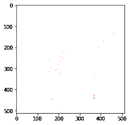
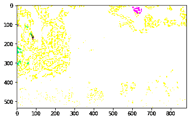

# maho tas–XYZ 到 RGB 转换

> 原文:[https://www . geesforgeks . org/maho tas-XYZ-to-RGB-conversion/](https://www.geeksforgeeks.org/mahotas-xyz-to-rgb-conversion/)

在本文中，我们将看到如何在 mahotas 中将 xyz 图像转换为 rgb 图像。Xyz 是一个基于眼睛如何解释光刺激的附加颜色空间。与其他像 rgb 这样的加性 Rgb 不同，Xyz 是一个纯粹的数学空间，主要成分是“想象的”，这意味着我们不能通过照射代表 x、y 和 z 的任何种类的光来创建物理空间中表示的颜色。一个 RGB 图像，有时被称为 truecolor 图像，在 MATLAB 中被存储为 m 乘 n 乘 3 的数据数组，该数组为每个单独的像素定义了红色、绿色和蓝色的颜色成分。我们使用 mahotas.colors.rgb2xyz 方法将 rgb 图像转换为 xyz 图像。

在本教程中我们将使用“lena”图像，下面是加载它的命令。

```py
mahotas.demos.load('lena')
```

下面是莉娜的形象


为此，我们将使用 maho tas . colors . XYZ 2 rg method

> **语法:**maho tas . colors . XYZ 2rgb(img)
> **参数:**它以图像对象作为参数
> **返回:**它返回图像对象

下面是实现

## 蟒蛇 3

```py
# importing required libraries
import mahotas
import mahotas.demos
from pylab import gray, imshow, show
import numpy as np

# loading image
img = mahotas.demos.load('lena')

# rgb to xyz
xyz_img = mahotas.colors.rgb2xyz(img)

# showing new image
print("Image")
imshow(xyz_img)
show()

# getting rgb image
new_img = mahotas.colors.xyz2rgb(xyz_img)

# showing image
print("New Image")
imshow(new_img)
show()
```

**输出:**

```py
Image
```


```py
New Image
```



另一个例子

## 蟒蛇 3

```py
# importing required libraries
import mahotas
import numpy as np
import matplotlib.pyplot as plt
import os

# loading image
img = mahotas.imread('dog_image.png')

# filtering image
img = img[:, :, :3]

# rgb to xyz
xyz_img = mahotas.colors.rgb2xyz(img)

# showing new image
print("Image")
imshow(xyz_img)
show()

# getting rgb image
new_img = mahotas.colors.xyz2rgb(xyz_img)

# showing image
print("New Image")
imshow(new_img)
show()
```

**输出:**

```py
Image
```


```py
New Image
```

