# 支持向量机(SVM)中的主要核函数

> 原文:[https://www . geeksforgeeks . org/main-kernel-functions-in-support-vector-machine/](https://www.geeksforgeeks.org/major-kernel-functions-in-support-vector-machine-svm/)

**核函数**是一种以数据为输入，转换成处理数据所需形式的方法。使用“核”是因为支持向量机中使用的一组数学函数提供了操作数据的窗口。因此，核函数通常对训练数据集进行变换，使得非线性决策表面能够在更高维空间中变换成线性方程。基本上，它返回标准特征尺寸中两点之间的内积。

**标准核函数方程:**

<center>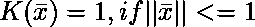
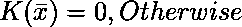</center>

**主要内核函数:-**

为了实现内核函数，首先我们必须使用命令提示终端安装“scikit-learn”库:

```py
    pip install scikit-learn

```

*   **高斯核:**用于在没有数据先验知识的情况下进行变换。

<center>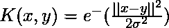</center>

*   **高斯核径向基函数(RBF) :** 同上核函数，加入径向基方法改进变换。

<center>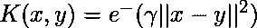
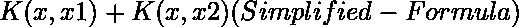
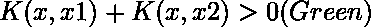
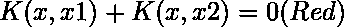</center>

<center>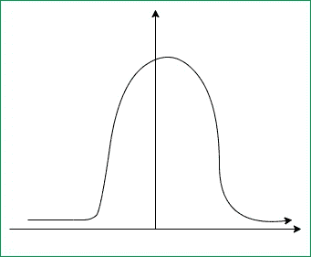</center>

**Code:**

```py
from sklearn.svm import SVC
classifier = SVC(kernel ='rbf', random_state = 0)
 # training set in x, y axis
classifier.fit(x_train, y_train)
```

*   **Sigmoid Kernel:** 这个函数相当于神经网络的两层、感知器模型，作为人工神经元的激活函数。

<center>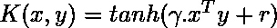
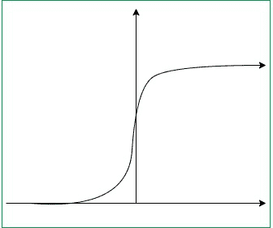</center>

**代码:**

```py
from sklearn.svm import SVC
classifier = SVC(kernel ='sigmoid')
classifier.fit(x_train, y_train) # training set in x, y axis
```

*   **多项式核:**表示特征空间中训练数据集的向量与核中使用的原始变量的多项式的相似性。

<center>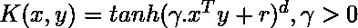
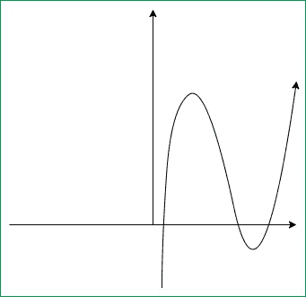</center>

**Code:**

```py
from sklearn.svm import SVC
classifier = SVC(kernel ='poly', degree = 4)
classifier.fit(x_train, y_train) # training set in x, y axis
```

*   [**线性核:**](https://www.geeksforgeeks.org/creating-linear-kernel-svm-in-python/) 在数据线性可分时使用。

**代码:**

```py
from sklearn.svm import SVC
classifier = SVC(kernel ='linear')
classifier.fit(x_train, y_train) # training set in x, y axis
```