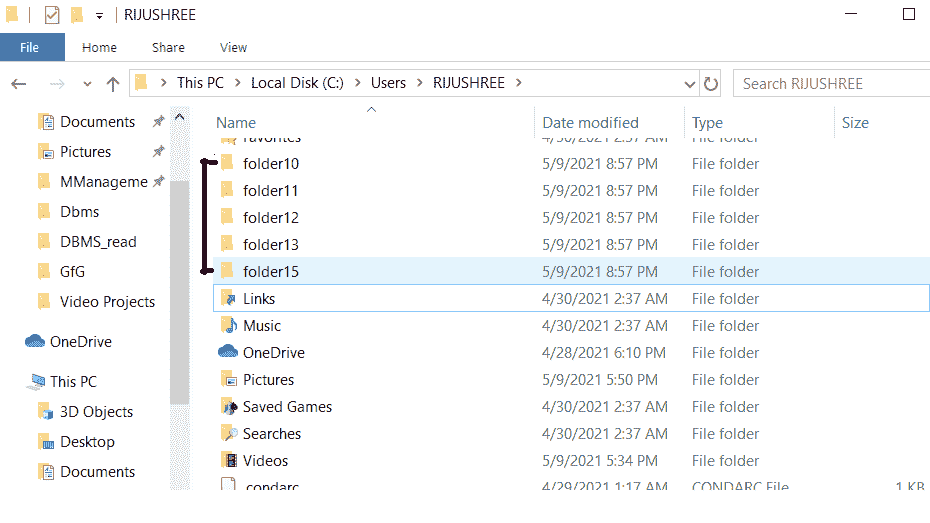
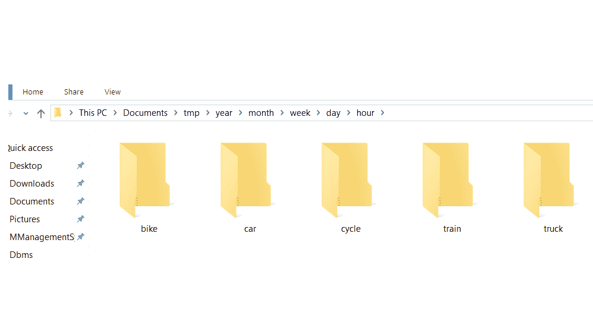
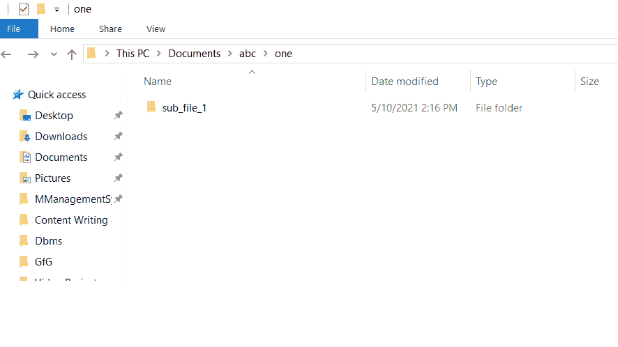

# 使用 Python 基于一个列表创建多个目录

> 原文:[https://www . geesforgeks . org/make-multi-directory-based-on-list-use-python/](https://www.geeksforgeeks.org/make-multiple-directories-based-on-a-list-using-python/)

在本文中，我们将学习如何使用 Python 基于列表创建目录。Python 有一个名为 **os** 的模块，它构成了 python 生态系统的核心部分。os 模块帮助我们使用操作系统文件夹和其他相关功能。虽然我们可以直接在系统上创建文件夹/目录，但这里我们将看到如何从 python 中给出的列表中创建许多文件夹，这不太耗时。

为了完成我们的任务，我们将使用 Python 中提供的一些模块及其方法，如下所示:

*   **os:**python 中的 OS 模块为我们提供了一些与操作系统交互的方法(这里用于创建文件夹)。
*   [**os.mkdir(路径)**](https://www.geeksforgeeks.org/python-os-mkdir-method/) **:** 用于在目录中一次创建单个文件夹(此处为路径)。
*   [**os.path.join(root_path，path)**](https://www.geeksforgeeks.org/python-os-path-join-method/) **:** 这个方法将几个路径连接到一个目录。这里，参数根路径将与想要创建的路径连接在一起。
*   [**分部(函数，argument1，argument2，…)**](https://www.geeksforgeeks.org/partial-functions-python/) **:** 这个方法允许一个人固定一定数量的参数并生成一个新的函数。
*   [**OS . makedirs(path)**](https://www.geeksforgeeks.org/python-os-makedirs-method/)**:**这个方法帮助我们一次创建多个目录。这里的参数路径表示我们想要创建的带有子文件夹的目录。

**示例 1:** 在安装 Python 的同一目录下创建文件夹

在这个例子中，我们得到了一个元素列表。然后我们遍历列表中的每个元素。由于我们没有提到任何根目录，os 模块在安装 python ide 的目录中为列表的每个元素创建一个文件夹。

## 蟒蛇 3

```
import os

list = ['folder10','folder11','folder12',
        'folder13', 'folder15']

for items in list:
    os.mkdir(items)
```

**输出:**



**示例 2:** 在不同的目录中创建文件

在变量中声明我们想要创建文件夹列表的根目录。初始化项目列表。然后遍历列表中的每个元素。os 模块在安装 python ide 的目录中为列表的每个元素创建一个文件夹。使用 os.path.join()将列表中的项目作为文件夹连接到根目录。然后使用 os.mkdir()在列表的每次迭代中创建一个目录。

## 蟒蛇 3

```
import os

root_path = 'Documents/tmp/year/month/week/day/hour'

list = ['car', 'truck', 'bike', 'cycle', 'train']

for items in list:
    path = os.path.join(root_path, items)
    os.mkdir(path)
```

**输出:**



**示例 3:** 在给定的根目录中创建包含子文件夹的目录列表

首先，从 functions 模块导入分部函数，并初始化根目录和目录列表。使用 partial 函数并用根目录预填充它，以创建用于在其中创建文件夹列表的路径。然后再次借助 partial 函数和 os.makedirs()方法预填充 make_directory 函数。遍历给定的项目列表。在每次迭代中，使用每个列表项作为参数调用 make_directory 方法来创建目录。

## 蟒蛇 3

```
import os
from functools import partial

root_directory = 'Documents/abc'

list = ('one/sub_file_1', 'two/sub_file_2', 'three/sub_file_3')

concat_root_path = partial(os.path.join, root_directory)
make_directory = partial(os.makedirs, exist_ok=True)

for path_items in map(concat_root_path, list):
    make_directory(path_items)
```

**输出:**


下面给出了创建的子文件夹的快照。

