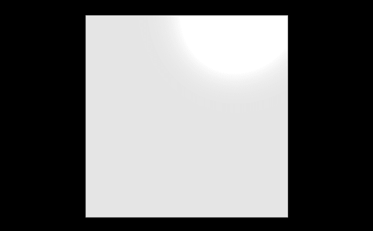
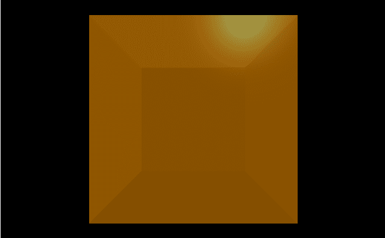
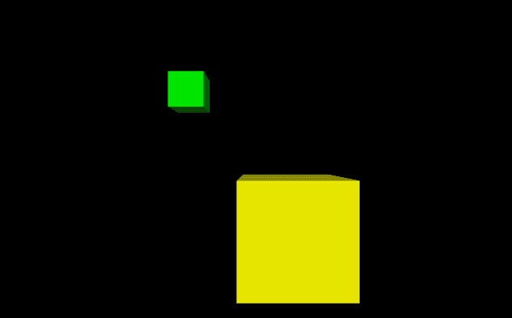
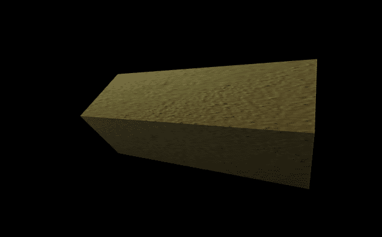

# 用 VPython 制作盒子

> 原文:[https://www.geeksforgeeks.org/making-a-box-with-vpython/](https://www.geeksforgeeks.org/making-a-box-with-vpython/)

**`VPython`** 可以轻松创建可导航的 3D 显示和动画，即使对于编程经验有限的人来说也是如此。因为它基于 Python，所以它也可以为有经验的程序员和研究人员提供很多东西。`VPython`允许用户在三维空间中创建球体和圆锥体等对象，并在窗口中显示这些对象。这使得创建简单的可视化变得容易，允许程序员将更多的精力放在程序的计算方面。`VPython`的简单性使它成为简单物理的图解工具，尤其是在教育环境中。

**安装:**

```py
pip install vpython
```

**盒子**或立方体是三维空间中的几何对象，由六个正方形面界定，每个顶点有三个相交面。我们可以使用`box()`方法在`VPython`中生成一个盒子。

## 方框()

> **语法:**框(参数)
> 
> **参数:**
> 
> *   **pos :** 是盒子中心的位置。指定包含 3 个值的向量，例如 pos = vector(0，0，0)
> *   **轴:**是箱体的对中轴。指定包含 3 个值的向量，例如轴=向量(1，2，1)
> *   **向上:**是盒子的方位。指定一个包含 3 个值的向量，例如 up = vector(0，1，0)
> *   **颜色:**是盒子的颜色。指定一个包含 3 个值的向量，例如 color = vector(1，1，1)将给出白色
> *   **不透明度:**是盒子的不透明度。分配一个浮动值，其中 1 是最不透明的，0 是最不透明的，例如不透明度= 0.5
> *   **光泽:**是盒子的光泽。指定一个浮动值，其中 1 是最闪亮的，0 是最不闪亮的，例如闪亮度= 0.6
> *   **发射率:**是盒子的发射率。指定一个布尔值，其中“真”是发射性的，“假”不是发射性的，例如发射率=假
> *   **纹理:**是盒子的纹理。从纹理类中指定所需的纹理，例如纹理=纹理.灰泥
> *   **长度:**是简单情况下盒子在 x 方向的长度。分配一个浮点值，默认长度为 1，示例长度= 10
> *   **高度:**是简单情况下盒子在 y 方向的高度。指定一个浮动值，默认高度为 1，例如高度= 10
> *   **宽度:**是简单情况下盒子在 z 方向的宽度。分配一个浮点值，默认宽度为 1，示例宽度= 10
> *   **大小:**是盒子的大小。分配一个包含 3 个值的向量，分别表示长度、高度和宽度，默认大小为(2，2，2)，示例大小=向量(1，1，1)
> 
> 所有参数都是可选的。

**例 1 :** 一个没有参数的框，所有参数都会有默认值。

```py
# import the module
from vpython import * box()
```

**输出:**


**示例 2 :** 使用颜色、不透明度、光泽和发射率参数的方框。

```py
# import the module
from vpython import * box(color = vector(1, 0.6, 0), 
    opacity = 0.5, 
    shininess = 1, 
    emissive = False)
```

**输出:**


**示例 3 :** 显示 2 个框来可视化属性位置和大小。

```py
# import the module
from vpython import *

# the first box
box(pos = vector(-2, 2, 0),
    size = vector(1, 1, 1),
    color = vector(0, 1, 0))

# the second box
box(pos = vector(1, -2, 0), 
    size = vector(3, 3, 3),
    color = vector(1, 1, 0))
```

**输出:**


**示例 4 :** 一个使用纹理、轴和向上参数的盒子。

```py
# import the module
from vpython import * box(texture = textures.stucco,
    axis = vector(1, 2, 2),
    up = vector(-1, 2, 2))
```

**输出:**
