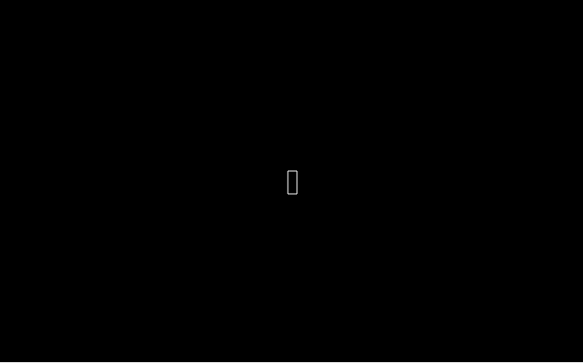
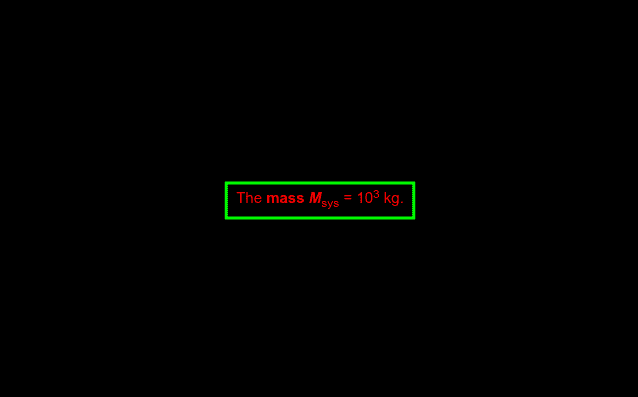
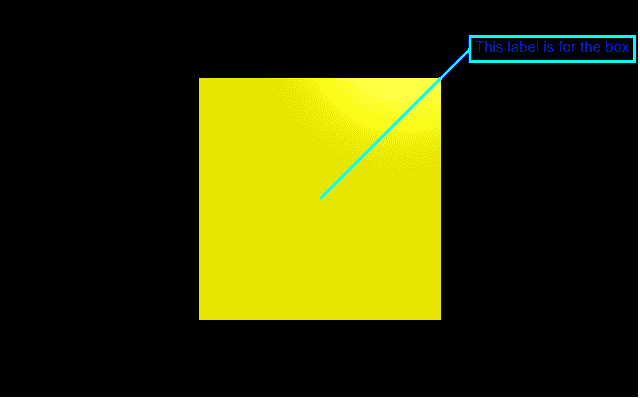

# 用 VPython 制作标签

> 原文:[https://www.geeksforgeeks.org/making-a-label-with-vpython/](https://www.geeksforgeeks.org/making-a-label-with-vpython/)

**`VPython`** 可以轻松创建可导航的 3D 显示和动画，即使对于编程经验有限的人来说也是如此。因为它基于 Python，所以它也可以为有经验的程序员和研究人员提供很多东西。`VPython`允许用户在三维空间中创建球体和圆锥体等对象，并在窗口中显示这些对象。这使得创建简单的可视化变得容易，允许程序员将更多的精力放在程序的计算方面。`VPython`的简单性使它成为简单物理的图解工具，尤其是在教育环境中。

**安装:**

```
pip install vpython
```

一个**标签**对象用于显示文本框中的文本。即使画布旋转，标签也将始终面向前方。我们可以使用`label()`方法在`VPython`中生成一个标签。

## label()方法

> **语法:**圆柱体(参数)
> 
> **参数:**
> 
> *   **pos :** 是世界空间中被标注的点。分配一个包含 3 个值的向量，例如 pos = vector(0，0，0)或被标记的对象，例如 pos = obj.pos
> *   **pixel_pos :** 以像素为单位确定位置。分配布尔值
> *   **对齐:**是标签的对齐。指定一个带有“居中”、“右”和“左”选项的字符串，默认为“居中”
> *   **颜色:**是标签文字的颜色。指定一个包含 3 个值的向量，例如 color = vector(1，1，1)将给出白色
> *   **背景:**是标签背景的颜色。指定一个包含 3 个值的向量，例如 color = vector(1，1，1)将使背景颜色为白色
> *   **不透明度:**是盒子背景的不透明度。分配一个浮动值，其中 1 是最不透明的，0 是最不透明的，例如不透明度= 0.5
> *   **xoffset :** 是标签 x 轴的偏移量。分配一个浮点值，例如 xoffset = 2
> *   **yoffset :** 是标签 y 轴的偏移量。分配一个浮点值，例如 yoffset = 5
> *   **文本:**是要在标签中显示的文本。分配文本时也可以包含 HTML 样式。
> *   **字体:**是标签文本的字体。分配一个字符串值，默认为“sans”，例如 font = "serif "
> *   **高度:**是字体的高度，以像素为单位。指定一个整数值，默认值为 15，例如高度= 18
> *   **边框:**是文字到周围方框的距离，以像素为单位。分配一个浮点值，默认长度为 5，示例边框= 10
> *   **半径:**是圆柱体的半径。指定一个浮动值，默认半径为 1，示例半径= 5
> *   **框:**决定是否要画框。指定一个布尔值，其中“真”为“是”，而“假”为“否”，默认值为“真”
> *   **线:**决定是否要画一条从 pos 到盒子的线。指定一个布尔值，其中“真”为“是”，而“假”为“否”，默认值为“真”
> *   **线条颜色:**是线条和方框的颜色。指定一个包含 3 个值的向量，例如 color = vector(1，1，1)将赋予 linecolor 白色
> *   **线宽:**是从 pos 到盒子所画的线的粗细，以及盒子的边缘。分配一个整数值，默认值为 1 像素，例如线宽= 5
> *   **空间:**是 pos 周围球体的半径，以像素为单位，连线不进入。分配一个整数值，示例空间= 20
> *   **可见:**决定是否显示标签。指定一个布尔值，其中“真”为“是”，而“假”为“否”，默认值为“真”
> 
> 所有参数都是可选的。

**例 1 :** 一个没有参数的标签，所有参数都会有默认值。

```
# import the module
from vpython import * label()
```

**输出:**


**示例 2 :** 使用参数颜色、文本、线宽、线条颜色和边框的标签。

```
# import the module
from vpython import * label(text = "The <b>mass <i>M</i></b><sub>sys</sub> = 10<sup>3</sup> kg.",
      color = vector(1, 0, 0),
      linecolor = vector(0, 1, 0),
      linewidth = 3,
      border = 10) 
```

**输出:**


**示例 3 :** 对象的标签。

```
# import the module
from vpython import *

# the box to be labelled
b = box(color = vector(1, 1, 0),
        size = vector(1, 1, 1))

# the label for the box
label(pos = b.pos,
      text = "This label is for the box",
      font = "sans",
      color = vector(0, 0, 1),
      linecolor = vector(0, 1, 1),
      linewidth = 3,
      yoffset = 150,
      xoffset = 150) 
```

**输出:**
