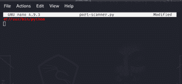
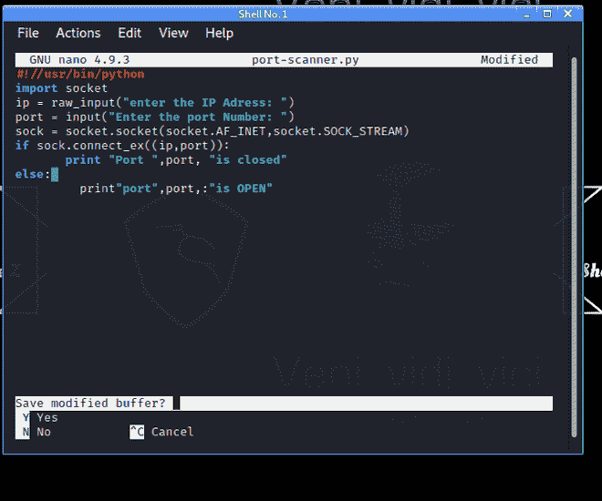
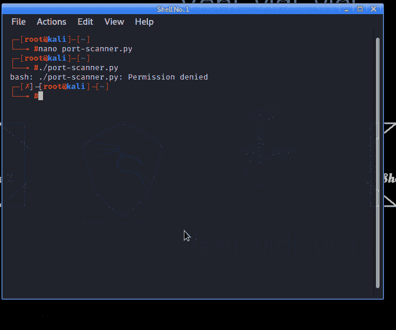
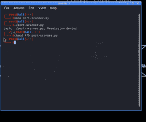
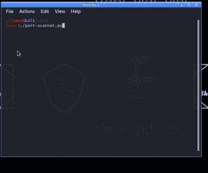
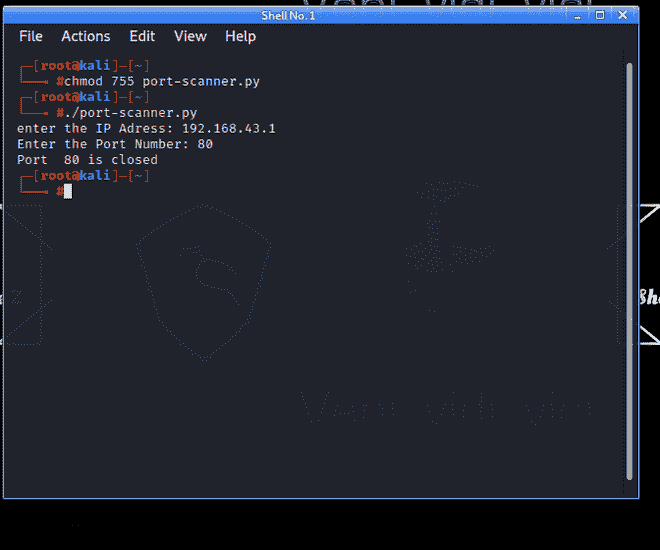

# 用 Python 在 Kali Linux 终端制作端口扫描器

> 原文:[https://www . geesforgeks . org/making-a-port-scanner-in-kali-Linux-terminal-use-python/](https://www.geeksforgeeks.org/making-a-port-scanner-in-kali-linux-terminal-using-python/)

在[计算机网络](https://www.geeksforgeeks.org/basics-computer-networking/)中，**端口**是网络连接开始和结束的虚拟点。这就像你家一扇敞开的门，如果你不关上它，那么任何人都可以进入你的家。端口扫描器是一个程序，它搜索网络中的端口，并试图发现哪些端口实际上是打开和关闭的。这是常见的技术[黑客](https://www.geeksforgeeks.org/types-of-hackers/)或[网络安全](https://www.geeksforgeeks.org/difference-between-cyber-security-and-information-security/)专家用来发现网络中打开的门或弱点。

### **端口扫描仪程序是如何工作的？**

这个程序发送一个网络请求抛出网络，并试图连接到计算机上一个特定的 [TCP](https://www.geeksforgeeks.org/tcp-connection-termination/) 或 [UDP](https://www.geeksforgeeks.org/user-datagram-protocol-udp/) 端口，并记录响应。

三种响应类型如下:

1.  **打开，接受**:当端口打开时，您可以通过它们访问该系统。
2.  **关闭，不监听**:此时该端口在**使用或不可用**
3.  **过滤、掉线、封锁**:电脑连回应都懒得回应。

### **使用 Python 在 Kali Linux 终端上设计端口扫描器**

**第一步:设计程序**

首先，我们需要打开我们的 [Kali Linux](https://www.geeksforgeeks.org/difference-between-fedora-and-kali-linux/) 终端，我们应该做的第一件事就是找出我们的 python 解释器在哪里，这样我们就可以命令

**语法:**

```py
which python
```

[](https://www.geeksforgeeks.org/kali-linux-file-management/)

我们的 python 解释器在哪里

当我们进行下一步时，这将是非常重要的。

下一步我们需要打开外壳，因为在那里我们要输入我们的代码，所以我们可以输入 **nano** 命令并点击回车。

**语法:**

```py
nano (name).extension
```

**示例:**

```py
nano port-scanner.py
```


给我们的程序起个名字

现在在这里，首先我们需要分配我们的 [Python](https://www.geeksforgeeks.org/python-programming-language/) [解释器](https://www.geeksforgeeks.org/compiler-vs-interpreter-2/)位置

```py
#!//usr/bin/python
```



Python 解释器的位置

现在我们的主程序启动，我们要导入 [sockets](https://www.geeksforgeeks.org/what-is-web-socket-and-how-it-is-different-from-the-http/) ，sockets 会告诉我们端口如何操作以及本质上如何传输数据。

```py
import socket
```

然后我们需要输入 [IP 地址](https://www.geeksforgeeks.org/difference-between-private-and-public-ip-addresses/)，之后我们还需要一个程序来询问我们要找的是哪个端口

```py
ip = raw_input("enter the IP Address: ")
port = input("Enter the Port Number: ")
```

现在我们要定义套接字我们正在寻找哪种类型的传输数据，更具体地说，我们要求看到什么[协议](https://www.geeksforgeeks.org/file-transfer-protocol-ftp-in-application-layer/)。

*   **插座。AF_INET** 这个插座可以让我们看到 [TCP](https://www.geeksforgeeks.org/differences-between-tcp-and-udp/) 连接
*   这让我们可以看看基本上是视频和音频流的 UDP 协议

```py
sock = socket.socket(socket.AF_INET,socket.SOCK_STREAM)
```

现在，我们将打印我们的程序如何显示特定端口是打开的，还是 IP 关闭了，或者端口关闭了。

```py
if sock.connect_ex((ip,port)):
       print "Port ",port, "is closed"
else:
         print"Port",port,"is OPEN"
```



完整的项目

现在保存该程序按**控制键+ x 键**保存该程序

**语法:**

```py
cnrl+x
```

**第二步:编译并运行程序**

我们都知道如何在 Kali Linux 终端上运行脚本

**例**

```py
./script name . extension
```

**语法**

```py
./port-scanner.py
```



程序没有运行

看这里是**棘手的部分**，我们完美地编写了我们的程序，但是它没有编译和运行。所以是时候给我们的系统许可了。

> **Chmod 775** 是一个 Linux 命令，它设置权限以便**用户/所有者**可以读取、写入和执行。**组**可以读写和执行。其他会读不会写不会执行。

**语法**

```py
chmod 775 ./port-scanner.py
```



chmod 775 给你许可

现在我们可以再次运行我们的程序，它将编译并成功运行

**语法**

```py
./port-scanner.py
```



成功运行

### 测试我们的程序

所以对于端口扫描，我们需要一个**特定的 IP，**我们需要告诉我们的程序在输入点击进入后我们正在寻找哪个**端口**

**例**

```py
Enter Your Ip Address : 192.168.43.1
Enter The Port Number : 80
```



端口扫描成功