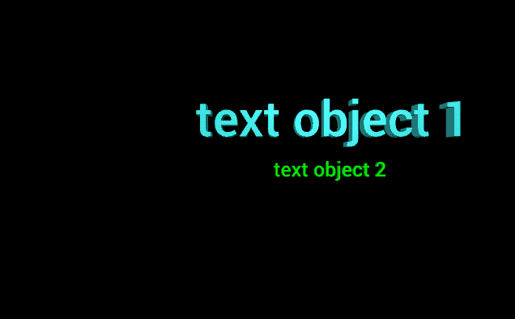

# 用 VPython 制作文本对象

> 原文:[https://www . geesforgeks . org/making-a-text-object-with-vpython/](https://www.geeksforgeeks.org/making-a-text-object-with-vpython/)

**VPython** 可以轻松创建可导航的 3D 显示和动画，即使对于编程经验有限的用户也是如此。因为它基于 Python，所以它也可以为有经验的程序员和研究人员提供很多东西。VPython 允许用户在 3D 空间中创建球体和圆锥体等对象，并在窗口中显示这些对象。这使得创建简单的可视化变得容易，允许程序员将更多的精力放在程序的计算方面。VPython 的简单性使其成为简单物理的说明工具，尤其是在教育环境中。
**安装:**

```py
pip install vpython
```

一个**文本**对象用于显示 3D 文本数据。我们可以使用 text()方法在 VPython 中生成一个文本对象。

## text()方法

> **语法:**文字(参数)
> T3】参数:T5】
> 
> *   **pos :** 是文字对象的位置。指定包含 3 个值的向量，例如 pos = vector(0，0，0)
> *   **对齐:**是文本对象的对齐方式。指定一个带有“中心”、“右侧”和“左侧”选项的字符串，默认为“左侧”
> *   **高度:**是大写字母的高度。指定一个浮动值，默认值为 1，例如高度= 18
> *   **长度:**是显示文本的长度。指定一个浮点值，例如长度= 4
> *   **深度:**是显示文本的深度。指定一个浮动值，默认值为 0.2 *高度，示例深度= 2
> *   **轴:**是文本对象的对齐轴。指定包含 3 个值的向量，例如轴=向量(1，2，1)
> *   **up :** 是文字对象的方位。指定一个包含 3 个值的向量，例如 up = vector(0，1，0)
> *   **字体:**是文字的字体。为字符串赋值“无”或“衬线”
> *   **颜色:**是文字的颜色。指定一个包含 3 个值的向量，例如 color = vector(1，1，1)将给出白色
> *   **背景:**是标签背景的颜色。指定一个包含 3 个值的向量，例如 color = vector(1，1，1)将使背景颜色为白色
> *   **广告牌:**决定文字对象是否始终面向你。指定一个布尔值，其中“真”是“是”，而“假”是“否”
> *   **不透明度:**是文本对象的不透明度。分配一个浮动值，其中 1 是最不透明的，0 是最不透明的，例如不透明度= 0.5
> *   **亮色:**是文字对象的亮色。指定一个浮动值，其中 1 是最闪亮的，0 是最不闪亮的，例如闪亮度= 0.6
> *   **发射率:**是文字对象的发射率。指定一个布尔值，其中“真”是发射性的，“假”不是发射性的，例如发射率=假
> *   **文本:**是要显示的文本。分配文本时也可以包含 HTML 样式。
> *   **下降符:**是 y 等小写字母上下降符的高度，赋一个浮点值，默认值为 0.3 *高度，例如下降符= 8
> *   **左上、右上、右下、左下:**它们是显示文本的边界框
> *   **开始、结束:**它们是基线上最左边和最右边的位置
> *   **垂直间距:**是多行文字中从一条基线到下一条基线的垂直距离
> 
> 所有参数都是可选的。

**例 1 :** 一个只有文本参数的文本对象，其他所有参数都会有默认值。

## 蟒蛇 3

```py
# import the module
from vpython import * text(text = "text")
```

**输出:**


**示例 2 :** 使用颜色、不透明度、光泽和发射率参数的文本对象。

## 蟒蛇 3

```py
# import the module
from vpython import * text(text = "text",
     color = vector(0, 0, 1),
     opacity = 0.5,
     shininess = 1,
     emissive = False)
```

**输出:**


**示例 3 :** 显示两个文本对象，以可视化位置、高度和深度属性。

## 蟒蛇 3

```py
# import the module
from vpython import *

# the first text object
text(text = "text object 1",
     pos = vector(-5, 2, 0),
     height = 3,
     depth = 1,
     color = vector(0.5, 1, 1))

# the second text object
text(text = "text object 2",
     pos = vector(1, -1, 5),
     color = vector(0, 1, 0))
```

**输出:**



**示例 4 :** 使用参数轴和向上的圆柱体。

## 蟒蛇 3

```py
# import the module
from vpython import * text(text = "text",
     color = vector(1, 0.5, 0),
     axis = vector(-1, 4, 0),
     up = vector(1, 2, 2))
```

**输出:**

