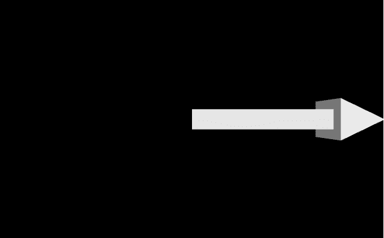
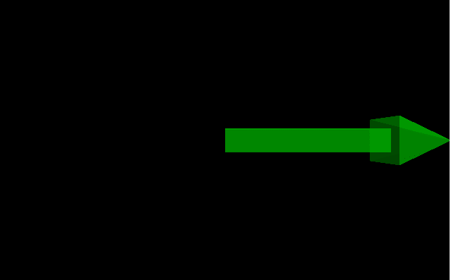
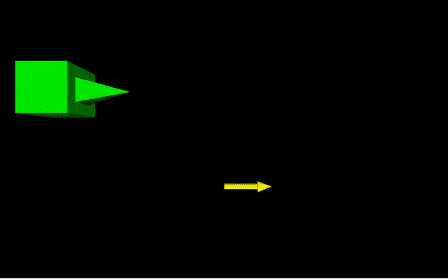
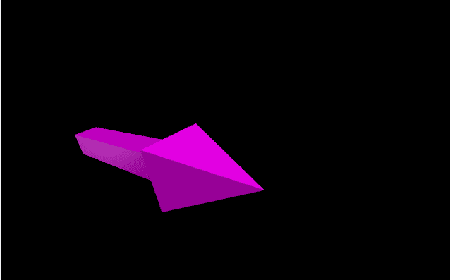

# 用 VPython 做箭头

> 原文:[https://www.geeksforgeeks.org/making-an-arrow-with-vpython/](https://www.geeksforgeeks.org/making-an-arrow-with-vpython/)

**`VPython`** 可以轻松创建可导航的 3D 显示和动画，即使对于编程经验有限的人来说也是如此。因为它基于 Python，所以它也可以为有经验的程序员和研究人员提供很多东西。`VPython`允许用户在三维空间中创建球体和圆锥体等对象，并在窗口中显示这些对象。这使得创建简单的可视化变得容易，允许程序员将更多的精力放在程序的计算方面。`VPython`的简单性使它成为简单物理的图解工具，尤其是在教育环境中。

**安装:**

```py
pip install vpython
```

一个**箭头**是三维空间中的一个几何物体，它是一条直线(或长方体)，有一个尖端。我们可以使用`arrow()`方法在`VPython`中生成一个箭头。

## 箭头()

> **语法:**箭头(参数)
> 
> **参数:**
> 
> *   **pos :** 是箭头轴开始的位置。指定包含 3 个值的向量，例如 pos = vector(0，0，0)
> *   **轴:**是箭头对齐的轴。指定包含 3 个值的向量，例如轴=向量(1，2，1)
> *   **向上:**是箭头的方向。指定一个包含 3 个值的向量，例如 up = vector(0，1，0)
> *   **颜色:**是箭头的颜色。指定一个包含 3 个值的向量，例如 color = vector(1，1，1)将给出白色
> *   **不透明度:**是箭头的不透明度。分配一个浮动值，其中 1 是最不透明的，0 是最不透明的，例如不透明度= 0.5
> *   **闪亮:**是箭的闪亮。指定一个浮动值，其中 1 是最闪亮的，0 是最不闪亮的，例如闪亮度= 0.6
> *   **发射率:**是箭头的发射率。指定一个布尔值，其中“真”是发射性的，“假”不是发射性的，例如发射率=假
> *   **纹理:**是箭头的纹理。从纹理类中指定所需的纹理，例如纹理=纹理.灰泥
> *   **长度:**是箭头的长度。分配一个浮点值，默认长度为 1，示例长度= 10
> *   **轴宽:**是箭头轴的宽度。指定一个浮动值，默认轴宽为 0.1*(箭头长度)，例如 shaftwidth = 10
> *   **头饰:**是箭头头部的宽度。分配一个浮动值，默认的头部宽度是 2 *轴宽，例如头宽= 10
> *   **头长:**是箭首的长度。指定一个浮动值，默认的磁头长度是 3 *轴长，例如磁头长度= 10
> 
> 所有参数都是可选的。

**例 1 :** 一个没有参数的箭头，所有参数都会有默认值。

```py
# import the module
from vpython import * arrow()
```

**输出:**


**示例 2 :** 使用颜色、不透明度、光泽和发射率参数的箭头。

```py
# import the module
from vpython import * arrow(color = vector(0, 1, 0), 
      opacity = 0.5, 
      shininess = 1, 
      emissive = False)
```

**输出:**


**示例 3 :** 显示两个箭头，以可视化位置、轴向、头向和头向属性。

```py
# import the module
from vpython import *

# the first arrow
arrow(pos = vector(-3, 1, 0),
      shaftwidth = 1,
      headwidth = 1,
      headlength = 2,
      color = vector(0, 1, 0))

# the second arrow
arrow(pos = vector(0, -1, 0),
      color = vector(1, 1, 0))
```

**输出:**


**示例 4 :** 使用参数轴和向上的箭头。

```py
# import the module
from vpython import * arrow(pos = vector(-2, 0, 0),
      color = vector(1, 0, 1),
      axis = vector(1, 2, 2),
      up = vector(-1, 5, 2))
```

**输出:**
