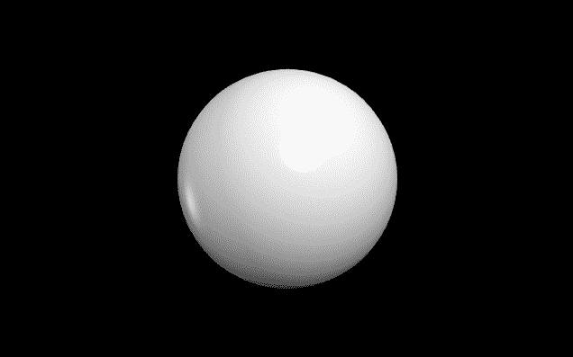
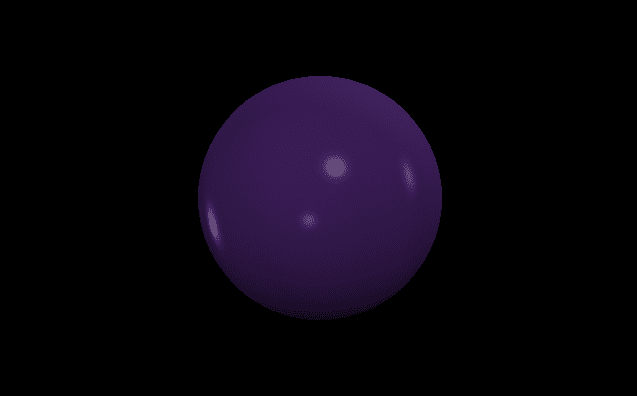
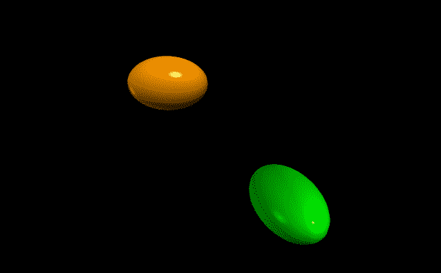
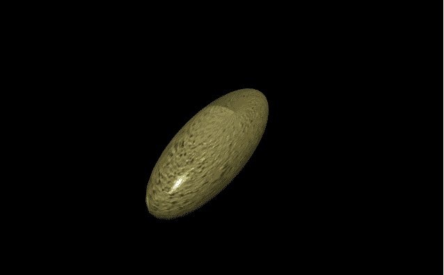

# 用 VPython 做椭球

> 原文:[https://www . geesforgeks . org/making-an-a-椭圆体-with-vpython/](https://www.geeksforgeeks.org/making-an-ellipsoid-with-vpython/)

**`VPython`** 可以轻松创建可导航的 3D 显示和动画，即使对于编程经验有限的人来说也是如此。因为它基于 Python，所以它也可以为有经验的程序员和研究人员提供很多东西。`VPython`允许用户在三维空间中创建球体和圆锥体等对象，并在窗口中显示这些对象。这使得创建简单的可视化变得容易，允许程序员将更多的精力放在程序的计算方面。`VPython`的简单性使它成为简单物理的图解工具，尤其是在教育环境中。

**安装:**

```py
pip install vpython
```

**椭圆体**是三维空间中的几何对象，其中所有平面横截面都是形成封闭表面的椭圆或圆。我们可以使用`ellipsoid()`方法在`VPython`中生成椭球体。

## 椭球体()

> **语法:**椭球体(参数)
> 
> **参数:**
> 
> *   **pos :** 是椭球体中心的位置。指定包含 3 个值的向量，例如 pos = vector(0，0，0)
> *   **轴:**是椭球体的对中轴。指定包含 3 个值的向量，例如轴=向量(1，2，1)
> *   **向上:**是椭球的方位。指定一个包含 3 个值的向量，例如 up = vector(0，1，0)
> *   **颜色:**是椭球的颜色。指定一个包含 3 个值的向量，例如 color = vector(1，1，1)将给出白色
> *   **不透明度:**是椭球体的不透明度。分配一个浮动值，其中 1 是最不透明的，0 是最不透明的，例如不透明度= 0.5
> *   **闪亮度:**是椭球体的闪亮度。指定一个浮动值，其中 1 是最闪亮的，0 是最不闪亮的，例如闪亮度= 0.6
> *   **发射率:**是椭球体的发射率。指定一个布尔值，其中“真”是发射性的，“假”不是发射性的，例如发射率=假
> *   **纹理:**是椭球体的纹理。从纹理类中指定所需的纹理，例如纹理=纹理.灰泥
> *   **长度:**是椭球体在 x 方向的长度。分配一个浮点值，默认长度为 1，示例长度= 10
> *   **高度:**是椭球体在 y 方向的高度。指定一个浮动值，默认高度为 1，例如高度= 8
> *   **宽度:**是椭球体在 z 方向的宽度。分配一个浮点值，默认宽度为 1，示例宽度= 5
> *   **大小:**是椭球体的大小。指定一个包含 3 个值的向量，分别代表长度、高度和宽度，例如大小=向量(1，1，1)
> 
> 所有参数都是可选的。

**例 1 :** 一个没有参数的椭球体，所有参数都会有默认值。

```py
# import the module
from vpython import * ellipsoid()
```

**输出:**


**示例 2 :** 使用颜色、不透明度、光泽和发射率参数的椭球体。

```py
# import the module
from vpython import * ellipsoid(color = vector(0.4, 0.2, 0.6), 
          opacity = 0.5, 
          shininess = 1, 
          emissive = False)
```

**输出:**


**示例 3 :** 显示 2 个椭圆体，以可视化位置、长度、高度和扭曲的属性。

```py
# import the module
from vpython import *

# the first ellipsoid
ellipsoid(pos = vector(-2, 2, 0),
           length = 3,
           height = 2,
           width = 2,
           color = vector(1, 0.6, 0))

# the second ellipsoid
ellipsoid(pos = vector(1, -1, 5), 
          width = 3,
           color = vector(0, 1, 0))
```

**输出:**


**示例 4 :** 使用纹理、轴和向上参数的椭球体。

```py
# import the module
from vpython import * ellipsoid(texture = textures.stucco,
          axis = vector(-1, 4, 0),
          up = vector(1, 2, 2),
          length = 3)
```

**输出:**
