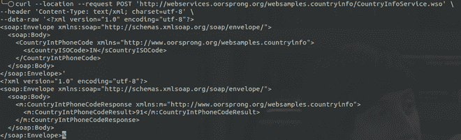

# 使用 Python 进行 SOAP API 调用

> 原文:[https://www . geesforgeks . org/making-soap-API-calls-use-python/](https://www.geeksforgeeks.org/making-soap-api-calls-using-python/)

SOAP 代表[简单对象访问协议](https://www.geeksforgeeks.org/basics-of-soap-simple-object-access-protocol/)，顾名思义，就是节点之间交换结构化数据的协议。它使用 XML 而不是 JSON。

在本文中，我们将看到如何使用 python 进行 SOAP API 调用。如果您想测试有效负载和响应到底是什么样子，可以使用下面的 curl 命令:



卷曲输出

### 方法 1:使用请求

首先，我们导入 [*请求*](https://www.geeksforgeeks.org/python-requests-tutorial/) 库，然后我们定义 SOAP URL。

下一步也是最重要的一步是根据 SOAP URL 中提供的结构格式化 XML 主体。要知道格式，只需访问 SOAP URL，点击 **CountryISOCode** 链接，并相应地格式化 XML。

然后，您只需准备标题并进行开机自检调用。

**代码:**

## 蟒蛇 3

```
import requests
# SOAP request URL
url = "http://webservices.oorsprong.org/websamples.countryinfo/CountryInfoService.wso"

# structured XML
payload = """<?xml version=\"1.0\" encoding=\"utf-8\"?>
            <soap:Envelope xmlns:soap=\"http://schemas.xmlsoap.org/soap/envelope/\">
                <soap:Body>
                    <CountryIntPhoneCode xmlns=\"http://www.oorsprong.org/websamples.countryinfo\">
                        <sCountryISOCode>IN</sCountryISOCode>
                    </CountryIntPhoneCode>
                </soap:Body>
            </soap:Envelope>"""
# headers
headers = {
    'Content-Type': 'text/xml; charset=utf-8'
}
# POST request
response = requests.request("POST", url, headers=headers, data=payload)

# prints the response
print(response.text)
print(response)
```

**输出:**

```
<?xml version="1.0" encoding="utf-8"?>
<soap:Envelope xmlns:soap="http://schemas.xmlsoap.org/soap/envelope/">
  <soap:Body>
    <m:CountryIntPhoneCodeResponse xmlns:m="http://www.oorsprong.org/websamples.countryinfo">
      <m:CountryIntPhoneCodeResult>91</m:CountryIntPhoneCodeResult>
    </m:CountryIntPhoneCodeResponse>
  </soap:Body>
</soap:Envelope>
<Response [200]>
```

### 方法 2:使用塞普

现在我们已经看到了如何用请求进行 SOAP 调用，我们将看到通过 Zeep 进行调用是多么容易。首先需要安装 *zeep* 。

```
pip3 install zeep
```

**进场:**

*   首先，设置 WSDL 网址。您只需访问基本网址并点击**服务描述**，即可获得 WSDL 网址。这将带你到 WSDL 的网址。基本网址将是*服务网址*，并在基本网址后附加服务名称。
*   接下来，您需要创建一个标题元素。现在，您需要用*方法 _url* 和*服务 _url* 设置头元素。
*   现在，用 WSDL 网址初始化一个 zeep 客户端。
*   所有的设置都完成了，现在你只需要用服务名调用 zeep 服务，这里的服务名是 **CountryIntPhoneCode** 。您需要用*国家/地区代码*传递参数，并将标题作为列表传递给 *_soapheaders* 。
*   现在，这将直接返回国家的电话代码。

**代码:**

## 蟒蛇 3

```
import zeep

# set the WSDL URL
wsdl_url = "http://webservices.oorsprong.org/websamples.countryinfo/CountryInfoService.wso?WSDL"

# set method URL
method_url = "http://webservices.oorsprong.org/websamples.countryinfo/CountryIntPhoneCode"

# set service URL
service_url = "http://webservices.oorsprong.org/websamples.countryinfo/CountryInfoService.wso"

# create the header element
header = zeep.xsd.Element(
    "Header",
    zeep.xsd.ComplexType(
        [
            zeep.xsd.Element(
                "{http://www.w3.org/2005/08/addressing}Action", zeep.xsd.String()
            ),
            zeep.xsd.Element(
                "{http://www.w3.org/2005/08/addressing}To", zeep.xsd.String()
            ),
        ]
    ),
)
# set the header value from header element
header_value = header(Action=method_url, To=service_url)

# initialize zeep client
client = zeep.Client(wsdl=wsdl_url)

# set country code for India
country_code = "IN"

# make the service call
result = client.service.CountryIntPhoneCode(
    sCountryISOCode=country_code,
    _soapheaders=[header_value]
)
# print the result
print(f"Phone Code for {country_code} is {result}")

# set country code for United States
country_code = "US"

# make the service call
result = client.service.CountryIntPhoneCode(
    sCountryISOCode=country_code,
    _soapheaders=[header_value]
)

# print the result
print(f"Phone Code for {country_code} is {result}")
print(response)
```

**输出:**

```
Phone Code for IN is 91
Phone Code for US is 1
<Response [200]>
```