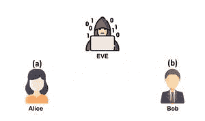
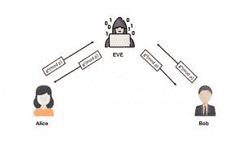
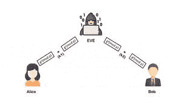

# 迪菲-海尔曼密钥交换中的中路人攻击

> 原文:[https://www . geesforgeks . org/中间人-diffie-hellman-key-exchange 中的攻击/](https://www.geeksforgeeks.org/man-in-the-middle-attack-in-diffie-hellman-key-exchange/)

**先决条件:** [迪菲-赫尔曼算法](https://www.geeksforgeeks.org/implementation-diffie-hellman-algorithm/)

Diffie-Hellman 密钥交换算法是一种用于建立共享秘密(或共享秘密密钥)的高级密码方法，可用于在爱丽丝和鲍勃之间的公共网络上执行秘密通信，同时防止可以窃听他们所有通信的 Eve(窃听者)得知生成的秘密。

**密钥交换过程有两个步骤:**

1.  **一次性设置:**我们定义了一些大家永远使用的公共参数。
2.  **协议:**要生成新的密钥，运行双消息密钥交换协议。这个过程是用一些简单的代数、素数和模算术的性质来完成的。

## **迪菲-赫尔曼的安全威胁**

让我们假设窃听者 EVE 像其他人一样知道公众的价值观 p 和 g，从她的窃听中，她了解到爱丽丝和鲍勃、gᵃ mod p 和 gᵇ mod p 交换的价值观。以她所有的知识，她还是无法计算出秘钥 S，事实证明，如果 p 和 g 选择得当，对她来说是非常非常难做到的。

例如，您可以强行尝试所有选项，但是当数字很大时，计算(mod p)会使离散对数计算变得非常慢。如果 p 和 g 有数千位，那么计算离散日志的最著名的算法，虽然比普通的蛮力快，但仍然需要数百万年才能计算出来。

即使对暴力免疫，它也容易受到 MITM(中间位置的人)的攻击。

### **中路人(MITM)对阵迪菲-赫尔曼:**

恶意的马洛里，有一个 MitM(中间的人)的位置，可以操纵爱丽丝和鲍勃之间的通信，破坏密钥交换的安全性。

**这个过程的分步说明:**

**第一步:**选定的公众号 p 和 g，p 为素数，称为“模”，g 为基数。

**第二步:**选择私人号码。

让爱丽丝挑选一个私人随机数 a，让鲍勃挑选一个私人随机数 b，马洛里挑选 2 个随机数 c 和 d。



**第三步:**截取公共值，

马洛里截取爱丽丝的公共值(g <sup>a</sup> (mod p))，阻止它到达鲍勃，而是发送给鲍勃她自己的公共值(g <sup>c</sup> (modp))，马洛里截取鲍勃的公共值(g <sup>b</sup> (mod p))，阻止它到达爱丽丝，而是发送给爱丽丝她自己的公共值(g <sup>d</sup> (modp))



**步骤 4:** 计算密钥

爱丽丝将计算一个密钥 S <sub>1</sub> =g <sup>da</sup> (mod p)，鲍勃将计算一个不同的密钥 S <sub>2</sub> =g <sup>cb</sup> (mod p)



**第五步:**如果爱丽丝使用 S <sub>1</sub> 作为密钥对稍后发送给鲍勃的消息进行加密，则马洛里可以对其进行解密，使用 S <sub>2</sub> 对其进行重新加密，并将其发送给鲍勃。鲍勃和爱丽丝不会注意到任何问题，可能会假设他们的通信是加密的，但实际上，马洛里可以解密、读取、修改，然后重新加密他们所有的对话。

**下面是实现:**

## 蟒蛇 3

```
import random

# public keys are taken
# p is a prime number
# g is a primitive root of p
p = int(input('Enter a prime number : '))
g = int(input('Enter a number : '))

class A:
    def __init__(self):
        # Generating a random private number selected by alice
        self.n = random.randint(1, p)     

    def publish(self):
        # generating public values
        return (g**self.n)%p

    def compute_secret(self, gb):
        # computing secret key
        return (gb**self.n)%p

class B:
    def __init__(self):
        # Generating a random private number selected for alice
        self.a = random.randint(1, p)
        # Generating a random private number selected for bob
        self.b = random.randint(1, p)
        self.arr = [self.a,self.b]

    def publish(self, i):
        # generating public values
        return (g**self.arr[i])%p

    def compute_secret(self, ga, i):
        # computing secret key
        return (ga**self.arr[i])%p

alice = A()
bob = A()
eve = B()

# Printing out the private selected number by Alice and Bob
print(f'Alice selected (a) : {alice.n}')
print(f'Bob selected (b) : {bob.n}')
print(f'Eve selectd private number for Alice (c) : {eve.a}')
print(f'Eve selectd private number for Bob (d) : {eve.b}')

# Generating public values 
ga = alice.publish()
gb = bob.publish()
gea = eve.publish(0)
geb = eve.publish(1)
print(f'Alice published (ga): {ga}')
print(f'Bob published (gb): {gb}')
print(f'Eve published value for Alice (gc): {gea}')
print(f'Eve published value for Bob (gd): {geb}')

# Computing the secret key
sa = alice.compute_secret(gea)
sea = eve.compute_secret(ga,0)
sb = bob.compute_secret(geb)
seb = eve.compute_secret(gb,1)
print(f'Alice computed (S1) : {sa}')
print(f'Eve computed key for Alice (S1) : {sea}')
print(f'Bob computed (S2) : {sb}')
print(f'Eve computed key for Bob (S2) : {seb}')
```

**输出:**

```
Enter a prime number (p) : 227
Enter a number (g) : 14

Alice selected (a) : 227
Bob selected (b) : 170

Eve selectd private number for Alice (c) : 65
Eve selectd private number for Bob (d) : 175

Alice published (ga): 14
Bob published (gb): 101

Eve published value for Alice (gc): 41
Eve published value for Bob (gd): 32

Alice computed (S1) : 41
Eve computed key for Alice (S1) : 41

Bob computed (S2) : 167
Eve computed key for Bob (S2) : 167
```