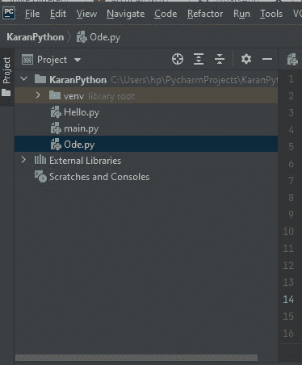
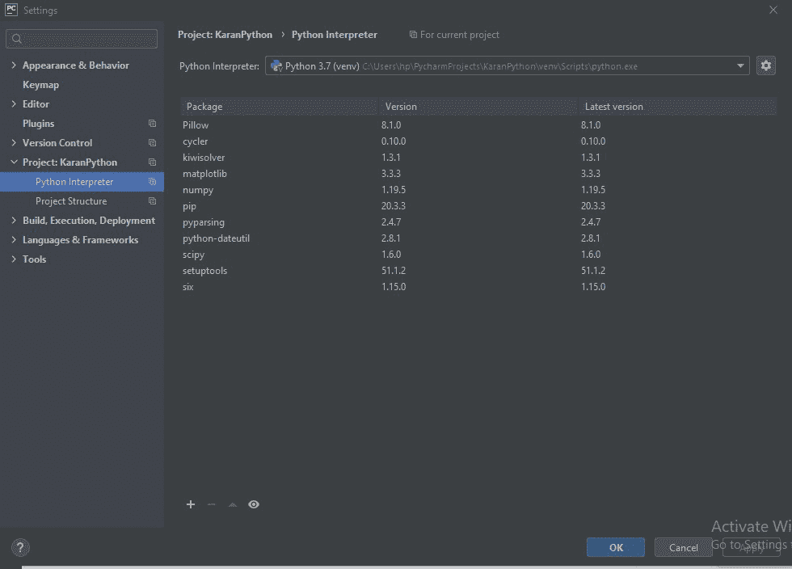
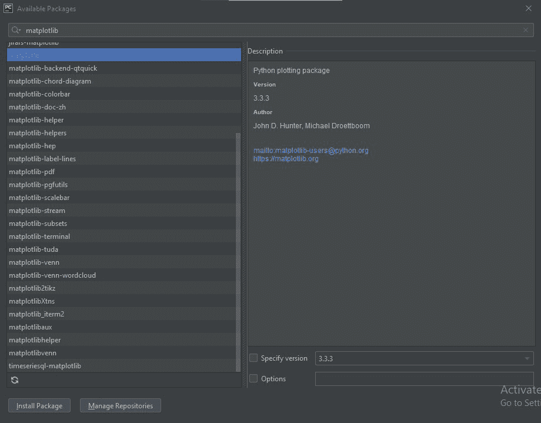
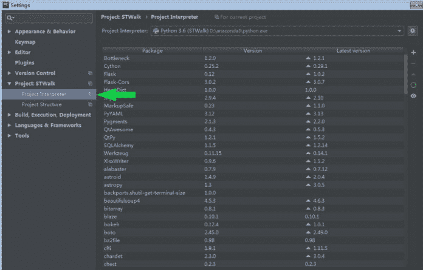
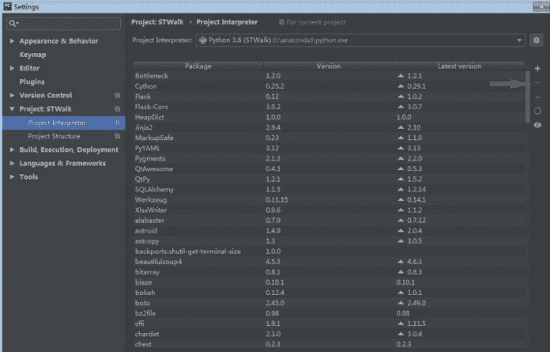
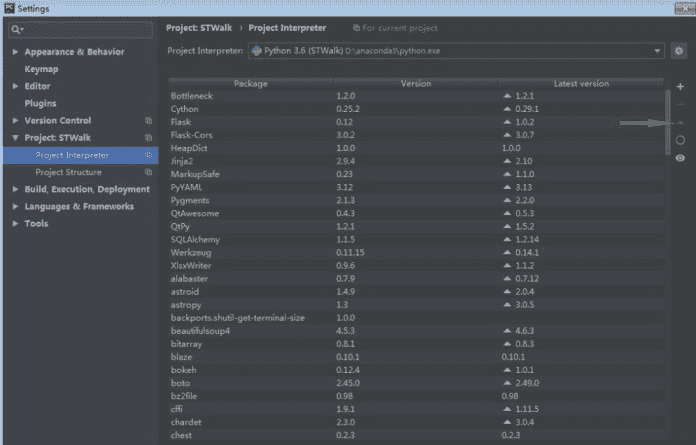

# 管理 Pycharm 中的包

> 原文:[https://www.geeksforgeeks.org/managing-packages-in-pycharm/](https://www.geeksforgeeks.org/managing-packages-in-pycharm/)

**Pycharm** 支持 Python 包的安装、卸载和升级。默认情况下，Pycharm 同样使用 **pip 包管理器。类似地， **conda 包管理器**用于处理 conda 环境。在本文中，我们将研究在 Pycharm 中管理 python 包的过程。**

### 安装软件包:

按照以下步骤在 Pycharm 中安装软件包:

*   **第一步:**创建一个 Pycharm 项目。它看起来像下图。

*   **第二步:**现在进入**文件→设置→项目→ python 解释器。**会出现如下画面。

*   **第三步:**现在点击左下角的**“+”**符号。将出现如下所示的新屏幕。搜索您想要安装的软件包(例如 matplotlib、numpy、scipy 等)。

根据您的需要，选中以下复选框:

1.  **指定版本:**用于安装软件包的特定版本。为此，您还需要指定需要安装的版本。默认情况下，它采用最新版本。
2.  **选项:**如果选中，它可以用来运行文本字段中的 pip 命令(例如 pip 安装 Flask)。
3.  **安装到用户的站点包目录<路径>** :如果勾选，可以指定你希望包安装的位置(即具体目录)。默认情况下，它在当前解释器中安装包。该选项是**而不是**可用于康达环境。

*   **第 4 步:**在最后点击**安装包。**根据你的网速，需要一些时间。

在底角完成所有这些步骤后，您将获得一条类似“**【您的软件包名称】安装成功”的消息。**

### **卸载软件包:**

要在 Pycharm 中卸载软件包，请按照以下步骤操作:

*   **第一步:**导航至**设置→项目解释器**，如下图。

*   **第二步:**选择需要卸载的软件包，点击**卸载**或**“-”**符号。

这将卸载您选择的软件包。

### 升级软件包:

Pycharm 会自动跟踪 python 包是否过时。列出了目前已安装的套装版本(列**版本**，列**最新版本**)。Pycharm 用箭头标记出新的可用版本，并建议将其升级至。

要升级 Pycharm 中的现有包，请按照以下步骤操作:

*   **第一步:**导航至**设置→项目解释器**，如下图。

*   **步骤 2:** 选择软件包，点击升级符号(⇑)升级所选软件包。

这将把所选包升级到最新版本。如果升级失败或成功，您还会收到确认。