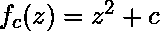
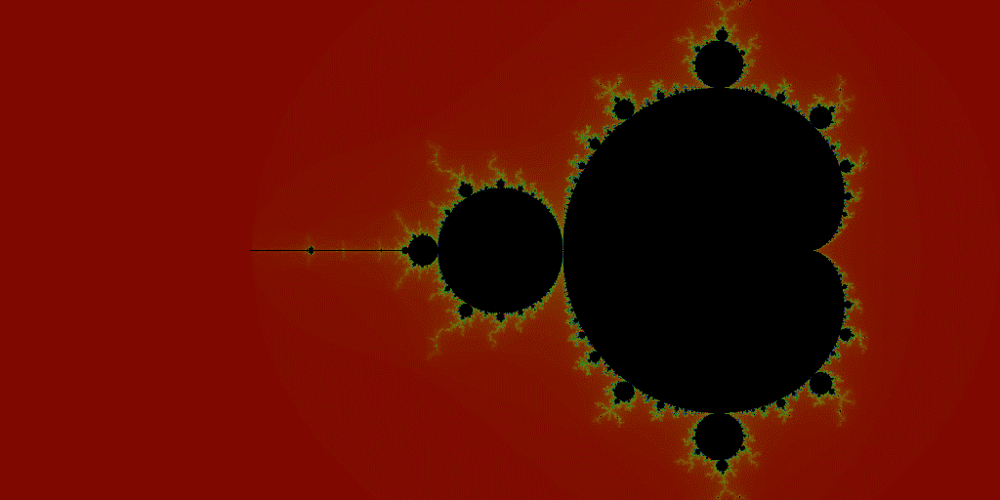

# Python 中曼德勃罗分形集可视化

> 原文:[https://www . geeksforgeeks . org/Mandelbrot-fractal-set-可视化-in-python/](https://www.geeksforgeeks.org/mandelbrot-fractal-set-visualization-in-python/)

**分形:**
分形是一种曲线或几何图形，其每一部分都具有与整体相同的统计特征。它们可用于模拟类似图案以逐渐变小的尺度重复出现的结构(如雪花)，也可用于描述部分随机或混乱的现象，如晶体生长和星系形成。

简单地说，分形是一种永无止境的模式。分形是无限复杂的模式，在不同的尺度上是自相似的。它们是通过在一个持续的反馈循环中一遍又一遍地重复一个简单的过程而产生的。在递归的驱动下，分形是动态系统的图像——混沌的图像。
在几何学上，它们存在于我们熟悉的维度之间。分形图案非常熟悉，因为自然界充满了分形。例如:树木、河流、海岸线、山脉、云、贝壳、飓风等。抽象分形——比如曼德勃罗集——可以通过计算机一遍又一遍地计算一个简单的方程来生成。

**曼德勃罗集合:**
曼德勃罗集合是复数 **c** 的集合，对于该集合，函数在从 **z** =0 迭代时不发散，即对于该集合，序列等。，保持绝对值有界。简单地说，曼德勃罗集是一组特殊的复数，当绘制时，它有一个高度复杂的分形边界。

安装所需的 Python 模块:

```py
pip install pillow
pip install numpy
```

**代码#1:**

```py
# Python code for Mandelbrot Fractal

# Import necessary libraries
from PIL import Image
from numpy import complex, array
import colorsys

# setting the width of the output image as 1024
WIDTH = 1024

# a function to return a tuple of colors
# as integer value of rgb
def rgb_conv(i):
    color = 255 * array(colorsys.hsv_to_rgb(i / 255.0, 1.0, 0.5))
    return tuple(color.astype(int))

# function defining a mandelbrot
def mandelbrot(x, y):
    c0 = complex(x, y)
    c = 0
    for i in range(1, 1000):
        if abs(c) > 2:
            return rgb_conv(i)
        c = c * c + c0
    return (0, 0, 0)

# creating the new image in RGB mode
img = Image.new('RGB', (WIDTH, int(WIDTH / 2)))
pixels = img.load()

for x in range(img.size[0]):

    # displaying the progress as percentage
    print("%.2f %%" % (x / WIDTH * 100.0)) 
    for y in range(img.size[1]):
        pixels[x, y] = mandelbrot((x - (0.75 * WIDTH)) / (WIDTH / 4),
                                      (y - (WIDTH / 4)) / (WIDTH / 4))

# to display the created fractal after 
# completing the given number of iterations
img.show()
```

**输出:**


**代码#2:**

```py
# Mandelbrot fractal
# FB - 201003254
from PIL import Image

# drawing area
xa = -2.0
xb = 1.0
ya = -1.5
yb = 1.5

# max iterations allowed
maxIt = 255 

# image size
imgx = 512
imgy = 512
image = Image.new("RGB", (imgx, imgy))

for y in range(imgy):
    zy = y * (yb - ya) / (imgy - 1)  + ya
    for x in range(imgx):
        zx = x * (xb - xa) / (imgx - 1)  + xa
        z = zx + zy * 1j
        c = z
        for i in range(maxIt):
            if abs(z) > 2.0: break
            z = z * z + c
        image.putpixel((x, y), (i % 4 * 64, i % 8 * 32, i % 16 * 16))

image.show()
```

**输出:**
