# Jupyter 笔记本中的 Markdown 单元格

> 原文:[https://www . geesforgeks . org/markdown-cell-in-jupyter-notebook/](https://www.geeksforgeeks.org/markdown-cell-in-jupyter-notebook/)

**Jupyter 笔记本**(原 IPython Notebook)是一个基于 web 的交互式计算环境，用于创建 Jupyter 笔记本文档。Markdown 是一种轻量级且流行的标记语言，是数据科学家和分析师的写作标准。它经常被转换成相应的 HTML，通过它，Markdown 处理器允许它在不同的设备和人之间轻松共享。在本教程中，您将学习如何使用 Jupyter Notebook 使用和编写不同的标记标签。

在本教程中，您将学习如何使用以下内容:

*   标题
*   彩色便签盒
*   缩进块
*   子弹
*   单空间字体
*   嵌入式代码
*   数学符号和乳胶方程式
*   断线
*   粗斜体文字
*   水平线
*   几何形状
*   有序和无序列表
*   内外链接
*   表
*   图像
*   GitHub 风味降价

## 激活减价单元格

可以使用标记单元格将文本添加到 Jupyter 笔记本中。您可以使用单元格菜单、工具栏或快捷键 **m** 将单元格类型更改为向下标记。Markdown 是一种流行的标记语言，是 **HTML** 的超集。它可以在 Jupyter 笔记本中激活，如下所示:

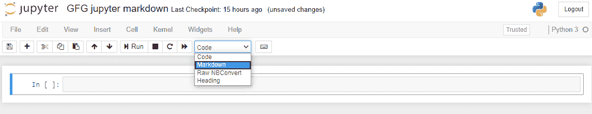

从上面的选项卡中选择减价选项。

### 标题

您可以添加标题，方法是以一行(或多行)' # '开头，后跟空格，如下例所示:

**输入:**

**输出:**

根据上下文使用所需的标题

标题也可以和这里的

# 标题

# 标签一起使用。

### 彩色便签盒

使用 div 标签创建一个彩色的注释框。不是所有的标记代码都在 div 标签中工作，所以仔细检查你的彩色框！例如，要使一个单词加粗，用**文本**而不是两个星号或下划线包围它。

**备注框:**使用蓝色框表示提示和备注。如果是笔记，你不需要包括“笔记”这个词。

**输入:**

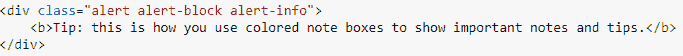

**输出:**

这是一个笔记标记单元格

**示例框:**对于不在代码单元格内的示例，使用黄色框，如果需要，也可以用于数学公式。

**输入:**

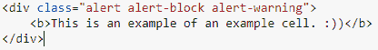

**输出:**

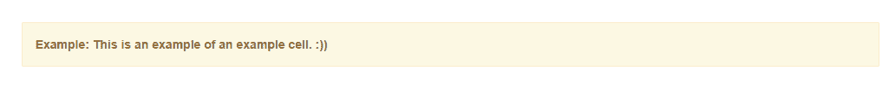

这是一个降价单元格的例子

**警告框:**尽量避开警告框。

**输入:**

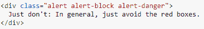

**输出:**

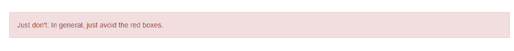

这是一个警告标记单元格

**成功框:**以受限或不频繁的方式使用绿色框(或成功框)。例如，如果你有很多相关的内容要链接，也许你决定使用绿框来显示笔记本每个部分的相关链接。

**输入:**

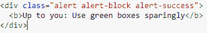

**输出:**

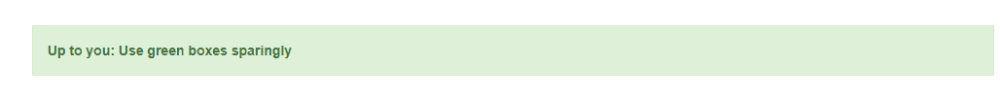

这是一个成功的降价单元

### 缩进

使用大于号“>”和空格，然后键入文本。一切都缩进，直到下一个回车。

使用“>”* x 次。其中 x 是您想要缩进给定文本的次数。

**输入:**

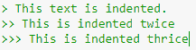

**输出:**

嵌套缩进块的示例

它们也可以通过

> text

获得

**输入:**

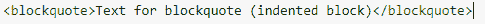

**输出:**

使用

> Example of block reference of tag

### 子弹

使用破折号“-”后面有两个空格或一个空格、破折号和一个空格“-”来创建一个圆形项目符号。要创建子项目符号，请使用制表符后跟破折号和两个空格。您也可以使用星号(“*”)代替破折号，它的工作原理是一样的。

**输入:**

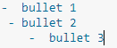

**输出:**

圆形、方形和子项目符号示例

### 等间距字体

用后面的单引号( ` )将文本括起来。对于文件路径和文件名以及用户输入的文本或用户看到的消息文本，请使用等间距。

**输入:**

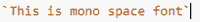

**输出:**

等间距字体示例

### 嵌入式编码器

您可以在 Python 中嵌入用于说明而不是执行的代码:

代码部分是指定不同编程语言代码的部分，可以在内联代码以“‘内联代码在此处’打勾”开头，但代码块以三个打勾“‘块行代码在此处’”开头的地方呈现。此外，代码部分的标记是“`代码在这里`”。``

**输入:**

使用降价

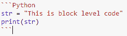

**输出:**

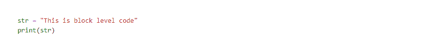

使用标记来表示 python 代码段

**输入:**

使用标记标签

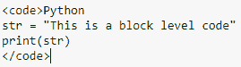

**输出:**

使用标记来表示 python 代码

### **数学符号和乳胶方程式**

Markdown 中的数学符号包含在“$数学表达式在这里{content}”中。包含在美元符号和标记中，您可以通过此链接了解更多详细信息:数学运算符。你可以看到下面使用[数学符号](https://www.w3schools.com/charsets/ref_utf_math.asp)的例子。

使用以下代码:$数学符号$。你可以把数学表达式都包括在内: **ei？+1=0** 并显示:

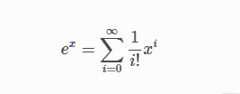

单独一行中的表达式

内嵌表达式可以通过在 latex 代码周围加上$来添加:

**输入:**

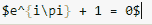

**输出:**

这是数学表达式的内联表示

它们自己行上的表达式被$包围:

**输入:**

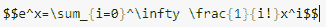

**输出:**

这是数学表达式的轮廓表示

### **断线**

换行标记以
标记开始，没有换行的结束标记，其余内容以新的一行开始，如下例所示。

**输入:**

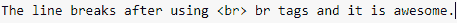

**输出:**

“br 标签和它是令人敬畏的”出现在一个新的行。"

### **粗斜体文字**

您可以使用 **< b >** 标签、**“* *”**即“双星号”或**“_ _”**即“双下划线”来获得具有以下语法的粗体文本。

**输入:**

**输出:**

粗体文本示例。

您可以使用 **< i >** 标记、**' ***即单个星号或 **'_'** 即单个下划线来获取以下语法的斜体文本。不要在星号和文本之间留空格，因为它算作一个项目符号。

**输入:**

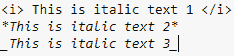

**输出:**

斜体文本示例

### **水平线**

您可以通过使用标记“—”三个连字符或标记标签

* * *

获得一条水平线

单击“运行”后，上述两种语法将呈现从一端到另一端的水平线。

**输入:**

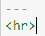

**输出:**

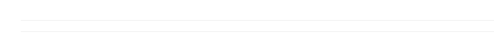

水平线示例

### 有序和无序列表

**有序列表:**

**输入:**

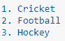

或者

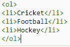

**输出:**

这是一个有序列表的例子

**无序列表:**无序列表是通过使用< ul >标签并以< /ul >标签结束而获得的项目符号列表，见下例:

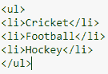

或者，无序列表可以以带空格的“-”符号开始，这给出了黑色圆圈符号，也可以以带空格的“*”符号开始，这给出了黑色正方形符号。

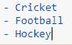

**输出:**

这是一个无序列表的例子

### **内外链接**

**内部链接:**上面定义的 id 可以通过跟随使链接可点击的代码链接到笔记本的部分。

**【章节标题】(#分部 _ID)**

上面的例子可以在下面看到，其中定义的 id 与工具栏中点击“运行”后获得的部分和可点击链接相链接。

**输入:**

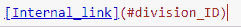

**输出:**

这是一个内在联系

或者

Markdown 中的内部链接以

**输入:**

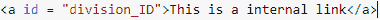

**输出:**

内部链接使用  标记

**外部链接:**Markdown 中的外部链接以< a >开始，以< a >标记结束，即< a >代表定义链接的锚点，它有属性‘href’也叫超引用，包含链接或 URL 的目的地址，标记之间的文本可见，可点击打开目的地址，如下图所示。

**输入:**

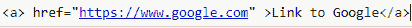

或者，它也可以以 __(网站的网址)_ 开始，其中双下划线在两边，文本链接用方括号括起来，网站的网址用括号括起来，后面跟着网址。

**输入:**

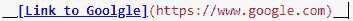

**输出:**

外部链接示例

### 桌子

表格包含行和列中的信息，由“|”组合而成，即“竖线”分隔每一列，用“-”即连字符符号创建标题，空白行即竖线和破折号的组合呈现表格格式。

此外，您可以通过与列大致对齐来改变单元格，笔记本会自动调整给定单元格中内容的大小。

**输入:**

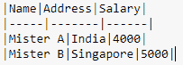

或者，向下标记可用于构建表格，其中< table >用于定义宽度为百分比的表格。设置表格行，表格行以粗体居中显示，表格标题由Description, located at the top of the table, other entries in the table are defined bySettings, that is, table data labels.

**输入:**

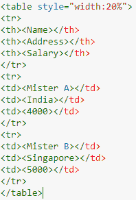

**输出:**

表格示例

### 图像

您可以通过从“编辑”菜单中选择“插入图像”从工具栏中插入图像，并可以浏览所需的图像，如下所示。

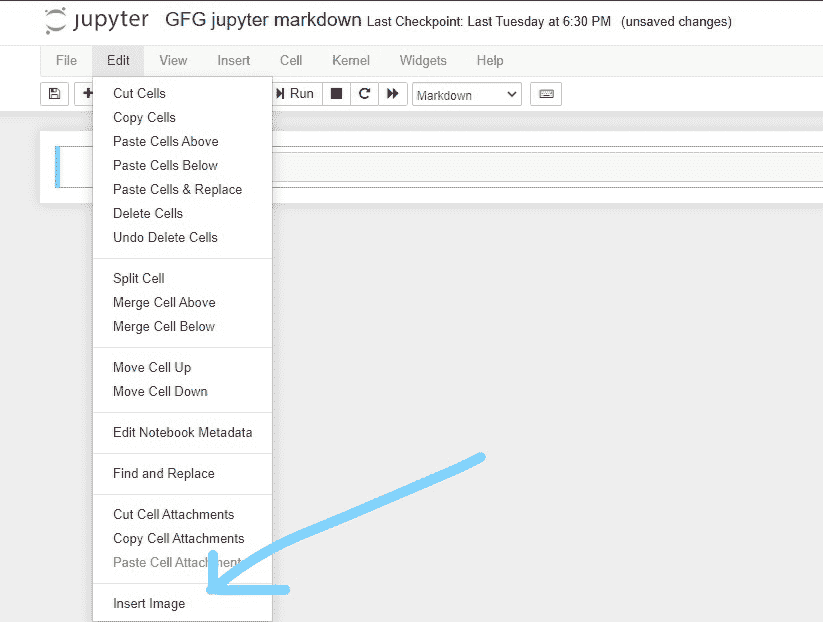

使用工具栏插入图像

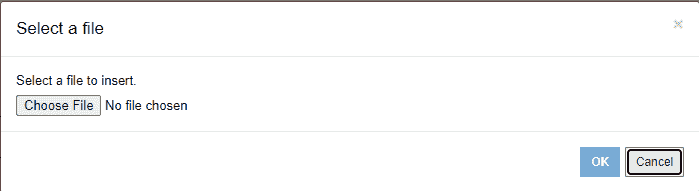

从电脑中选择一个文件

或者您也可以使用标签插入图像:

**输入:**

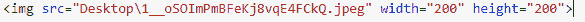

**输出:**

使用标签插入图像

### GitHub 风味降价

笔记本网络应用程序支持 Github 风格的降价，这意味着您可以对代码块使用三重回溯:

**输入:**

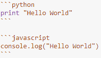

**输出:**

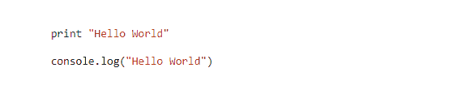

这是 GitHub 口味的降价