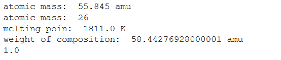
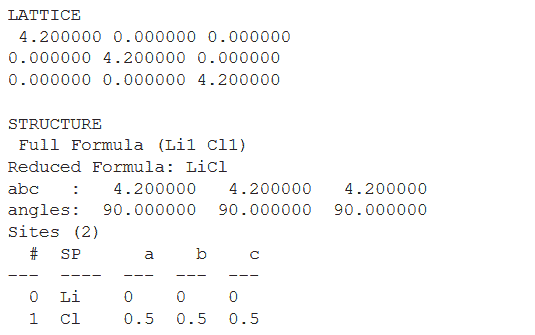
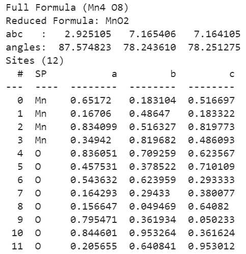
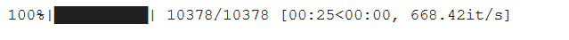
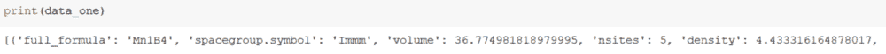
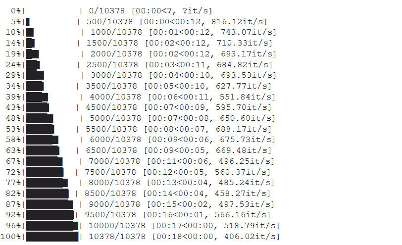
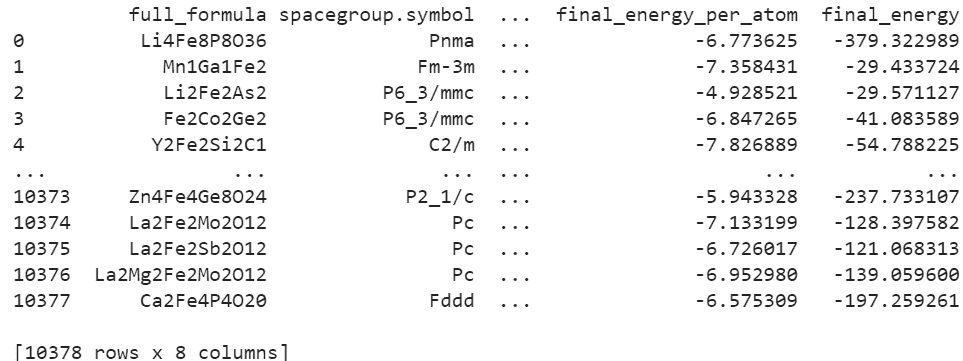

# 使用 Python 进行材料分析

> 原文:[https://www . geesforgeks . org/material-analysis-use-python/](https://www.geeksforgeeks.org/material-analysis-using-python/)

使用一个以上领域的基本原理来解决一个复杂的问题可能很难通过使用一个领域的知识来实现。通过这种方法，人们还可以重新定义超出通常界限的问题，并利用对以前认为不可能解决的难以理解的情况的新理解来达成解决方案。

## **材料分析**

通俗地说，分析材料及其性质是一个研究领域。

科学上——这是一项研究，旨在深入了解材料的基本特性，以确定该材料是否适合其预期用途，或者是否需要某种掺杂(或任何其他方法)以使其完全符合该目的。

**用例:**这项研究也正在与计算机科学相结合，以便在没有太多实际实现的情况下更好、更精确地洞察数据。

**例如:**如果你有一个数据库，比如说，锰(锰)化合物和它们的磁性行为。分析相同的数据可以使用机器学习方法预测未知磁性化合物的磁性(其性质仍然是新的)。

## **描述符**

在字典中，它被描述为用来描述或识别某物的单词或表达方式。

描述符用于描述计算算法的复合。属性元素的许多表示可以转换成向量和矩阵的数学格式(像使用单热向量编码来描述元素的电子配置)，以将它们作为输入传递给机器学习算法。

## Pymatgen 模块

Pymatgen 是 Python 材料基因组学的简称。这是一个健壮的、开源的、广泛用于材料分析的 Python 库。

注意-仅获得电子配置、原子序数或任何其他非常基本的材料属性不考虑材料分析。

Pymatgen 被广泛采用，因为它:

1.  高度灵活的元素、位置、分子、结构对象、最近邻表示类。
2.  各种输入/输出格式，如到岸价格，高斯，XYZ，VASP。
3.  电子结构分析，如态密度和能带结构。
4.  强大的分析工具。
5.  与材料项目 REST API、结晶学开放数据库和其他外部数据源集成。
6.  它是免费使用的，记录良好，开放和快速。

### 装置

因为它不是内置的 python 库，所以需要从外部安装。

#### 第一种方法:

最简单的安装是使用 conda。安装 conda 后:

> conda 安装–通道 conda-forge pymatgen

Pymatgen 使用“gcc”进行编译，因此需要最新版本的 gcc 来编译 pymatgen。

> conda 安装 gcc

Pymatgen 是开源的，所以会定期添加新功能。因此，要将 pymatgen 升级到最新版本:

> pymatgen 升级伯爵

#### **第二种方法:**

使用 pip:

> pip 安装 pymatgen

升级 pymatgen

> pip 安装–升级 pymatgen

#### 第三种方法:

在谷歌 collab 上安装 pymatgen

> ！pip 安装 pymatgen

## 履行

#### **元素和化合物的详细信息**

使用 Pymatgen 库的 element 类获取元素的细节(如原子质量、熔点)。将元素符号作为参数传递给元素类。

同样，也可以得到一个化合物的细节。

## 蟒蛇 3

```
import pymatgen.core as pg
# Fetch details of an Element
fe = pg.Element("Fe")
# Atomic mass
print('atomic mass: ', fe.atomic_mass)
print('atomic mass: ', fe.Z)
# Melting point
print('melting point: ', fe.melting_point)

# Fetch details of a composition
cmps = pg.Composition("NaCl")
print('weight of composition: ', cmps.weight)

# Composition allows strings to
# be treated as an Element object
# It returns the number of Cl
# atoms present in the composition
cmps["Cl"]
```

**输出:**



#### 结构和文件格式

Pymatgen 有许多库，根据它们所代表的属性进行分组/分离。这里，pymatgen 第一个对角点阵被创建，然后获取它的结构。如果没有文件名，将返回一个字符串。否则，输出将被写入文件。如果只提供文件名

## 蟒蛇 3

```
# import module
import pymatgen.core as pg
from pymatgen.symmetry.analyzer import SpacegroupAnalyzer

# assign and display data
lattice = pg.Lattice.cubic(4.2)
print('LATTICE\n', lattice, '\n')
structure = pg.Structure(lattice, ["Li", "Cl"],
                         [[0, 0, 0],
                          [0.5, 0.5, 0.5]])
print('STRUCTURE', '\n', structure)

# Convert structure of the compound
# to user defined formats
structure.to(fmt="poscar")
structure.to(filename="POSCAR")
structure.to(filename="CsCl.cif")
```

**输出:**



#### 提取结构

Pymatgen 还允许用户从外部文件中读取结构。您可以通过以下代码中使用的字符串和文件两种方式来实现相同的目的。我们要获取的文件是 [MnO2.cif](https://materialsproject.org/materials/mp-19395/#) 的计算版本。

## 蟒蛇 3

```
# Reading a structure from a file
structure = pg.Structure.from_str(open("MnO2.cif").read(),
                                  fmt="cif")
structure = pg.Structure.from_file("MnO2.cif")

# Reading a molecule from a file
graphite = pg.Molecule.from_file("graphite.xyz")
# Writing the same molecule but in other file format
mol.to("graphite.cif")
```

**输出:**



它还可以作为文件转换器，因为它允许以一种格式从文件中读取分子，并以另一种格式将相同的分子写入文件。

#### **外部数据源**

如上所述，pymatgen 可以链接到不同的外部数据源。材料项目的数据可以使用项目的 MPRester API 在 pymatgen 中访问。

材料项目是通过开放材料应用程序编程接口(也称为 MPRester API，因为它基于表示状态转移(REST)原则)提供数据和科学分析的外部数据库之一。这个应用编程接口可以与支持基本 HTTP 请求的任何编程语言一起使用，MPRester 应用编程接口的包装器已经在 pymatgen 库中实现，以方便希望利用其数据的研究人员。

API 密钥生成参见本网站->[https://materialsproject.org/open](https://materialsproject.org/open)

这里，首先使用应用编程接口键创建对象，然后查询特定任务标识的属性数据(任务标识可以被认为是材料项目数据库中每个元素的唯一标识)。

注意-属性名称在属性下提及。如果不存在这样的特定属性数据，则接收该特定属性的空对象。

## 蟒蛇 3

```
# import module
from pymatgen.ext.matproj import MPRester

# create object
m = MPRester(API_key)
# fetch all the required properties of an element using mpid
# fetching details of a compound related to TaskId=mpid-1010
data_one = m.query(criteria={'task_id': 'mp-1010'},
                   properties=["full_formula",
                               "spacegroup.symbol",
                               "volume",
                               "nsites", "density",
                               "spacegroup.crystal_system",
                               "final_energy_per_atom",
                               "final_energy"])

# display fetched data
print(data_one)
```

输出格式在字典数据结构中，以便于简单易懂地访问所需的属性

**输出:**

 

其次，获取铁(铁)化合物的所有定义的性质数据(元素和化合物)。

## 蟒蛇 3

```
# Fetch all the compounds details of an element in the database
# Fetching data of Fe-Iron
from pymatgen.ext.matproj import MPRester

import pandas as pd
m = MPRester(API_key)
data_s = m.query(criteria={"elements": {"$in": ["Fe"]}},
                 properties=["full_formula",
                             "spacegroup.symbol",
                             "volume",
                             "nsites", "density",
                             "spacegroup.crystal_system",
                             "final_energy_per_atom",
                             "final_energy"])

# convert data to pandas data
# frame and store it in .csv file
df = pd.DataFrame(data_s)
df.to_csv('all.csv')

# display data saved in all.csv
print(df)
```

查询 Fe 元素所有数据的输出是嵌套字典格式，在控制台中显示非常大，因此首先将其转换为 pandas 数据框，然后将其保存为. csv 文件。

**输出:**

 

## 真实的用例

在这里，我们要计算化合物中的原子数量。这可以很容易地通过以 CIF 格式获取化合物的结构细节来完成，因为它包含化合物的每个原子的所有坐标位置。

首先，从文件中删除所有不必要的文本，然后计算剩余的行数。

CoNi3 化合物与 mp-1183751 相关

## 蟒蛇 3

```
# import module
from pymatgen.core import Structure
from pymatgen.ext.matproj import MPRester
import re

m = MPRester(API_key)
id = 'mp-1183751'
data_c = m.query(criteria={'task_id': id},
                 properties=[
                 'cifs.conventional_standard'])

# delete extras
with open('cnt.cif', 'w') as f:
    filedata = str(data_c)
    filedata = re.sub(r'.*_occupancy',
                      '', filedata)
    filedata = filedata[:-4]
    filedata = filedata.replace('\\n',
                                '\n')
    f.write(filedata[1:])
    f.close()
    count = len(open('cnt.cif',
                     'r').readlines())

    # display the no. of atoms
    print(count)
```

**输出:**

```
4
```