# 主成分分析的数学方法

> 原文:[https://www.geeksforgeeks.org/mathematical-approach-to-pca/](https://www.geeksforgeeks.org/mathematical-approach-to-pca/)

**什么是 PCA？**

**主成分分析**的主要指导原则是特征提取，即“数据集的特征应该更少，并且彼此之间的相似性非常小。”在主成分分析中，从本质上非常不同的原始特征中提取一组新的特征。因此，一个 **n 维特征空间**被转换成一个 **m 维特征空间。**，其中尺寸相互正交。

**正交性概念:**

(要理解这个题目，就得去线性代数中的向量空间概念)**向量空间**是一组向量。它们可以表示为称为**基向量的较小向量集的线性组合。**因此向量空间中的任何向量‘v’都可以表示为:

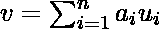

其中 ***a*** 代表‘n’个标量，u 代表基向量。基向量彼此正交。向量的正交性可以被认为是向量在二维向量空间**中垂直的延伸。**所以我们的特征向量(数据集)可以转换成一组主成分(就像基向量一样)。

**主成分分析的目标:**

1.  新特征是不同的，即新特征之间的协方差(在主成分分析的情况下，它们是主成分)是 **0** 。
2.  主成分是按照它捕获的数据的可变性来生成的。因此，第一个主成分应该捕获最大的可变性，第二个主成分应该捕获次高的可变性，等等。
3.  新特征/主成分的方差之和应等于原始特征的方差之和。

**主成分分析工作:**

主成分分析在数据集协方差矩阵的特征值分解过程中工作。步骤如下:

*   首先，计算数据集的协方差矩阵。
*   然后，计算协方差矩阵的特征向量。
*   具有最高特征值的特征向量表示方差最高的方向。因此，这将有助于确定第一个主成分。
*   具有次高特征值的特征向量表示数据具有最高剩余方差并且也与第一方向正交的方向。这有助于识别第二个主成分。
*   像这样，识别具有顶‘k’个特征值的顶‘k’个特征向量，得到‘k’个主成分。

**主成分分析的数值:**

考虑以下数据集

<figure class="table">

| **x1** | **2.5** | **0.5** | **2.2** | **1.9** | **3.1** | **2.3** | **2.0** | **1.0** | **1.5** | **1.1** |
| **x2** | **2.4** | **0.7** | **2.9** | **2.2** | **3.0** | **2.7** | **1.6** | **1.1** | **1.6** | **0.9** |

</figure>

#### **第一步:标准化数据集**

的平均值= 1.81 = 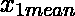

的平均值= 1.91 = 

我们将更改数据集。

<figure class="table">

| 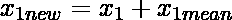 | Zero point six nine | -1.31 | Zero point three nine | Zero point zero nine | One point two nine | Zero point four nine | Zero point one nine | -0.81 | -0.31 | -0.71 |
|  | Zero point four nine | -1.21 | Zero point nine nine | Zero point two nine | One point zero nine | Zero point seven nine | -0.31 | -0.81 | -0.31 | -1.01 |

</figure>

#### **第二步:求特征值和特征向量**

**相关矩阵 c =** 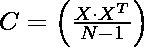

**其中，X 为数据集矩阵**(本数值中为 10×2 矩阵)

 是 X 的转置(在这个数值中，它是一个 2×10 的矩阵)，N 是元素个数= 10

所以，

{因此，为了计算相关矩阵，我们必须将数据集矩阵与其转置相乘}

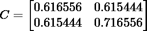

使用等式，**| C–****I | = 0**–**等式(i)** 其中{ \λ是特征值，I 是单位矩阵}

所以解方程(I)

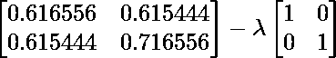

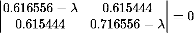

取左侧的行列式，我们得到

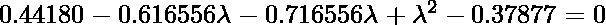

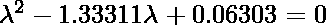

我们得到的两个值，分别是 **(**  ** ) = 1.28403 和(**  **) = 0.0490834** 。现在我们必须找到特征值 **和** 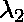的特征向量

**为了从特征值中找到特征向量，我们将使用以下方法:**

首先，我们将通过使用方程找到特征值 1.28403 的特征向量

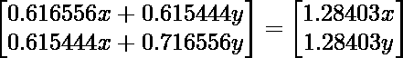

求解矩阵，我们得到

0.616556 x+0.615444y = 1.28403 x； **x = 0.922049 y**

(X 和 y 属于矩阵 X)所以如果我们把 y = 1，X 出来就是 0.922049。所以现在更新后的 X 矩阵看起来像:

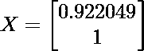

> **IMP:到目前为止我们还没有达到特征向量，我们必须对 X 矩阵进行一点修改。它们如下:**
> 
> A.求 X 矩阵中元素平方和的平方根，即
> 
> 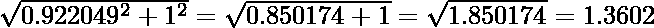
> 
> B.现在把 X 矩阵的元素除以 1.3602(刚刚发现)
> 
> 
> 
> **所以现在我们找到了特征向量**  **的特征向量，它们分别是 0.67787 和 0.73518**

**其次，我们将使用等式{与上一步相同的方法)**找到特征值 0.0490834 的特征向量

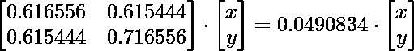

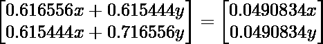

求解矩阵，我们得到

0.616556 x+0.615444y = 0.0490834 x； **y = -0.922053**

(X 和 y 属于矩阵 X)所以如果我们把 x = 1，y 出来是-0.922053 所以现在更新的 X 矩阵会是这样的:

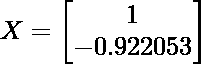

> 到目前为止，我们还没有达到特征向量，我们必须对 X 矩阵进行一些修改。它们如下:
> 
> A.求 X 矩阵中元素平方和的平方根，即
> 
> 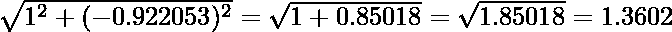
> 
> B.现在把 X 矩阵的元素除以 1.3602(刚刚发现)
> 
> 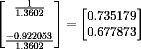
> 
> **那么现在我们找到了特征向量\λ_ 2 的特征向量，它们是 0.735176 和 0.677873**

特征值()和()之和= 1.28403 + 0.0490834 = 1.33 =总方差{大部分方差来自

#### **第三步:排列特征值**

特征值最高的特征向量是数据集的主成分。所以在这种情况下，λ1 的特征向量是主成分。

{基本上为了完成数值，我们只需要求解到这一步，但是如果我们必须证明为什么我们选择了那个特定的特征向量，我们必须遵循从 4 到 6 的步骤 **}**

#### **第四步:形成特征向量**

 这是数值的特征向量

其中第一列是 &的特征向量，第二列是的特征向量

#### **步骤 5:变换原始数据集**

使用方程 Z = X V

![\begin{bmatrix} 0.69 & 0.49 \\ -1.31 & -1.21 \\ 0.39 & 0.99 \\ 0.09 & 0.29 \\ 1.29 & 1.09 \\ 0.49 & 0.79 \\ 0.19 & -0.31 \\ -0.81 & -0.81 \\ -0.31 & -0.31 \\ -0.71 & -1.01 \end{bmatrix} \cdot \begin{bmatrix} 0.677873 & 0.735179 \\ 0.735179 & -0.677879 \end{bmatrix} = \begin{bmatrix} 0.8297008 & 0.17511574 \\ -1.77758022 & -0.14285816 \\ 0.99219768 & -0.38437446 \\ 0.27421048 & -0.13041706 \\ 1.67580128 & 0.20949934 \\ 0.91294918 & -0.17528196 \\ -1.14457212 & -0.04641786 \\ -0.43804612 & -0.01776486 \\ -1.22382.62 & 0.16267464 \end{bmatrix} = Z](img/85d83e88136d7caa5fba20589fd39d06.png "Rendered by QuickLaTeX.com")

#### **第六步:重建数据**

使用等式 X =  ( 是 V 的转置)，X =行零均值数据

![\begin{bmatrix} 0.8297008 & 0.17511574 \\ -1.77758022 & -0.14285816 \\ 0.99219768 & -0.38437446 \\ 0.27421048 & -0.13041706 \\ 1.67580128 & 0.20949934 \\ 0.91294918 & -0.17528196 \\ -1.14457212 & -0.04641786 \\ -0.43804612 & -0.01776486 \\ -1.22382.62 & 0.16267464 \end{bmatrix} \cdot \begin{bmatrix} 0.677873 & 0.735179 \\ 0.735176 & -0.677879 \end{bmatrix} = \begin{bmatrix} 0.6899999766573 & 0.4899999834233 \\ -1.3099999556827 & -1.2099999590657 \\ 0.389999968063 & 0.9899999665083 \\ 0.0899999969553 & 0.2899999901893 \\ 0.61212695653593 & 0.35482096313253 \\ 0.4899999834233 & 0.7899999732743 \\ 0.189999935723 & -0.309999995127 \\ -0.8099999725977 & -0.8099999725977 \\ -0.3099999895127 & -0.3099999895127\\ -0.7099999759807 & -1.0099999658317 \end{bmatrix}](img/89ae419808b16f30d1a8e53f9f41c034.png "Rendered by QuickLaTeX.com")

为了重建原始数据，我们遵循:

**行原始数据集=行零均值数据+原始均值**

![\begin{bmatrix} 0.6899999766573 & 0.4899999834233 \\ -1.3099999556827 & -1.2099999590657 \\ 0.389999968063 & 0.9899999665083 \\ 0.0899999969553 & 0.2899999901893 \\ 0.61212695653593 & 0.35482096313253 \\ 0.4899999834233 & 0.7899999732743 \\ 0.189999935723 & -0.309999995127 \\ -0.8099999725977 & -0.8099999725977 \\ -0.3099999895127 & -0.3099999895127\\ -0.7099999759807 & -1.0099999658317 \end{bmatrix} + \begin{bmatrix} 1.81 & 1.91 \end{bmatrix} = \begin{bmatrix} 2.49 & 2.39 \\ 0.5 & 0.7 \\ 2.19 & 2.89 \\ 1.89 & 2.19 \\ 3.08 & 2.99 \\ 2.30 & 2.7 \\ 2.01 & 1.59 \\ 1.01 & 1.11 \\ 1.5 & 1.6 \\ 1.1 & 0.9 \end{bmatrix}](img/a800e653190aca22277e57297d401138.png "Rendered by QuickLaTeX.com")

因此，对于第一特征值的特征向量，可以像原始数据集一样重构数据。因此我们可以说数据集的主成分是是 1.28403，其次是  **也就是 0.0490834**