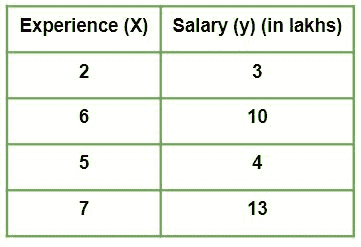
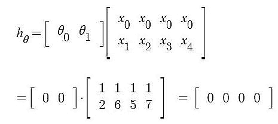
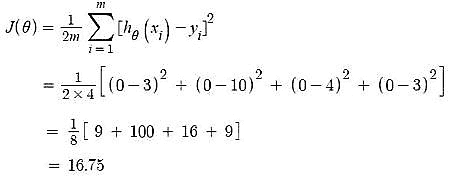
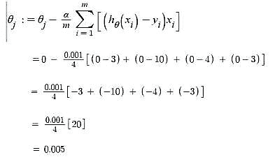
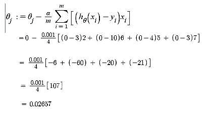
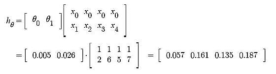

# 线性回归工作的数学解释

> 原文:[https://www . geesforgeks . org/数学-线性回归解释-工作/](https://www.geeksforgeeks.org/mathematical-explanation-for-linear-regression-working/)

假设给我们一个数据集

给出了一个公司的工作与经验数据集，任务是根据员工的工作经验预测其工资。
本文旨在解释当我们使用预定义函数执行预测任务时，现实中[线性回归](https://www.geeksforgeeks.org/ml-linear-regression/)在数学上是如何工作的。
让我们探索一下**当线性回归算法被训练时，这些东西是如何工作的。**

**迭代 1**–开始时，随机选择θ 0 和θ 1 值。我们假设，θ 0 = 0，θ 1 = 0。

*   **线性回归假设下迭代 1 后的预测值。**

*   **成本函数–错误**

*   **梯度下降–更新θ 0 值**T4【这里，j = 0

*   **梯度下降–更新θ 1 值**T4【这里，j = 1

**迭代 2**–θ0= 0.005，θ1= 0.02657

*   **线性回归假设下迭代 1 后的预测值。**

现在，类似于上面执行的第 1 次迭代，我们将再次计算成本函数，并使用梯度下降更新θ j 值。
我们将继续迭代，直到成本函数不再减少。此时，模型达到最佳θ值。在模型假设中使用这些θ值将给出最佳的预测结果。