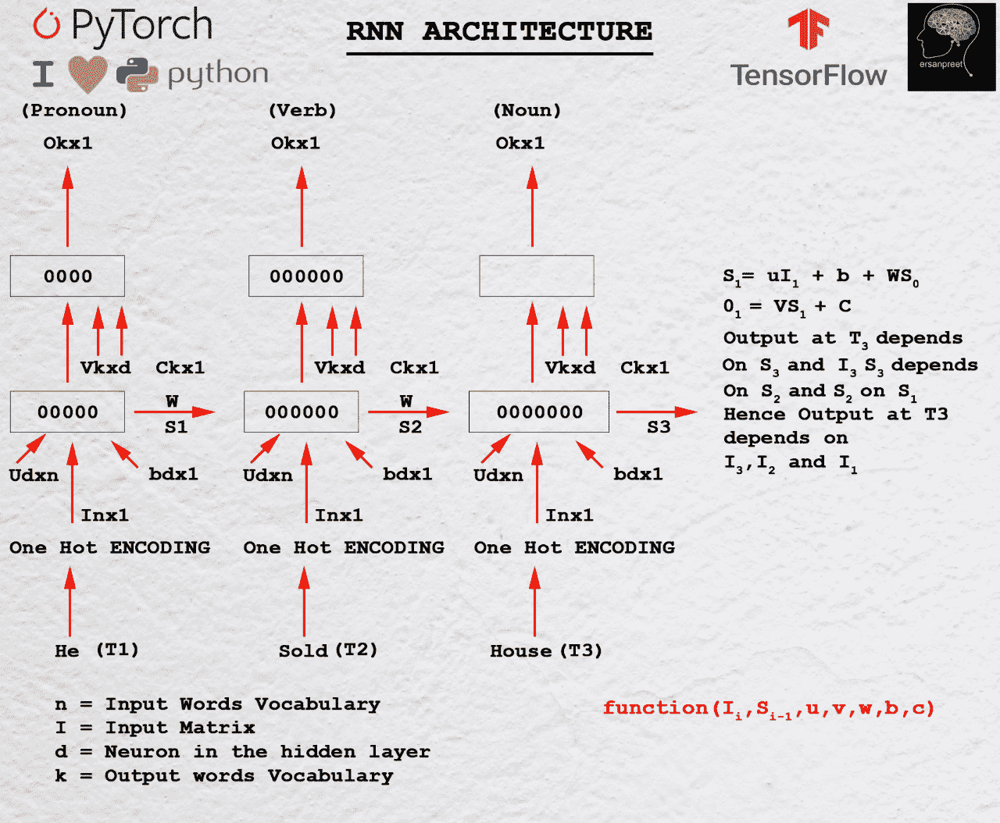
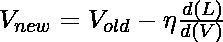
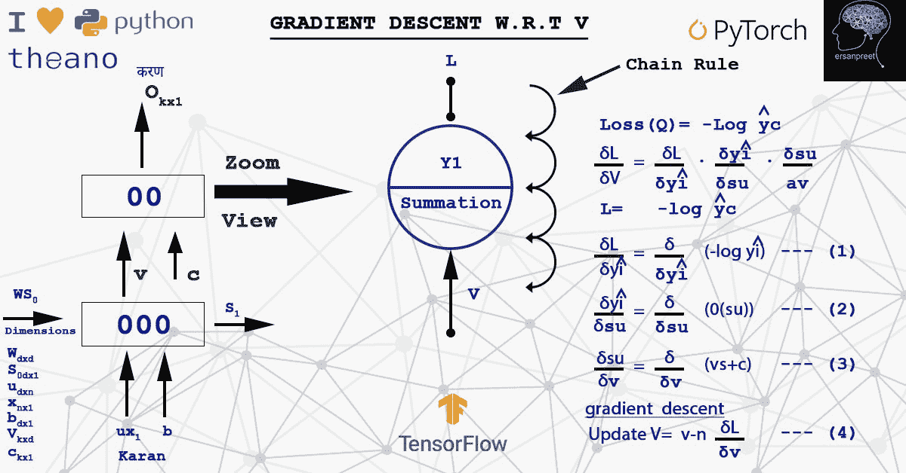
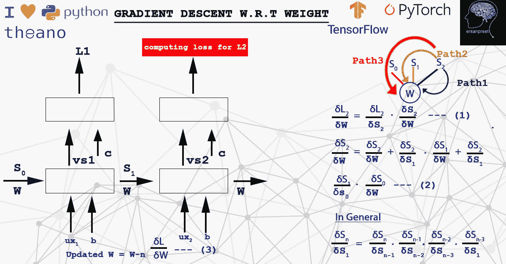
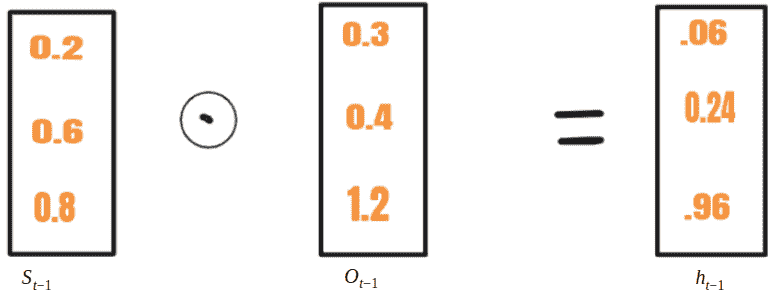
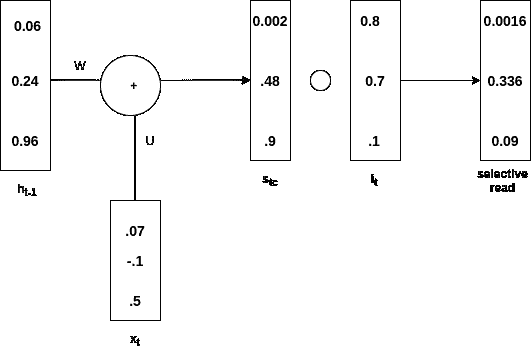
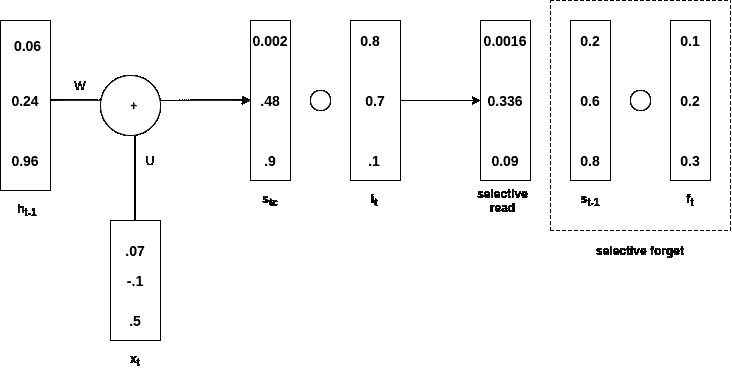
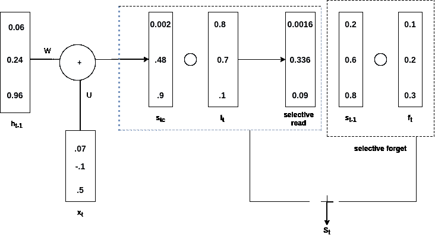
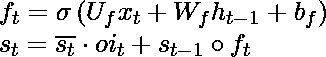

# 对 RNN 及其变体的数学理解

> 原文:[https://www . geeksforgeeks . org/对 rnn 及其变体的数学理解/](https://www.geeksforgeeks.org/mathematical-understanding-of-rnn-and-its-variants/)

**简介:**

专家预计人工智能将致力于创造更美好的生活。他们说，随着未来更多的计算能力，即更多的图形处理单元，人工智能将为人类带来更大的进步和生产力。如今，人们可以看到许多这样的人工智能驱动的应用程序，如打击人口贩运、医疗顾问、自动驾驶汽车、入侵检测和预防、对象跟踪和计数、人脸检测和识别、疾病预测以及寻求人类帮助的虚拟援助。这篇特别的帖子讨论了 RNN，它的变体(LSTM，GRU)和它背后的数学。RNN 是一种接受可变长度输入并产生可变长度输出的神经网络。它被用来开发各种应用，如文本到语音，聊天机器人，语言建模，情感分析，时间序列股票预测，机器翻译和 nam 实体识别。

**目录:**

*   什么是 RNN，它与前馈神经网络有何不同
*   RNN 背后的数学
*   RNN 变体(LSTM 和 GRU)
*   RNN 的实际应用
*   最后说明

**什么是 RNN，它与前馈神经网络有何不同:**

RNN 是一个递归神经网络，其当前输出不仅取决于其当前值，还取决于过去的输入，而对于前馈网络，当前输出仅取决于当前输入。请看下面的例子，以便更好地理解 RNN。

> 拉胡尔属于国会。
> 
> 拉胡尔是印度板球队的一员。

如果有人问谁是拉胡尔，他/她会说两个拉胡尔都不一样，即一个来自印度国会，另一个来自印度板球队。现在，如果给机器同样的任务来给出输出，它不能说，直到它知道完整的上下文，即预测单个单词的身份取决于知道整个上下文。这种任务可以由 RNN 的变种 LSTM 来执行。RNN 适合这样的工作，因为他们有能力了解背景。其他应用包括语音到文本的转换、构建虚拟辅助、时间序列股票预测、情感分析、语言建模和机器翻译。另一方面，前馈神经网络产生仅取决于当前输入的输出。例如图像分类任务、图像分割或对象检测任务。这种网络的一种类型是卷积神经网络(CNN)。请记住，RNN 和美国有线电视新闻网都是有监督的深度学习模型，也就是说，它们在训练阶段需要标签。

## RNN 背后的数学

**1。)RNN 数学方程**

要了解 RNN 背后的数学，请看下图



RNN 背后的数学

正如第一个标题中所讨论的，输出取决于当前和过去的输入。让 **I <sub>1</sub>** 作为第一个输入，其维度为 **n*1** ，其中 n 为词汇长度。 **S <sub>0</sub>** 是第一个具有 d 神经元的 RNN 细胞的隐藏状态。对于每个单元格，输入隐藏状态应该是前一个。对于第一个单元，用零或一些随机数初始化 **S <sub>0</sub>** ，因为没有看到以前的状态。 **U** 是维度 **d*n** 的另一个矩阵，其中 **d** 是第一个 RNN 细胞中的神经元数量， **n** 是输入词汇大小。 **W** 是另一个尺寸为 **d*d** 的矩阵。 **b** 是尺寸为 **d*1** 的偏差。为了找到第一个单元的输出，取另一个矩阵 **V** ，其尺寸为 **k*d** ，其中 **c** 与尺寸 **k*1** 偏置。

**数学上，****第一 RNN 单元的输出如下**

```
S1= UI1+ WS0 + b
O1= VS1+c
```

**一般情况下，**

```
Sn= UIn+ WSn-1 + b
On= VSn+c
```

**从**键取上述**方程**

一般来说，输出 O <sub>n</sub> 取决于 S <sub>n</sub> ，S <sub>n</sub> 取决于 S <sub>n-1</sub> 。S <sub>n-1</sub> 依赖 S <sub>n-2</sub> 。过程进行到 S <sub>0</sub> 完成。这清楚地表明，第 n<sup>时间步长的输出取决于所有先前的输入。</sup>

### 2.)参数和梯度

RNN 中的参数为 **U、V、b、c、W** 在所有 RNN 单元中共享。共享的原因是创建一个可以在所有时间步骤中应用的公共函数。参数是可学习的，负责训练模型。在每个时间步，计算损失，并通过梯度下降算法反向传播。

#### 2.1)相对于 V 的损失梯度

梯度表示切线和点在函数最大增长率方向上的斜率。我们有兴趣发现损失最小的 V。从损失来看，它意味着成本函数或误差。简单来说，成本函数是真实值和预测值之间的差值。移动方向与相对于 V 的损耗梯度方向相反。数学上，使用以下数学公式获得新的 V 值

<center></center>

其中 **d(L)/d(V)** 是从时间步长获得的所有损失的总和。有两种更新权重的方法。一种是计算定义批次的梯度，然后更新它(迷你批次)或计算每个样本并更新(随机)。在计算 **d(L)/d(V)** 时，应用了链式法则。请看下图，了解计算和链式法则。



计算损耗梯度的链式规则实现

#### 2.2)相对于 W 的损失梯度

**W** 乘以 **S** 。为了计算在任何时间步长相对于重量的损失导数，应用链式法则来考虑从 **S <sub>n</sub>** 到 **S <sub>0</sub>** 到达 W 的所有路径。这意味着由于任何错误的 S <sub>n</sub> ，W 受到影响。换句话说，一些错误的信息来自一些隐藏的状态，从而导致损失。数学上，权重更新如下

<center></center>

要记住的关键点是，梯度和权重要么在每个样本更新，要么在一批之后更新。这取决于选择随机或小批量的算法。请看下面的截图，以更精细的方式可视化概念。



相对于 W 的梯度下降

## RNN 变体(LSTM 和 GRU)

从上面的讨论中，我希望 RNN 背后的数学现在是清晰的。RNN 的主要缺点是，无论序列的长度是多少，状态向量的维数保持不变。考虑到一种情况，如果输入序列的长度很长，新的信息被添加到相同的状态向量中。当一个人到达远离第一时间步的第 n 个时间步时，信息是非常混乱的。在这种情况下，不清楚在时间步骤 1 或 2 提供了什么信息。它类似于一块白板，它的尺寸是固定的，人们在上面不停地书写。在某些位置，它变得非常凌乱。人们甚至看不懂写在船上的东西。为了解决这些问题，它的变体被称为 LSTM 和格鲁。他们根据选择性读、写和忘记的原则工作。现在白板(**类比状态向量**)是一样的，但是在时间步只写需要的信息，过滤掉不需要的信息，使得序列神经网络适合长序列的训练。从这里的[可以看出 LSTM 和 GRU 的区别。](https://www.quora.com/Whats-the-difference-between-LSTM-and-GRU/answer/Sanpreet-Singh-10?ch=10&share=6e532d5d&srid=Y73q)

### LSTM(长短期记忆)

#### 数学表示:

遵循的策略是选择性的写、读、忘。



选择性写入

**选择性写入:**

在 RNN， **S <sub>t-</sub>** <sub>1</sub> 与 **x <sub>t</sub>** 一起送入细胞，而在 LSTM**S<sub>t-1</sub>**<sub>用另一种载体 **O <sub>t-1</sub> 转化为**h<sub>t-1</sub>**<sub>这个过程叫做**选择性写入**。选择性写入的数学方程式如下</sub>**</sub>

<center></center>

**选择性读取:**

请看下图，了解概念



选择性阅读

**h <sub>t-1</sub>** 加 **x <sub>t</sub>** 生成 s <sub>t</sub> 。然后将的哈达玛积(图中写成 **s <sub> tc </sub>** )制成 **s <sub> t </sub>** 。这叫做**输入门**。在 s <sub>t</sub> 中，只有选择性信息通过，这个过程称为**选择性读取**。数学上，选择性读取的方程式如下

<center></center>

**选择性遗忘:**

请看下图，了解概念



选择性遗忘

**s <sub>t-1</sub>** 是哈达玛与 f <sub>t</sub> 的乘积，被称为**选择性遗忘**。总的来说 **s <sub>t</sub>** 是通过选择性读取和选择性遗忘相加得到的。请参见下图以理解上述陈述



增加选择性阅读和遗忘

数学上，选择性遗忘的公式如下

<center></center>

**注:**GRU 没有忘年门(门控轮回单位)。它只有输入和输出门。

**RNN 的实际应用:**

RNN 在语音到文本转换、构建虚拟辅助、情感分析、时间序列股票预测、机器翻译、语言建模中找到了它的用例。更多的研究正在使用 RNN 及其变体创建生成性聊天机器人。其他应用程序包括图像字幕、从一个小段落生成大文本和文本摘要(像 Inshorts 这样的应用程序正在使用这一功能)。音乐创作和呼叫中心分析是使用 RNN 的其他领域。

**最终备注:**

简而言之，我们可以从开篇理解 RNN 和前馈神经网络的区别，然后深入 RNN 背后的数学。最后，文章通过解释 RNN 的不同变体和 RNN 的一些实际应用来完成。为了研究 RNN 的应用，人们必须在微积分、导数，尤其是链式法则是如何工作的方面获得丰富的知识。一旦理论被研究，关于这些主题的一些代码应该用你最喜欢的编码语言来制作。这会让你占上风。