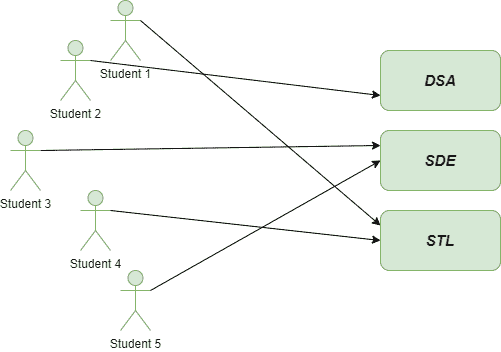
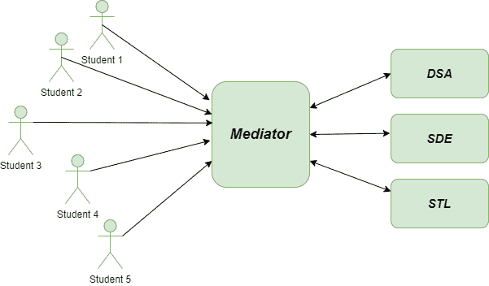
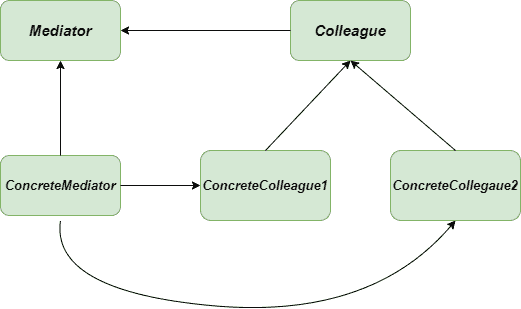

# 中介方法–Python 设计模式

> 原文:[https://www . geesforgeks . org/mediator-method-python-design-pattern/](https://www.geeksforgeeks.org/mediator-method-python-design-pattern/)

中介方法是一种 [**行为设计模式**](https://www.geeksforgeeks.org/design-patterns-set-1-introduction/) ，它允许我们减少对象之间无序的依赖关系。在中介环境中，对象在中介对象的帮助下相互通信。它通过减少通信对象之间的依赖来减少耦合。中介作为对象之间的路由器，它可以有自己的逻辑来提供一种通信方式。

### 设计组件:

*   **中介器:**定义同事对象之间通信的接口。
*   **具体中介器:**实现中介器接口，协调同事对象之间的通信。
*   **同事:**定义与其他同事沟通的接口
*   **具体同事:**实现同事接口，通过其中介器与其他同事沟通。

### 不使用中介方法的问题

想象一下，你将被 [**GeeksforGeeks**](geeksforgeeks.org) 提供的精英课程之一录取，如 **DSA、SDE****和 **STL** 。最初，很少有学生接近加入这些课程。最初，开发人员可以为学生和课程之间的联系创建单独的对象和类，但是随着课程在学生中变得有名，开发人员很难处理如此大量的子类及其对象。**

**

问题-中介-方法** 

### **使用介质方法的解决方案**

**现在让我们了解一个专业开发人员将如何使用 **Mediator 设计模式**来处理这种情况。我们可以创建一个名为**课程**的独立中介类和一个**用户类**，使用它们我们可以创建课程类的不同对象。在主方法中，我们将为每个学生创建一个单独的对象，在用户类中，我们将为课程类创建对象，这有助于防止无序代码。**

**

溶液-介质-方法**  **## 蟒蛇 3

```
class Course(object):
    """Mediator class."""

    def displayCourse(self, user, course_name):
        print("[{}'s course ]: {}".format(user, course_name))

class User(object):
    '''A class whose instances want to interact with each other.'''

    def __init__(self, name):
        self.name = name
        self.course = Course()

    def sendCourse(self, course_name):
        self.course.displayCourse(self, course_name)

    def __str__(self):
        return self.name

"""main method"""

if __name__ == "__main__":

    mayank = User('Mayank')   # user object
    lakshya = User('Lakshya') # user object
    krishna = User('Krishna') # user object

    mayank.sendCourse("Data Structures and Algorithms")
    lakshya.sendCourse("Software Development Engineer")
    krishna.sendCourse("Standard Template Library")
```

### UML 图

下面是中介方法的 UML 图:



中介器-方法-UML-图

### 优势

*   **单一责任原则:**在**调解方法**下，可以将各个组件之间的通信提取到一个更容易维护的地方。
*   **开/闭原则:**引入新的介体很容易，不会干扰现有的客户端代码。
*   **允许继承:**我们可以重用调解器的单个组件，因为它遵循 [**继承**](https://www.geeksforgeeks.org/inheritance-in-python/)
*   **很少子类:**中介器限制子类化，因为中介器将原本会受到干扰的行为定位在几个对象中。

### 不足之处

*   **集中化:**它完全集中化了控制，因为中介模式在中介中用交互的复杂性换取复杂性。
*   **神物:**一个介体可以转化为 [**神物**](https://en.wikipedia.org/wiki/God_object) (一个知道的太多或者做的太多的物体)。
*   **复杂度增加:**如果我们在中介对象里面放太多逻辑，中介对象的结构可能会变得太复杂。

### 适应性

*   **减少子类的数量:**当你意识到自己创建了很多不必要的子类时，那么最好使用 Mediator 方法来避免这些不必要的子类。
*   **空中交通管制员:**空中交通管制员是中介模式的一个很好的例子，机场控制室作为不同航班之间通信的中介。

**进一步阅读–**[**爪哇**](https://www.geeksforgeeks.org/prototype-design-pattern/)
调解法**