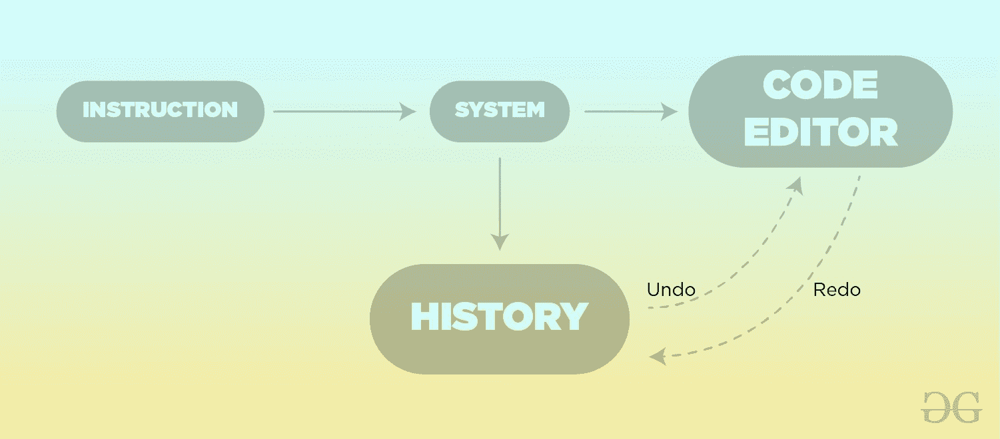

# 纪念品方法–Python 设计模式

> 原文:[https://www . geesforgeks . org/memoto-method-python-design-patterns/](https://www.geeksforgeeks.org/memento-method-python-design-patterns/)

纪念品方法是一种 [**行为设计模式**](https://www.geeksforgeeks.org/design-patterns-set-1-introduction/) ，它提供了将对象恢复到其先前状态的能力。在不透露具体实现细节的情况下，它允许您保存和恢复对象的先前版本。它试图不干扰代码的封装，并允许您捕获和外部化对象的内部状态。

### 不使用纪念品方法的问题

假设你是一个学生，想在竞争激烈的编程世界中脱颖而出，但你面临一个问题，即找到一个好的**代码编辑器**进行编程，但目前的代码编辑器都不能满足你的需求，所以你试图为自己制造一个。任何代码编辑器最重要的特性之一是**撤销**和**重做**，这两个特性也是您所需要的。作为一个没有经验的开发人员，您只是使用了直接存储所有已执行操作的方法。当然，这种方法会有效，但效率低下！



动量问题图

### 纪念品法解答

让我们讨论一下上述问题的解决方案。通过不干扰代码的封装，整个问题很容易解决。当一些对象试图执行没有分配给它们的额外任务时，问题就出现了，因此它们会侵入其他对象的私有空间。Memento 模式表示为该状态的实际所有者(发起者对象)创建状态快照。因此，不是其他对象试图从“外部”复制编辑器的状态，而是编辑器类本身可以制作快照，因为它可以完全访问自己的状态。
根据模式，我们应该将对象状态的副本存储在一个名为**memorate**的特殊对象中，除了产生它的对象之外，其他任何对象都无法访问 memorate 对象的内容。

## 蟒蛇 3

```py
"""Memento class for saving the data"""

class Memento:

    """Constructor function"""
    def __init__(self, file, content):

        """put all your file content here"""

        self.file = file
        self.content = content

"""It's a File Writing Utility"""

class FileWriterUtility:

    """Constructor Function"""

    def __init__(self, file):

        """store the input file data"""
        self.file = file
        self.content = ""

    """Write the data into the file"""

    def write(self, string):
        self.content += string

    """save the data into the Memento"""

    def save(self):
        return Memento(self.file, self.content)

    """UNDO feature provided"""

    def undo(self, memento):
        self.file = memento.file
        self.content = memento.content

"""CareTaker for FileWriter"""

class FileWriterCaretaker:

    """saves the data"""

    def save(self, writer):
        self.obj = writer.save()

    """undo the content"""

    def undo(self, writer):
        writer.undo(self.obj)

if __name__ == '__main__':

    """create the caretaker object"""
    caretaker = FileWriterCaretaker()

    """create the writer object"""
    writer = FileWriterUtility("GFG.txt")

    """write data into file using writer object"""
    writer.write("First vision of GeeksforGeeks\n")
    print(writer.content + "\n\n")

    """save the file"""
    caretaker.save(writer)

    """again write using the writer """
    writer.write("Second vision of GeeksforGeeks\n")

    print(writer.content + "\n\n")

    """undo the file"""
    caretaker.undo(writer)

    print(writer.content + "\n\n")
```

### UML 图

以下是纪念品方法的 UML 图


矩量法 uml 图

### 优势

*   **鼓励封装:** Memento 方法可以帮助生成对象的状态，而不会破坏客户端代码的封装。
*   **简化代码:**我们可以利用看管人，他可以通过维护发起者代码的历史来帮助我们简化代码。
*   **通用 memoto 的实现:**最好使用序列化来实现更通用的 memoto 模式实现，而不是每个对象都需要有自己的 memoto 类实现的 memoto 模式。

### 不足之处

*   **巨大的内存消耗:**如果发起者的对象非常巨大，那么 memoto 对象的大小也会很大，并且会使用大量的内存，这肯定不是完成工作的有效方法。
*   **动态语言的问题:**像[**Ruby**](https://www.geeksforgeeks.org/ruby-programming-language/)[**Python**](https://www.geeksforgeeks.org/python-programming-language/)和 [**PHP**](https://www.geeksforgeeks.org/php/) 这样的编程语言都是动态类型语言，不能保证纪念品对象不会被触碰。
*   **难以删除:**删除纪念品对象并不容易，因为管理员必须跟踪创作者的生命周期才能得到结果。

### 适应性

*   **UNDO 和 REDO:** 像 Paint、Coding IDEs、text editor 等大多数软件应用程序都提供了 **UNDO** 和 **REDO** 功能，以方便客户端使用。
*   **提供封装:**我们可以使用**memotion 的方法**来避免客户端代码中封装的破坏，这可能是由于直接访问对象的内部实现而产生的。

**进一步阅读–**[**爪哇纪念品法**](https://www.geeksforgeeks.org/memento-design-pattern/)