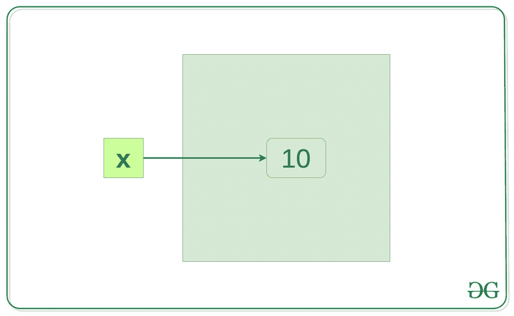
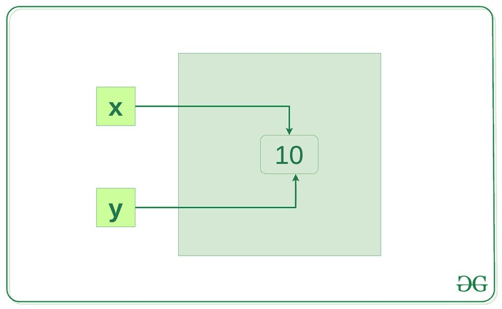
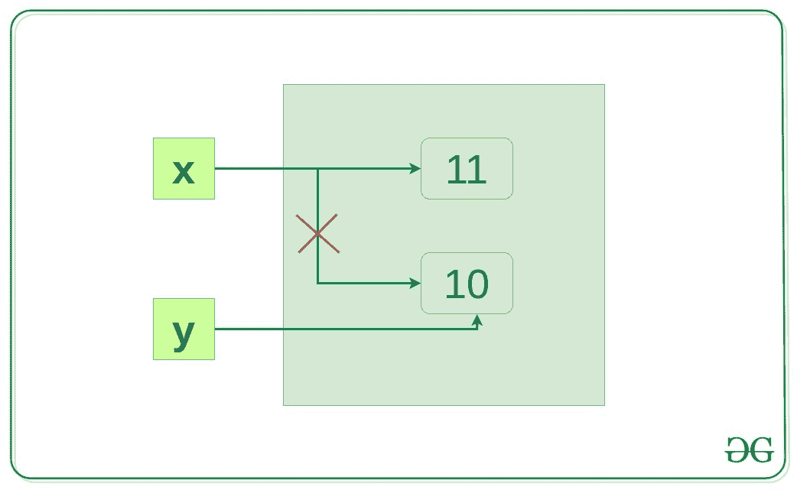

# Python 中的内存管理

> 原文:[https://www.geeksforgeeks.org/memory-management-in-python/](https://www.geeksforgeeks.org/memory-management-in-python/)

理解内存分配对任何软件开发人员来说都很重要，因为编写高效的代码意味着编写一个内存高效的代码。内存分配可以定义为将计算机内存中的一块空间分配给一个程序。在 Python 中，内存分配和释放方法是自动的，因为 Python 开发人员为 Python 创建了一个[垃圾收集器](https://www.geeksforgeeks.org/garbage-collection-python/)，这样用户就不必进行手动垃圾收集。

## 碎片帐集

[垃圾收集](https://www.geeksforgeeks.org/garbage-collection-python/)是解释器在不使用时释放内存，让其他对象可以使用的过程。
假设内存中没有指向某个对象的引用，即该对象没有被使用，虚拟机有一个垃圾收集器，它会自动从堆内存中删除该对象

**注意:**更多信息请参考【Python 中的[垃圾收集](https://www.geeksforgeeks.org/garbage-collection-python/)

## 参考计数

引用计数的工作原理是计算一个对象被系统中其他对象引用的次数。当移除对对象的引用时，对象的引用计数将减少。当引用计数变为零时，对象被解除分配。

例如，让我们假设有两个或多个变量具有相同的值，因此，Python 虚拟机所做的是，它实际上使第二个变量指向私有堆中最初存在的值，而不是在私有堆中创建另一个具有相同值的对象。因此，在类的情况下，具有多个引用可能会占用内存中的大量空间，在这种情况下，引用计数对于保留内存以供其他对象使用非常有益

**示例:**

```py
x = 10
```

当`x = 10`被执行时，一个整数对象 10 被创建在内存中，并且它的引用被分配给变量 x，这是因为在 Python 中一切都是对象。



让我们验证一下这是不是真的

```py
x = 10
y = x

if id(x) == id(y):
    print("x and y refer to the same object")
```

**输出:**

```py
x and y refer to the same object
```

在上面的例子中，`y = x`将创建另一个引用变量 y，该变量将引用相同的对象，因为 Python 通过将相同的对象引用分配给一个新变量来优化内存利用率，如果该对象已经存在相同的值。



现在，让我们改变 x 的值，看看会发生什么。

```py
x = 10
y = x
x += 1

if id(x) != id(y):
    print("x and y do not refer to the same object")
```

**输出:**

```py
x and y do not refer to the same object
```

所以现在 x 指的是一个新的对象 x，x 和 10 之间的链接断开了，但是 y 仍然指的是 10。



## Python 中的内存分配

记忆有两部分:

*   栈存储器
*   堆内存

方法/方法调用和引用存储在**堆栈内存**中，所有值对象存储在**私有堆**中。

### 堆栈内存的工作

分配发生在连续的内存块上。我们称之为堆栈内存分配，因为分配发生在函数调用堆栈中。编译器知道要分配的内存大小，每当调用一个函数时，其变量都会在堆栈上分配内存。

它是只在特定函数或方法调用中需要的内存。当一个函数被调用时，它被添加到程序的调用栈中。任何本地内存分配(如特定函数内部的变量初始化)都暂时存储在函数调用堆栈中，一旦函数返回，就会被删除，调用堆栈将继续执行下一个任务。这种对连续内存块的分配是由编译器使用预定义的例程来处理的，开发人员无需担心。

**示例:**

```py
def func(): 

    # All these variables get memory  
    # allocated on stack  
    a = 20
    b = [] 
    c = "" 
```

### 堆内存的工作

内存是在程序员编写的指令执行期间分配的。请注意，堆名与堆数据结构无关。之所以称之为堆，是因为它是程序员可以分配和取消分配的一堆内存空间。变量需要在方法或函数调用之外，或者在多个函数中全局共享，并存储在堆内存中。

**示例:**

```py
# This memory for 10 integers  
# is allocated on heap.  
a = [0]*10 
```