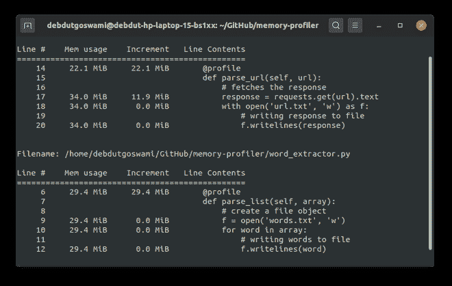

# 使用 memory_profiler 在 Python 中进行内存分析

> 原文:[https://www . geesforgeks . org/memory-profiling-in-python-use-memory _ profiler/](https://www.geeksforgeeks.org/memory-profiling-in-python-using-memory_profiler/)

如果你经常使用 Python，那么你可能知道很多人声称 Python 需要更多的时间来执行。好吧，你可能已经见过类似于花费总时间来执行一部分代码或类似的方法，但是有时你需要更多的东西。内存使用情况如何？没有人真的谈论这个，但它同样重要。这可能看起来微不足道，但在为生产编写代码时，它实际上非常重要。

我们将使用来自 PyPi 的**内存剖析器**。我们还需要**请求**来测试功能。为此，只需在终端中键入以下内容

```
pip3 install memory-profiler requests
```

**注意:**如果你正在操作窗口或者使用虚拟环境，那么它将是**画中画**而不是**画中画 3**

现在一切都准备好了，休息显然是相当容易和有趣的。创建一个名为 **word_extractor.py** 的新文件，并将代码添加到其中。下面是代码的实现。所有的内容都被很好地记录为在线评论。

## 蟒蛇 3

```
# imports
from memory_profiler import profile
import requests

class BaseExtractor:
    # decorator which specifies which
    # function to monitor
    @profile
    def parse_list(self, array):

        # create a file object
        f = open('words.txt', 'w')
        for word in array:

            # writing words to file
            f.writelines(word)

    # decorator which specifies which 
    # function to monitor
    @profile
    def parse_url(self, url):

        # fetches the response
        response = requests.get(url).text
        with open('url.txt', 'w') as f:

            # writing response to file
            f.writelines(response)
```

注意**@简介**这是一个装修工。这个装饰器装饰的任何函数，都会被跟踪。现在，我们的主代码已经准备好了。让我们编写调用这个类函数的驱动程序代码。现在，创建另一个名为 **run.py** 的文件，并在其中插入以下代码。

## 蟒蛇 3

```
from word_extractor import BaseExtractor

if __name__ == "__main__":

    # url for word list (huge)
    url = 'https://raw.githubusercontent.com/dwyl/english-words/master/words.txt'

    # word list in array
    array = ['one', 'two', 'three', 'four', 'five']

    # initializing BaseExtractor object
    extractor = BaseExtractor()

    # calling parse_url function
    extractor.parse_url(url)

    # calling pasrse_list function
    extractor.parse_list(array)
```

所以，基本上现在我们完成了。您会注意到 **parse_url()** 将比 **parse_list()** 消耗更多的内存，这是显而易见的，因为 parse_url 调用一个 url 并将响应内容写入一个文本文件。如果你打开链接，那么你会发现单词列表是巨大的。因此，现在要测试您的代码，只需运行 **run.py** 文件。你可以通过打字来完成

```
python3 run.py
```

**注意:**如果你在操作窗口或者使用虚拟环境，那么它将是 python 而不是 python3

如果一切运行成功，那么您应该会看到类似这样的情况



内存分析器统计信息

需要记住的重要一点是**内存剖析器**本身会消耗大量内存。只在开发中使用，但在生产中避免使用。