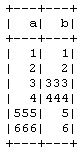

# 在 PySpark

中合并两个数据帧

> 原文:[https://www . geesforgeks . org/merge-two-data frames-in-py spark/](https://www.geeksforgeeks.org/merge-two-dataframes-in-pyspark/)

在本文中，我们将学习如何在 PySpark 中逐行合并多个数据帧。在链接联合之外，这是数据帧的唯一方法。使用的模块是 pyspark:

spark(Apache 开源大数据处理引擎)是一个集群计算系统。与其他集群计算系统(如 Hadoop)相比，它更快。它提供了 Python、Scala 和 Java 中的高级 API。平行作业在 Spark 中很容易写。我们将涵盖[**【PySpark】**](https://www.geeksforgeeks.org/introduction-pyspark-distributed-computing-apache-spark/#:~:text=Spark%20%E2%80%93%20Spark%20(open%20source%20Big,easy%20to%20write%20in%20Spark.)(Python+Apache Spark)因为这样会让学习曲线更平坦。要在 linux 系统上安装 Spark，请遵循 [<u>这个</u>](https://spark.apache.org/docs/0.9.0/python-programming-guide.html) 。要在多集群系统中运行 Spark，请遵循 [<u>中的</u>](https://www.pdf-archive.com/2017/06/10/settinguphdfsclusteron3nodes/settinguphdfsclusteron3nodes.pdf) 。

为了完成我们的任务，我们为所有的输入数据帧定义了一个递归调用的函数，并逐个进行联合。为了联合，我们使用 pyspark 模块:

*   **Dataframe union()**–data frame 的 union()方法用于混合等效结构/模式的两个 data frame。如果模式不等价，就会返回一个错误。
*   **data frame unionAll()**–unionAll()自 Spark“2 . 0 . 0”版本以来已被弃用，并被 union()取代。

注意:在其他的 SQL 中，Union 消除了重复，但是 UnionAll 合并了两个数据集，包括重复的记录。但是，在 spark 中，两者的行为是等效的，并使用 DataFrame 重复函数来消除重复的行。

在最后一次调用时，它返回所需的结果数据帧。下面的代码代表了我们解决给定问题背后的逻辑。

## 蟒蛇 3

```
from functools import reduce  # For Python 3.x
from pyspark.sql import DataFrame

def unionAll(*dfs):
    return reduce(DataFrame.unionAll, dfs)

unionAll(td2, td3, td4, td5, td6, td7, td8, td9, td10)
```

发生的事情是，它将您提交的所有对象作为参数，并减少它们对 unionAll 的使用(这一限制来自 Python，不再是 Spark 最小化，尽管它们的工作方式相似)，这迟早会将其减少到一个数据帧。

如果数据帧是普通的关系数据库，你可以把它们的列表放到你的迷你图上下文的联合特性中

### 示例:

有时，当要组合的数据帧没有相同的列顺序时，最好使用 df2.select(df1.columns)，以确保两个 df 在联合之前具有相同的列顺序。

## 蟒蛇 3

```
import functools

def unionAll(dfs):
    return functools.reduce(lambda df1, df2: df1.union(df2.select(df1.columns)), dfs)
```

**reduce(fun，seq)** 函数用于**将参数中传递的特定函数应用于所传递序列中提到的所有列表元素**。该功能在**功能工具**模块中定义。

现在，让我们借助一些例子来了解整个过程。

**例 1:**

在这个例子中，我们用一些随机值的列“a”和“b”创建数据帧，并将所有这三个数据帧传递给我们上面创建的方法 unionAll()，并获得结果数据帧作为输出并显示结果。

## 蟒蛇 3

```
# import modules
from pyspark.sql import SparkSession
import functools

# explicit function
def unionAll(dfs):
    return functools.reduce(lambda df1, df2: df1.union(df2.select(df1.columns)), dfs)

spark = SparkSession.builder.getOrCreate()
df1 = spark.createDataFrame([[1, 1], [2, 2]], ['a', 'b'])

# different column order.
df2 = spark.createDataFrame([[3, 333], [4, 444]], ['b', 'a'])
df3 = spark.createDataFrame([[555, 5], [666, 6]], ['b', 'a'])

unioned_df = unionAll([df1, df2, df3])
unioned_df.show()
```

**输出:**


**例 2:**

在本例中，我们使用一些随机值的列“a”和“b”创建数据帧，并将所有这三个数据帧传递给我们新创建的方法 unionAll()，在该方法中，我们不关注列的名称。我们只是将输入数据帧与下一个数据帧进行联合，并将结果数据帧作为输出并显示结果。

## 蟒蛇 3

```
# import modules
from functools import reduce  
from pyspark.sql import DataFrame
from pyspark.sql import SparkSession

# explicit functions
def unionAll(*dfs):
    return reduce(DataFrame.unionAll, dfs)

spark = SparkSession.builder.getOrCreate()

df1 = spark.createDataFrame([[1, 1], [2, 2]], ['a', 'b'])

# different column order.
df2 = spark.createDataFrame([[3, 333], [4, 444]], ['b', 'a'])
df3 = spark.createDataFrame([[555, 5], [666, 6]], ['b', 'a'])

unionAll(*[df1, df2, df3]).show()
```

**输出:**

