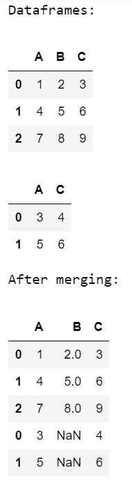
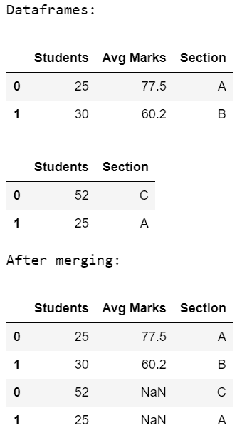
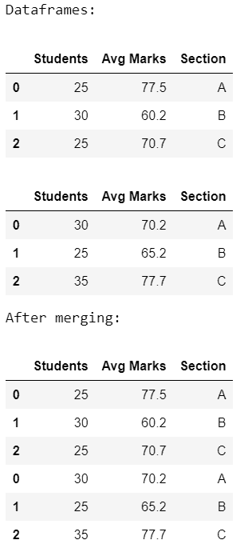

# 合并两个列名相同的数据帧

> 原文:[https://www . geesforgeks . org/merge-two-data frames-同列名/](https://www.geeksforgeeks.org/merge-two-dataframes-with-same-column-names/)

为了合并两个具有相同列名的数据帧，我们将使用 [pandas.concat()](https://www.geeksforgeeks.org/pandas-concat-function-in-python/) 。这个函数完成了沿着熊猫对象轴执行连接操作的所有繁重工作，同时在其他轴上执行索引的可选集合逻辑(并集或交集)。

> **语法:** *concat(objs，axis，join，ignore_index，key，levels，names，verify_integrity，sort，copy)*

### 方法

*   导入模块
*   创建或加载第一个数据帧
*   创建或加载第二个数据帧
*   基于相同的列名进行连接
*   显示结果

以下是描述如何合并具有相同列名的两个数据框的各种示例:

**例 1:**

## 蟒蛇 3

```py
# import module
import pandas as pd

# assign dataframes
data1 = pd.DataFrame([[1, 2, 3], [4, 5, 6], [7, 8, 9]],
                     columns=['A', 'B', 'C'])

data2 = pd.DataFrame([[3, 4], [5, 6]],
                     columns=['A', 'C'])

# display dataframes
print('Dataframes:')
display(data1)
display(data2)

# merge two data frames
print('After merging:')
pd.concat([data1, data2], axis=0)
```

**输出:**



**例 2:**

## 蟒蛇 3

```py
# import module
import pandas as pd

# assign dataframes
data1 = pd.DataFrame([[25, 77.5, 'A'], [30, 60.2, 'B']],
                     columns=['Students', 'Avg Marks', 'Section'])

data2 = pd.DataFrame([[52, 'C'], [25, 'A']],
                     columns=['Students', 'Section'])

# display dataframes
print('Dataframes:')
display(data1)
display(data2)

# merge two data frames
print('After merging:')
pd.concat([data1, data2], axis=0)
```

**输出:**



**例 3:**

## 蟒蛇 3

```py
# import module
import pandas as pd

# assign dataframes
data1 = pd.DataFrame([[25, 77.5, 'A'], [30, 60.2, 'B'],
                      [25, 70.7, 'C']],
                     columns=['Students', 'Avg Marks', 'Section'])

data2 = pd.DataFrame([[30, 70.2, 'A'], [25, 65.2, 'B'],
                      [35, 77.7, 'C']],
                     columns=['Students', 'Avg Marks', 'Section'])

# display dataframes
print('Dataframes:')
display(data1)
display(data2)

# merge two data frames
print('After merging:')
pd.concat([data1, data2], axis=0)
```

**输出:**

