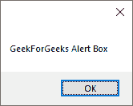
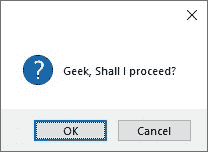
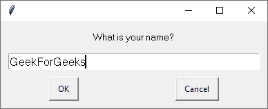

# 使用 PyAutoGUI 的消息框

> 原文:[https://www . geesforgeks . org/message-box-use-pyautogui/](https://www.geeksforgeeks.org/message-boxes-using-pyautogui/)

**PyAutoGUI** 是一个 Python 模块，可以自动化你的 GUI，并通过编程控制你的键盘和鼠标。本文展示了创建显示框的图形用户界面功能。
如果你想了解更多关于 PyAutoGUI 及其自动化你的键盘和鼠标的能力，跟随这篇文章:[使用 PyAutoGUI 的鼠标和键盘自动化](https://www.geeksforgeeks.org/mouse-keyboard-automation-using-python/)

python 没有 PyAutoGUI，因此请转到命令提示符并键入以下内容:

```py
 pip3 install PyAutoGUI
```

**警报()**:显示一个简单的消息框，其中包含文本和一个确定按钮。返回单击的按钮的文本。

```py
# Python Program to show alert() function
import pyautogui

pyautogui.alert('GeekforGeeks alert box')
```

**输出**:显示给定文本的提示框，点击【确定】返回【确定】


**确认()**:显示一个带有确定和取消按钮的消息框。按钮的数量和文本可以自定义。返回单击的按钮的文本。

```py
# Python Program to show confirm() function
import pyautogui
pyautogui.confirm('Geek Shall I proceed?')
```

**输出**:将显示带有给定文本的提醒框，点击按钮将返回按钮上的文本。在这种情况下，它的‘OK’


要有多个选择选项–

```py
# Python Program to show confirm() function
# with multiple options
import pyautogui
pyautogui.confirm('Enter option Gfg', buttons =['A', 'B', 'C'])
```

**输出**:点击 A，会返回‘A’作为输出。
T3】

**提示()**:显示文字输入的消息框，确定&取消按钮。返回输入的文本，如果单击“取消”，则返回“无”。

```py
# Python Program to show prompt() function
import pyautogui
pyautogui.prompt('What is your name?')
```

**输出**:它将返回输入的文本，在这种情况下，如果点击取消，将返回“极客伪造”或“无”。


**密码()**:显示文字输入消息框，点击【确定】&取消按钮。键入的字符显示为*。返回输入的文本，如果单击了取消，则返回无

```py
# Python Program to show password() function
import pyautogui
pyautogui.password('Enter password (text will be hidden)')
```

**输出**:将返回输入的文本/密码，在本例中为“极客伪造”，如果点击取消则为“无”。
T3】