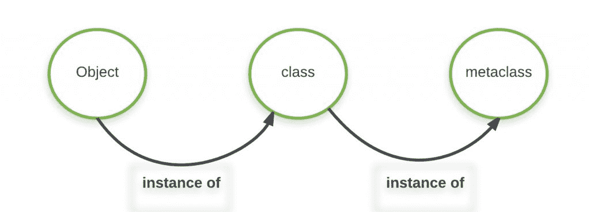

# 用 Python 中的元类进行元编程

> 原文:[https://www . geeksforgeeks . org/meta programming-meta class es-python/](https://www.geeksforgeeks.org/metaprogramming-metaclasses-python/)

起初,**元编程**这个词似乎是一个非常时髦和陌生的东西，但是如果你曾经和[装饰者](https://www.geeksforgeeks.org/function-decorators-in-python-set-1-introduction/)或元类一起工作过，你一直都在那里做元编程。**简而言之，我们可以说元编程是操纵代码的代码。**
在本文中，我们将讨论**元类**，为什么以及什么时候应该使用它们，以及有哪些替代方法。这是一个相当高级的 Python 主题，预计会有以下先决条件–

*   Python 中的面向对象概念
*   [Python 中的装饰者](https://www.geeksforgeeks.org/function-decorators-in-python-set-1-introduction/)

注意:本文考虑 Python 3.3 及以上版本

**元类**

在 Python 中，任何东西都有与之相关的某种类型。例如，如果我们有一个整数值的变量，那么它的类型就是 int。使用 **type()** 函数可以得到任何东西的类型。

## 蟒蛇 3

```py
num = 23
print("Type of num is:", type(num))

lst = [1, 2, 4]
print("Type of lst is:", type(lst))

name = "Atul"
print("Type of name is:", type(name))
```

输出:

```py
Type of num is: <class 'int'>
Type of lst is: <class 'list'>
Type of name is: <class 'str'>
```

**Python 中的每种类型都是由类**定义的。所以在上面的例子中，不像 C++或 Java 中 int、char、float 是主要的数据类型，在 Python 中它们是 int 类或 str 类的对象。所以我们可以通过创建一个新类型的类来创建一个新类型。例如，我们可以通过创建一个*学生*班级来创建一个新类型的*学生*。

## 蟒蛇 3

```py
class Student:
    pass
stu_obj = Student()

# Print type of object of Student class
print("Type of stu_obj is:", type(stu_obj))
```

输出:

```py
Type of stu_obj is: <class '__main__.Student'>
```

**类也是一个对象**，就像任何其他对象一样，它是一个叫做**元类**的实例。特殊类**类型**创建这些*类*对象。**类型**类默认为**元类**，负责制作类。在上面的例子中，如果我们试着找出*学生*班级的类型，结果是一个**类型的**。

## 蟒蛇 3

```py
class Student:
    pass

# Print type of Student class
print("Type of Student class is:", type(Student))
```

输出:

```py
Type of Student class is: <class 'type'>
```

因为类也是一个对象，所以可以用同样的方式修改它们。我们可以像处理其他对象一样，在类中添加或减去字段或方法。例如–

## 蟒蛇 3

```py
# Defined class without any
# class methods and variables
class test:pass

# Defining method variables
test.x = 45

# Defining class methods
test.foo = lambda self: print('Hello')

# creating object
myobj = test()

print(myobj.x)
myobj.foo()
```

输出:

```py
45
Hello
```

整个元事物可以概括为–**元类创建类，类创建对象**



元类负责类的生成，因此我们可以编写自定义元类，通过执行额外的操作或注入代码来修改类的生成方式。通常，我们不需要自定义元类，但有时它是必要的。
存在元类和非元类解决方案可用的问题(通常更简单)，但在某些情况下，只有元类可以解决问题。我们将在本文中讨论这样一个问题。

**创建自定义元类**

为了创建我们的定制元类，我们的定制元类必须继承**类型**元类，并且通常覆盖–

*   **__new__():** 是在 __init__()之前调用的方法。它创建对象并返回它。我们可以重写这个方法来控制对象的创建方式。
*   **__init__():** 这个方法只是初始化作为参数传递的创建对象

我们可以直接使用**类型()**函数创建类。它可以通过以下方式调用–

1.  当只使用一个参数调用时，它返回类型。我们以前在上面的例子中见过。
2.  当用三个参数调用时，它创建一个类。以下参数传递给它–
    1.  类别名
    2.  具有由类继承的基类的元组
    3.  **类字典:**它充当类的本地命名空间，用类方法和变量填充

考虑这个例子–

## 蟒蛇 3

```py
def test_method(self):
    print("This is Test class method!")

# creating a base class
class Base:
    def myfun(self):
        print("This is inherited method!")

# Creating Test class dynamically using
# type() method directly
Test = type('Test', (Base, ), dict(x="atul", my_method=test_method))

# Print type of Test
print("Type of Test class: ", type(Test))

# Creating instance of Test class
test_obj = Test()
print("Type of test_obj: ", type(test_obj))

# calling inherited method
test_obj.myfun()

# calling Test class method
test_obj.my_method()

# printing variable
print(test_obj.x)
```

输出:

```py
Type of Test class:  <class 'type'>
Type of test_obj:  <class '__main__.Test'>
This is inherited method!
This is Test class method!
atul
```

现在让我们创建一个元类，而不直接使用**类型()**。在下面的例子中，我们将创建一个元类 ***多基类*** ，它将检查正在创建的类是否继承自多个基类。如果是这样，它将引发错误。

## 蟒蛇 3

```py
# our metaclass
class MultiBases(type):
    # overriding __new__ method
    def __new__(cls, clsname, bases, clsdict):
        # if no of base classes is greater than 1
        # raise error
        if len(bases)>1:
            raise TypeError("Inherited multiple base classes!!!")

        # else execute __new__ method of super class, ie.
        # call __init__ of type class
        return super().__new__(cls, clsname, bases, clsdict)

# metaclass can be specified by 'metaclass' keyword argument
# now MultiBase class is used for creating classes
# this will be propagated to all subclasses of Base
class Base(metaclass=MultiBases):
    pass

# no error is raised
class A(Base):
    pass

# no error is raised
class B(Base):
    pass

# This will raise an error!
class C(A, B):
    pass
```

输出:

```py
Traceback (most recent call last):
  File "<stdin>", line 2, in <module>
  File "<stdin>", line 8, in __new__
TypeError: Inherited multiple base classes!!!
```

**用元类解决问题**

有些问题可以由装饰者(容易地)以及元类来解决。但是有一些问题的结果只能通过元类来实现。例如，考虑一个非常简单的代码重复问题。
我们要调试类方法，我们要的是每当类方法执行的时候，都要在执行它的体之前打印出它的全限定名。

我们想到的第一个解决方案是使用**方法装饰器**，下面是示例代码–

## 蟒蛇 3

```py
from functools import wraps

def debug(func):
    '''decorator for debugging passed function'''

    @wraps(func)
    def wrapper(*args, **kwargs):
        print("Full name of this method:", func.__qualname__)
        return func(*args, **kwargs)
    return wrapper

def debugmethods(cls):
    '''class decorator make use of debug decorator
       to debug class methods '''

    # check in class dictionary for any callable(method)
    # if exist, replace it with debugged version
    for key, val in vars(cls).items():
        if callable(val):
            setattr(cls, key, debug(val))
    return cls

# sample class
@debugmethods
class Calc:
    def add(self, x, y):
        return x+y
    def mul(self, x, y):
        return x*y
    def div(self, x, y):
        return x/y

mycal = Calc()
print(mycal.add(2, 3))
print(mycal.mul(5, 2))
```

输出:

```py
Full name of this method: Calc.add
5
Full name of this method: Calc.mul
10
```

这个解决方案工作得很好，但是有一个问题，如果我们想将这个方法装饰器应用于继承这个 ***Calc*** 类的所有子类，会怎么样。在这种情况下，我们必须像对待 ***Calc*** 类一样，将方法装饰器分别应用于每个子类。
问题是，如果我们有很多这样的子类，那么在这种情况下，我们不会喜欢分别为每个子类添加一个装饰器。如果我们事先知道每个子类都必须有这个调试属性，那么我们应该查找基于元类的解决方案。
看看这个**基于元类的解决方案**，想法是类将被正常创建，然后立即被调试方法装饰器打包–

## 蟒蛇 3

```py
from functools import wraps

def debug(func):
    '''decorator for debugging passed function'''

    @wraps(func)
    def wrapper(*args, **kwargs):
        print("Full name of this method:", func.__qualname__)
        return func(*args, **kwargs)
    return wrapper

def debugmethods(cls):
    '''class decorator make use of debug decorator
       to debug class methods '''

    for key, val in vars(cls).items():
        if callable(val):
            setattr(cls, key, debug(val))
    return cls

class debugMeta(type):
    '''meta class which feed created class object
       to debugmethod to get debug functionality
       enabled objects'''

    def __new__(cls, clsname, bases, clsdict):
        obj = super().__new__(cls, clsname, bases, clsdict)
        obj = debugmethods(obj)
        return obj

# base class with metaclass 'debugMeta'
# now all the subclass of this
# will have debugging applied
class Base(metaclass=debugMeta):pass

# inheriting Base
class Calc(Base):
    def add(self, x, y):
        return x+y

# inheriting Calc
class Calc_adv(Calc):
    def mul(self, x, y):
        return x*y

# Now Calc_adv object showing
# debugging behaviour
mycal = Calc_adv()
print(mycal.mul(2, 3))
```

输出:

```py
Full name of this method: Calc_adv.mul
6
```

**何时使用元类**

大多数情况下，我们不使用元类，它通常用于一些复杂的事情，但是我们使用元类的一些情况是–

*   正如我们在上面的例子中看到的，元类沿着继承层次向下传播。它也会影响所有的子类。如果我们有这样的情况，那么我们应该使用元类。
*   如果我们想自动改变类，当它被创建时，我们使用元类
*   对于 API 开发，我们可以使用元类

正如蒂姆·彼得斯所引用的

> 元类是更深层次的魔力，99%的用户永远不应该担心。如果你想知道你是否需要它们，你不需要(真正需要它们的人肯定知道他们需要它们，并且不需要解释为什么)。

**参考文献**

*   [http://www . dabeaz . com/py 3 meta/py 3 meta . pdf](http://www.dabeaz.com/py3meta/Py3Meta.pdf)
*   [https://stackoverflow . com/questions/100003/什么是 python 中的元类](https://stackoverflow.com/questions/100003/what-is-a-metaclass-in-python)

本文由 [**阿图尔·库马尔**](https://www.linkedin.com/in/atul-kumar-733b32136/) 供稿。如果你喜欢 GeeksforGeeks 并想投稿，你也可以使用[write.geeksforgeeks.org](https://write.geeksforgeeks.org)写一篇文章或者把你的文章邮寄到 review-team@geeksforgeeks.org。看到你的文章出现在极客博客主页上，帮助其他极客。
如果发现有不正确的地方，或者想分享更多关于上述话题的信息，请写评论。